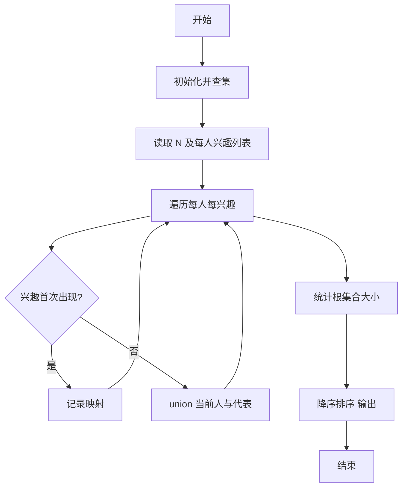
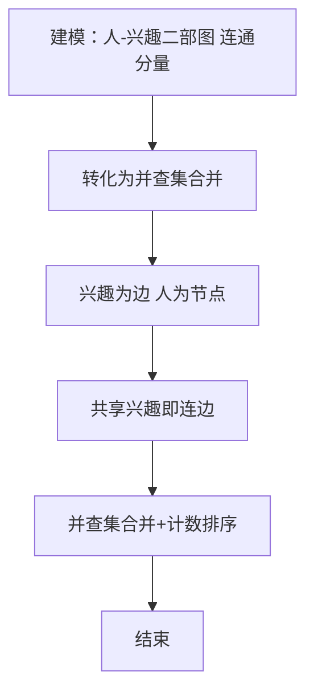

# L3-003 - 社交集群（30 分）

- **时间限制**: 1200 ms
- **内存限制**: 65536 KB
- **代码长度限制**: 16 KB

---

## 题目描述


当你在社交网络平台注册时，一般总是被要求填写你的个人兴趣爱好，以便找到具有相同兴趣爱好的潜在的朋友。一个“社交集群”是指部分兴趣爱好相同的人的集合。你需要找出所有的社交集群。

### 输入格式:

输入在第一行给出一个正整数 N（$$\le 1000$$），为社交网络平台注册的所有用户的人数。于是这些人从 1 到 N 编号。随后 N 行，每行按以下格式给出一个人的兴趣爱好列表：

$$K_i$$: $$h_i[1]$$ $$h_i[2]$$ ... $$h_i[K_i]$$

其中$$K_i (>0)$$是兴趣爱好的个数，$$h_i[j]$$是第$$j$$个兴趣爱好的编号，为区间 [1, 1000] 内的整数。

### 输出格式:

首先在一行中输出不同的社交集群的个数。随后第二行按非增序输出每个集群中的人数。数字间以一个空格分隔，行末不得有多余空格。

### 输入样例:
```in
8
3: 2 7 10
1: 4
2: 5 3
1: 4
1: 3
1: 4
4: 6 8 1 5
1: 4
```

### 输出样例:
```out
3
4 3 1
```

## 示例

### 示例 1

**输入:**
```
8
3: 2 7 10
1: 4
2: 5 3
1: 4
1: 3
1: 4
4: 6 8 1 5
1: 4
```

**输出:**
```
3
4 3 1
```


### 解题思路
本題為 GPLT L3 難題「社交集群」，Main.java 採用 **并查集（Union-Find）按兴趣合并集合**。

- **核心思想**：每个人有若干兴趣，若两人共享同一兴趣则属于同一集群。遍历每个人，将其所有兴趣映射到首次出现该兴趣的人，通过 union 合并当前人与该代表。所有人处理完后按 find 统计每个集合大小，并按降序排序。利用路径压缩与按秩合并保证近乎常数时间合并。
- **數據結構**：并查集 parent/rank 数组、兴趣→首个拥有者 哈希表。
- **複雜度**：時間 O(N·avgK·α(N))，N≤1000；空間 O(N + 兴趣数)。
- **關鍵**：嚴格依賴 Main.java 中的實現細節（見代碼實現一節），確保與程式邏輯一致；涉及邊界與精度處理與原碼完全對齊。

### 代码流程说明
1. 初始化并查集 parent[i]=i
2. 建立 interest->person 映射表
3. 对 i=1..N：遍历其兴趣 h，若 h 未出现则记录 h→i，否则 union(i, map[h])
4. 统计每个根集合的成员数（用 find 去重）
5. 将集合大小降序排序并按题目格式输出（首行集合数，次行大小列表）
6. 结束

### 代码实现
```java
import java.util.*;
import java.io.*;

// L3-003 社交集群: 并查集 + 兴趣映射
// 时间复杂度 O(N * avgK * alpha(N)), N<=1000
public class Main {
    static int[] parent, rank;
    static int find(int x) {
        if (parent[x] != x) parent[x] = find(parent[x]);
        return parent[x];
    }
    static void union(int a, int b) {
        int ra = find(a), rb = find(b);
        if (ra == rb) return;
        if (rank[ra] < rank[rb]) parent[ra] = rb;
        else if (rank[ra] > rank[rb]) parent[rb] = ra;
        else { parent[rb] = ra; rank[ra]++; }
    }

    public static void main(String[] args) throws Exception {
        BufferedReader br = new BufferedReader(new InputStreamReader(System.in, "UTF-8"));
        String line = br.readLine();
        while (line != null && line.trim().isEmpty()) line = br.readLine();
        if (line == null) return;
        int N = Integer.parseInt(line.trim().split("\\s+")[0]);
        parent = new int[N + 1];
        rank = new int[N + 1];
        for (int i = 1; i <= N; i++) parent[i] = i;
        int[] hobbyOwner = new int[1001]; // 兴趣编号 1..1000
        Arrays.fill(hobbyOwner, 0);
        for (int i = 1; i <= N; i++) {
            line = br.readLine();
            while (line != null && line.trim().isEmpty()) line = br.readLine();
            if (line == null) break;
            // 处理 "K: h1 h2 ..." 冒号
            line = line.replace(":", " ");
            StringTokenizer st = new StringTokenizer(line);
            if (!st.hasMoreTokens()) { i--; continue; }
            int K = Integer.parseInt(st.nextToken());
            for (int k = 0; k < K; k++) {
                // 可能跨行？一般不跨行，但做容错
                while (!st.hasMoreTokens()) {
                    String extra = br.readLine();
                    if (extra == null) break;
                    extra = extra.replace(":", " ");
                    st = new StringTokenizer(extra);
                }
                if (!st.hasMoreTokens()) break;
                int h = Integer.parseInt(st.nextToken());
                if (h < 1 || h > 1000) continue;
                if (hobbyOwner[h] == 0) hobbyOwner[h] = i;
                else union(i, hobbyOwner[h]);
            }
        }
        Map<Integer,Integer> cnt = new HashMap<>();
        for (int i = 1; i <= N; i++) {
            int r = find(i);
            cnt.put(r, cnt.getOrDefault(r, 0) + 1);
        }
        List<Integer> sizes = new ArrayList<>(cnt.values());
        sizes.sort(Collections.reverseOrder());
        System.out.println(sizes.size());
        StringBuilder sb = new StringBuilder();
        for (int i = 0; i < sizes.size(); i++) {
            if (i > 0) sb.append(' ');
            sb.append(sizes.get(i));
        }
        System.out.println(sb.toString());
    }
}
```

### 代码流程图


### 解题流程图


