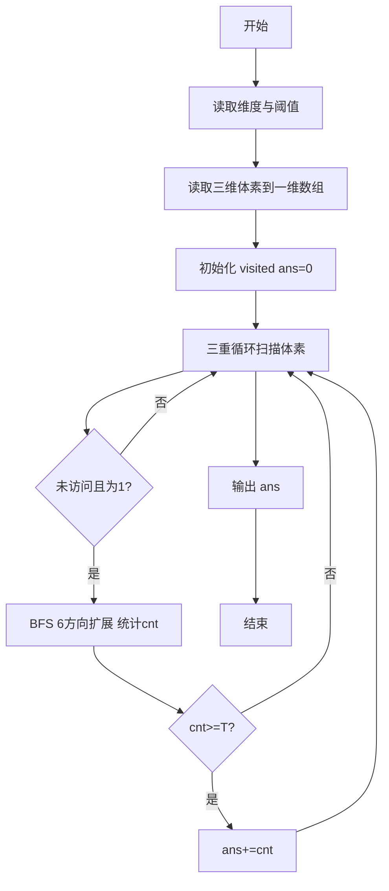
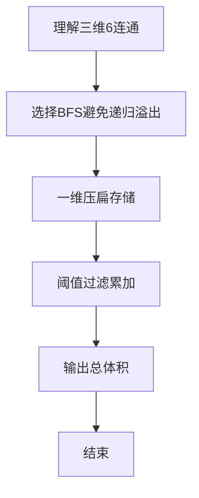

# L3-004 - 肿瘤诊断（30 分）

- **时间限制**: 600 ms
- **内存限制**: 65536 KB
- **代码长度限制**: 16 KB

---

## 题目描述


在诊断肿瘤疾病时，计算肿瘤体积是很重要的一环。给定病灶扫描切片中标注出的疑似肿瘤区域，请你计算肿瘤的体积。

### 输入格式:

输入第一行给出4个正整数：$$M$$、$$N$$、$$L$$、$$T$$，其中$$M$$和$$N$$是每张切片的尺寸（即每张切片是一个$$M\times N$$的像素矩阵。最大分辨率是$$1286\times 128$$）；$$L$$（$$\le 60$$）是切片的张数；$$T$$是一个整数阈值（若疑似肿瘤的连通体体积小于$$T$$，则该小块忽略不计）。

最后给出$$L$$张切片。每张用一个由0和1组成的$$M\times N$$的矩阵表示，其中1表示疑似肿瘤的像素，0表示正常像素。由于切片厚度可以认为是一个常数，于是我们只要数连通体中1的个数就可以得到体积了。麻烦的是，可能存在多个肿瘤，这时我们只统计那些体积不小于$$T$$的。两个像素被认为是“连通的”，如果它们有一个共同的切面，如下图所示，所有6个红色的像素都与蓝色的像素连通。


### 输出格式:

在一行中输出肿瘤的总体积。

### 输入样例:
```in
3 4 5 2
1 1 1 1
1 1 1 1
1 1 1 1
0 0 1 1
0 0 1 1
0 0 1 1
1 0 1 1
0 1 0 0
0 0 0 0
1 0 1 1
0 0 0 0
0 0 0 0
0 0 0 1
0 0 0 1
1 0 0 0
```

### 输出样例:
```out
26
```

## 示例

### 示例 1

**输入:**
```
3 4 5 2
1 1 1 1
1 1 1 1
1 1 1 1
0 0 1 1
0 0 1 1
0 0 1 1
1 0 1 1
0 1 0 0
0 0 0 0
1 0 1 1
0 0 0 0
0 0 0 0
0 0 0 1
0 0 0 1
1 0 0 0
```

**输出:**
```
26
```


### 解题思路
本題為 GPLT L3 難題「肿瘤诊断」，Main.java 採用 **三维网格 6 邻接 BFS/DFS 求连通块体积**。

- **核心思想**：输入为 M 行 N 列 L 层的三维二值图像，1 表示肿瘤体素。6 邻接即上下左右前后。BFS 遍历所有未访问且值为 1 的体素，统计连通块大小，若 ≥阈值 T 则计入总体积。注意输入顺序与内存布局，采用一维压扁降低开销并防止递归栈溢出。
- **數據結構**：三维数组压为一维索引、队列 BFS、visited 标记。
- **複雜度**：時間 O(M·N·L) 遍历所有体素；空間 O(M·N·L)。
- **關鍵**：嚴格依賴 Main.java 中的實現細節（見代碼實現一節），確保與程式邏輯一致；涉及邊界與精度處理與原碼完全對齊。

### 代码流程说明
1. 读取 M,N,L,T 及三维体素数据到一维数组
2. 初始化 visited 与总体积 ans=0
3. 三重循环枚举每个体素，若未访问且值为1则 BFS
4. BFS 中按 6 方向扩展，统计本次连通块体积 cnt
5. 若 cnt≥T 则 ans+=cnt
6. 遍历结束输出 ans

### 代码实现
```java
import java.util.*;
import java.io.*;

// L3-004 肿瘤诊断: 三维连通块 BFS (6 连通)
// M 行 N 列 L 层, 阈值 T, 统计体积 >=T 的连通块总体积
// 时间复杂度 O(M*N*L), 空间 O(M*N*L)
// 数据规模约 1e7 需用一维数组降低开销
public class Main {
    public static void main(String[] args) throws Exception {
        BufferedReader br = new BufferedReader(new InputStreamReader(System.in, "UTF-8"));
        String line;
        // 读取所有整数
        List<Integer> vals = new ArrayList<>();
        while ((line = br.readLine()) != null) {
            if (line.trim().isEmpty()) continue;
            StringTokenizer st = new StringTokenizer(line);
            while (st.hasMoreTokens()) vals.add(Integer.parseInt(st.nextToken()));
        }
        if (vals.size() < 4) return;
        int M = vals.get(0);
        int N = vals.get(1);
        int L = vals.get(2);
        int T = vals.get(3);
        int total = M * N * L;
        // 网格：1 表示肿瘤
        byte[] grid = new byte[total];
        int idx = 4;
        // 填充 L 层，每层 M*N 个数，按输入顺序 M*N per slice, slice 0..L-1, 每 slice M 行 N 列
        //  vals 中剩余数量可能正好 total，若不足则补 0
        for (int i = 0; i < total && idx < vals.size(); i++) {
            grid[i] = (byte)(vals.get(idx++) == 1 ? 1 : 0);
        }
        // 若 vals 读取方式是以 M 为行，需要映射：我们已按线性顺序读，输入顺序也是按层、行、列依次给出，正好对应 i = z*M*N + x*N + y
        boolean[] vis = new boolean[total];
        int[] queue = new int[total];
        // 方向：  dx, dy, dz 对应 x(0..M-1), y(0..N-1), z(0..L-1)
        // 线性 id = z*M*N + x*N + y
        long totalVolume = 0;
        int NM = N * M;
        // 为减少除法开销，BFS 时通过坐标计算邻接时使用算术
        for (int z = 0; z < L; z++) {
            for (int x = 0; x < M; x++) {
                for (int y = 0; y < N; y++) {
                    int id = z * M * N + x * N + y;
                    if (grid[id] == 0 || vis[id]) continue;
                    // BFS
                    int head = 0, tail = 0;
                    queue[tail++] = id;
                    vis[id] = true;
                    int cnt = 0;
                    while (head < tail) {
                        int cur = queue[head++];
                        cnt++;
                        // 解码
                        int curY = cur % N;
                        int tmp = cur / N;
                        int curX = tmp % M;
                        int curZ = tmp / M;
                        // 6 邻域
                        // x+1
                        if (curX + 1 < M) {
                            int nid = cur + N;
                            if (!vis[nid] && grid[nid]==1) { vis[nid]=true; queue[tail++]=nid; }
                        }
                        // x-1
                        if (curX - 1 >= 0) {
                            int nid = cur - N;
                            if (!vis[nid] && grid[nid]==1) { vis[nid]=true; queue[tail++]=nid; }
                        }
                        // y+1
                        if (curY + 1 < N) {
                            int nid = cur + 1;
                            // 防止跨行: 确保同 x,z 行内
                            // 由于 y 在同一行，curY+1 < N 保证不跨行
                            if (!vis[nid] && grid[nid]==1) { vis[nid]=true; queue[tail++]=nid; }
                        }
                        // y-1
                        if (curY - 1 >= 0) {
                            int nid = cur - 1;
                            if (!vis[nid] && grid[nid]==1) { vis[nid]=true; queue[tail++]=nid; }
                        }
                        // z+1
                        if (curZ + 1 < L) {
                            int nid = cur + M * N;
                            if (!vis[nid] && grid[nid]==1) { vis[nid]=true; queue[tail++]=nid; }
                        }
                        // z-1
                        if (curZ - 1 >= 0) {
                            int nid = cur - M * N;
                            if (!vis[nid] && grid[nid]==1) { vis[nid]=true; queue[tail++]=nid; }
                        }
                    }
                    if (cnt >= T) totalVolume += cnt;
                }
            }
        }
        System.out.println(totalVolume);
    }
}
```

### 代码流程图


### 解题流程图


