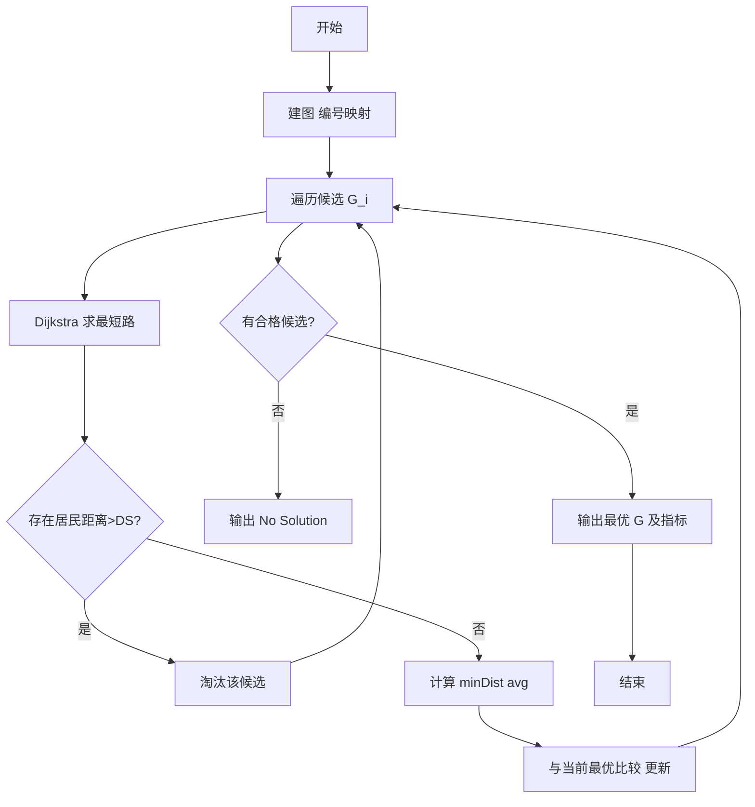
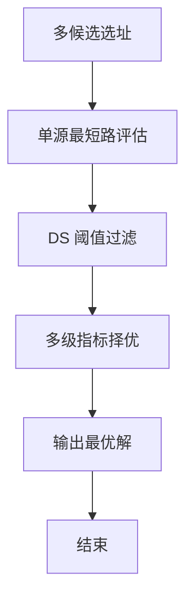

# L3-005 - 垃圾箱分布（30 分）

- **时间限制**: 200 ms
- **内存限制**: 65536 KB
- **代码长度限制**: 16 KB

---

## 题目描述


大家倒垃圾的时候，都希望垃圾箱距离自己比较近，但是谁都不愿意守着垃圾箱住。所以垃圾箱的位置必须选在到所有居民点的最短距离最长的地方，同时还要保证每个居民点都在距离它一个不太远的范围内。

现给定一个居民区的地图，以及若干垃圾箱的候选地点，请你推荐最合适的地点。如果解不唯一，则输出到所有居民点的平均距离最短的那个解。如果这样的解还是不唯一，则输出编号最小的地点。

### 输入格式:

输入第一行给出4个正整数：$$N$$（$$\le 10^3$$）是居民点的个数；$$M$$（$$\le 10$$）是垃圾箱候选地点的个数；$$K$$（$$\le 10^4$$）是居民点和垃圾箱候选地点之间的道路的条数；$$D_S$$是居民点与垃圾箱之间不能超过的最大距离。所有的居民点从1到$$N$$编号，所有的垃圾箱候选地点从$$G1$$到$$GM$$编号。

随后$$K$$行，每行按下列格式描述一条道路：
```
P1 P2 Dist
```
其中`P1`和`P2`是道路两端点的编号，端点可以是居民点，也可以是垃圾箱候选点。`Dist`是道路的长度，是一个正整数。

### 输出格式:

首先在第一行输出最佳候选地点的编号。然后在第二行输出该地点到所有居民点的最小距离和平均距离。数字间以空格分隔，保留小数点后1位。如果解不存在，则输出`No Solution`。

### 输入样例 1：
```in
4 3 11 5
1 2 2
1 4 2
1 G1 4
1 G2 3
2 3 2
2 G2 1
3 4 2
3 G3 2
4 G1 3
G2 G1 1
G3 G2 2
```

### 输出样例 1：
```out
G1
2.0 3.3
```

### 输入样例 2：
```in
2 1 2 10
1 G1 9
2 G1 20
```

### 输出样例 2：
```out
No Solution
```

## 示例

### 示例 1

**输入:**
```
4 3 11 5
1 2 2
1 4 2
1 G1 4
1 G2 3
2 3 2
2 G2 1
3 4 2
3 G3 2
4 G1 3
G2 G1 1
G3 G2 2
```

**输出:**
```
G1
2.0 3.3
```

### 示例 2

**输入:**
```
2 1 2 10
1 G1 9
2 G1 20
```

**输出:**
```
No Solution
```


### 解题思路
本題為 GPLT L3 難題「垃圾箱分布」，Main.java 採用 **多源最短路：对每个候选垃圾箱运行 Dijkstra 评估**。

- **核心思想**：垃圾箱候选点为 G1..Gm，居民点 1..N。每个候选点作为源点跑 Dijkstra 得到到所有居民点的最短距离。过滤条件：若任一距离 > DS 则该候选无效。评价指标依次为：到居民的最小距离最大化，其次平均距离最小，最后编号最小。两次排序比较选最优。
- **數據結構**：邻接表、优先队列、小根堆、候选编号映射 G1..Gm→N+1..N+M。
- **複雜度**：時間 O(M·((N+M) log(N+M)+E))，N≤1e3 M≤10；空間 O(N+M+E)。
- **關鍵**：嚴格依賴 Main.java 中的實現細節（見代碼實現一節），確保與程式邏輯一致；涉及邊界與精度處理與原碼完全對齊。

### 代码流程说明
1. 解析居民/垃圾箱编号映射，建无向带权图
2. 对每个候选 G_i 运行 Dijkstra 求到所有点的最短路
3. 检查是否所有居民距离 ≤DS，否则淘汰该候选
4. 计算该候选的最小距离 minDist 与平均距离 avg
5. 按 minDist 降序、avg 升序、编号升序 选择最优候选
6. 若无候选合格输出 No Solution，否则输出编号与 minDist/avg

### 代码实现
```java
import java.util.*;
import java.io.*;

// L3-005 垃圾箱分布: 对每个候选垃圾箱做 Dijkstra
// 评价指标：到居民点最小距离最大化，阈值 DS 过滤，次级最小平均距离
// 时间复杂度 O(M * ( (N+M) log(N+M) + K ) ), N<=1000,M<=10
public class Main {
    static class Edge {
        int to; int w;
        Edge(int to, int w){this.to=to;this.w=w;}
    }
    static class Node implements Comparable<Node>{
        int id; int dist;
        Node(int id,int dist){this.id=id;this.dist=dist;}
        public int compareTo(Node o){return Integer.compare(dist, o.dist);}
    }
    static int parseNode(String s, int N){
        s=s.trim();
        if (s.charAt(0)=='G' || s.charAt(0)=='g'){
            int num=Integer.parseInt(s.substring(1));
            return N + num;
        }else return Integer.parseInt(s);
    }

    public static void main(String[] args) throws Exception {
        BufferedReader br = new BufferedReader(new InputStreamReader(System.in, "UTF-8"));
        String line = br.readLine();
        while(line!=null && line.trim().isEmpty()) line=br.readLine();
        if(line==null) return;
        StringTokenizer st = new StringTokenizer(line);
        List<Integer> head = new ArrayList<>();
        while(st.hasMoreTokens()) head.add(Integer.parseInt(st.nextToken()));
        while(head.size()<4){
            line=br.readLine();
            if(line==null) break;
            st=new StringTokenizer(line);
            while(st.hasMoreTokens()) head.add(Integer.parseInt(st.nextToken()));
        }
        int N=head.get(0), M=head.get(1), K=head.get(2), DS=head.get(3);
        int V = N + M + 1; // 1-indexed, 0 unused
        List<Edge>[] adj = new ArrayList[V];
        for(int i=0;i<V;i++) adj[i]=new ArrayList<>();
        for(int i=0;i<K;i++){
            line=br.readLine();
            while(line!=null && line.trim().isEmpty()) line=br.readLine();
            if(line==null) break;
            st=new StringTokenizer(line);
            while(st.countTokens()<3){
                String extra=br.readLine();
                if(extra==null) break;
                line+=" "+extra;
                st=new StringTokenizer(line);
            }
            String p1=st.nextToken(), p2=st.nextToken();
            int w=Integer.parseInt(st.nextToken());
            int u=parseNode(p1,N), v=parseNode(p2,N);
            adj[u].add(new Edge(v,w));
            adj[v].add(new Edge(u,w));
        }
        final int INF = Integer.MAX_VALUE/4;
        int bestIdx=-1;
        double bestMinDist=-1;
        double bestAvg=Double.MAX_VALUE;
        int bestMinInt=-1;
        double bestAvgVal=0;

        for(int g=1; g<=M; g++){
            int src = N+g;
            int[] dist=new int[V];
            Arrays.fill(dist, INF);
            dist[src]=0;
            PriorityQueue<Node> pq=new PriorityQueue<>();
            pq.offer(new Node(src,0));
            boolean[] vis=new boolean[V];
            while(!pq.isEmpty()){
                Node cur=pq.poll();
                int u=cur.id;
                if(vis[u]) continue;
                vis[u]=true;
                for(Edge e: adj[u]){
                    int v=e.to;
                    if(dist[u]+e.w < dist[v]){
                        dist[v]=dist[u]+e.w;
                        pq.offer(new Node(v, dist[v]));
                    }
                }
            }
            // 评估
            boolean ok=true;
            int minDist=Integer.MAX_VALUE;
            long sum=0;
            for(int i=1;i<=N;i++){
                if(dist[i]==INF || dist[i]>DS){ ok=false; break; }
                if(dist[i]<minDist) minDist=dist[i];
                sum+=dist[i];
            }
            if(!ok) continue;
            double avg = sum * 1.0 / N;
            // 选择最大 minDist, 次小 avg, 次小编号
            if(bestIdx==-1 || minDist > bestMinInt || (minDist==bestMinInt && avg < bestAvg -1e-9) ){
                bestIdx=g;
                bestMinInt=minDist;
                bestMinDist=minDist;
                bestAvg=avg;
                bestAvgVal=avg;
            }
        }
        if(bestIdx==-1){
            System.out.println("No Solution");
        }else{
            System.out.println("G"+bestIdx);
            System.out.printf("%.1f %.1f\n", bestMinDist, bestAvgVal);
        }
    }
}
```

### 代码流程图


### 解题流程图


