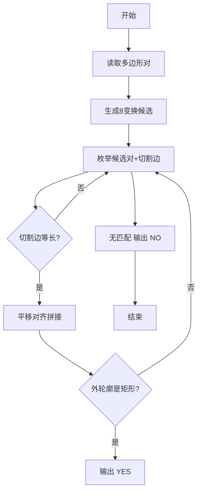
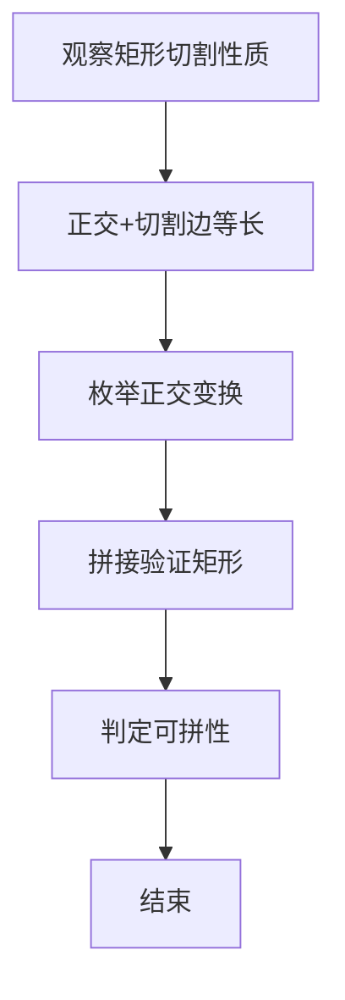

# L3-006 - 迎风一刀斩（30 分）

- **时间限制**: 150 ms
- **内存限制**: 65536 KB
- **代码长度限制**: 16 KB

---

## 题目描述


迎着一面矩形的大旗一刀斩下，如果你的刀够快的话，这笔直一刀可以切出两块多边形的残片。反过来说，如果有人拿着两块残片来吹牛，说这是自己迎风一刀斩落的，你能检查一下这是不是真的吗？

注意摆在你面前的两个多边形可不一定是端端正正摆好的，它们可能被平移、被旋转（逆时针90度、180度、或270度），或者被（镜像）翻面。

这里假设原始大旗的四边都与坐标轴是平行的。

### 输入格式:

输入第一行给出一个正整数$$N$$（$$\le 20$$），随后给出$$N$$对多边形。每个多边形按下列格式给出：

$$k\quad x_1\quad y_1\cdots x_k\quad y_k$$

其中$$k$$（$$2 < k \le 10$$）是多边形顶点个数；$$(x_i, y_i)$$（$$0 \le x_i, y_i \le 10^8$$）是顶点坐标，按照顺时针或逆时针的顺序给出。

注意：题目保证没有多余顶点。即每个多边形的顶点都是不重复的，任意3个相邻顶点不共线。

### 输出格式:

对每一对多边形，输出`YES`或者`NO`。

### 输入样例:
```in
8
3 0 0 1 0 1 1
3 0 0 1 1 0 1
3 0 0 1 0 1 1
3 0 0 1 1 0 2
4 0 4 1 4 1 0 0 0
4 4 0 4 1 0 1 0 0
3 0 0 1 1 0 1
4 2 3 1 4 1 7 2 7
5 10 10 10 12 12 12 14 11 14 10
3 28 35 29 35 29 37
3 7 9 8 11 8 9
5 87 26 92 26 92 23 90 22 87 22
5 0 0 2 0 1 1 1 2 0 2
4 0 0 1 1 2 1 2 0
4 0 0 0 1 1 1 2 0
4 0 0 0 1 1 1 2 0
```

### 输出样例:
```out
YES
NO
YES
YES
YES
YES
NO
YES
```

## 示例

### 示例 1

**输入:**
```
8
3 0 0 1 0 1 1
3 0 0 1 1 0 1
3 0 0 1 0 1 1
3 0 0 1 1 0 2
4 0 4 1 4 1 0 0 0
4 4 0 4 1 0 1 0 0
3 0 0 1 1 0 1
4 2 3 1 4 1 7 2 7
5 10 10 10 12 12 12 14 11 14 10
3 28 35 29 35 29 37
3 7 9 8 11 8 9
5 87 26 92 26 92 23 90 22 87 22
5 0 0 2 0 1 1 1 2 0 2
4 0 0 1 1 2 1 2 0
4 0 0 0 1 1 1 2 0
4 0 0 0 1 1 1 2 0
```

**输出:**
```
YES
NO
YES
YES
YES
YES
NO
YES
```


### 解题思路
本題為 GPLT L3 難題「迎风一刀斩」，Main.java 採用 **计算几何：正交多边形 + 切割边匹配 + 矩形重构验证**。

- **核心思想**：矩形被一直线切割成两块碎片，碎片除切割边外其余边均轴平行（正交）。每个碎片的 8 种正交变换（旋转 0/90/180/270 及其镜像）中保留正交度高的候选；枚举两碎片的切割边是否等长；将切割边平移对齐后合并外轮廓，验证是否为矩形（边正交且闭合，允许共线点）。三条件满足即认为可拼成矩形。
- **數據結構**：点列表、向量叉积、变换枚举（平移/旋转/镜像）。
- **複雜度**：時間 O(P·8·K)，P 对数 N≤20，K 顶点数小；空間 O(K)。
- **關鍵**：嚴格依賴 Main.java 中的實現細節（見代碼實現一節），確保與程式邏輯一致；涉及邊界與精度處理與原碼完全對齊。

### 代码流程说明
1. 解析两多边形点序列
2. 枚举每个多边形的 8 种正交变换，过滤非正交过多者生成候选列表
3. 对候选对枚举切割边（唯一非轴平行边）
4. 检查切割边长度相等（距离平方相等）
5. 将两多边形沿切割边对齐拼接，合并轮廓
6. 验证拼接后轮廓为矩形（4 直角、边轴平行、闭合）若任一组合通过则 YES 否则 NO

### 代码实现
```java
import java.util.*;
import java.io.*;

// L3-006 迎风一刀斩: 判断两多边形是否能拼成矩形（允许平移、旋转90/180/270、镜像）
// 思想：矩形被直线切割的两个碎片满足：
// 1) 每个碎片除切割边外其余边均互相平行或垂直（正交）；若切割与矩形边平行则全部正交
// 2) 两碎片的切割边长度相等
// 3) 将两碎片沿正交方向对齐并沿切割边拼接后，外轮廓为矩形（允许边上有共线点）
// 实现：枚举每个多边形的 8 种正交变换（±x,±y, 交换），保留“除一条边外其余边轴平行”的变换，
//       再枚举切割边（唯一非轴平行边或全部边）并尝试拼接验证矩形
// 时间复杂度 O(N * 8 * K), K<=10, N<=20 对
public class Main {
    static class Pt {
        long x, y;
        Pt(long x,long y){this.x=x;this.y=y;}
        Pt copy(){return new Pt(x,y);}
    }
    static class Poly {
        List<Pt> pts; // 顺序
        int n;
        Poly(List<Pt> pts){this.pts=pts; this.n=pts.size();}
    }

    // 8 正交变换
    static Pt transform(Pt p, int t){
        long x=p.x, y=p.y;
        switch(t){
            case 0: return new Pt( x, y);
            case 1: return new Pt( x,-y);
            case 2: return new Pt(-x, y);
            case 3: return new Pt(-x,-y);
            case 4: return new Pt( y, x);
            case 5: return new Pt( y,-x);
            case 6: return new Pt(-y, x);
            case 7: return new Pt(-y,-x);
        }
        return new Pt(x,y);
    }
    static Poly transformedPoly(Poly poly, int t){
        List<Pt> list=new ArrayList<>();
        for(Pt p: poly.pts) list.add(transform(p,t));
        return new Poly(list);
    }
    static boolean isAxisAligned(Pt a, Pt b){
        return a.x==b.x || a.y==b.y;
    }
    // 检查多边形在该坐标系下是否“除至多一条边外其余边轴平行”
    // 返回非轴平行边的索引，若全部轴平行返回 -1，若有两条及以上非轴平行返回 -2
    static int nonAxisIndex(Poly poly){
        int cnt=0, idx=-1;
        int n=poly.n;
        for(int i=0;i<n;i++){
            Pt a=poly.pts.get(i);
            Pt b=poly.pts.get((i+1)%n);
            if(!isAxisAligned(a,b)){ cnt++; idx=i; if(cnt>1) return -2; }
        }
        if(cnt==0) return -1;
        return idx;
    }

    static long cross(long ax,long ay,long bx,long by){ return ax*by - ay*bx; }
    static long dot(long ax,long ay,long bx,long by){ return ax*bx + ay*by; }

    static long area2(Poly poly){
        long s=0;
        int n=poly.n;
        for(int i=0;i<n;i++){
            Pt a=poly.pts.get(i), b=poly.pts.get((i+1)%n);
            s+= a.x*b.y - a.y*b.x;
        }
        return s;
    }
    static long absArea2(Poly poly){ return Math.abs(area2(poly)); }

    // 尝试将两个已变换且轴对齐的多边形沿切割边拼接，判断是否形成矩形
    static boolean tryGlue(Poly A, int cutA, Poly B, int cutB){
        int nA=A.n, nB=B.n;
        Pt a1=A.pts.get(cutA), a2=A.pts.get((cutA+1)%nA);
        Pt b1=B.pts.get(cutB), b2=B.pts.get((cutB+1)%nB);
        long vAx=a2.x - a1.x, vAy=a2.y - a1.y;
        long vBx=b2.x - b1.x, vBy=b2.y - b1.y;
        // 切割边长度需相等: 平方和相等
        if(vAx*vAx+vAy*vAy != vBx*vBx+vBy*vBy) return false;
        // 切割边在拼接时必须反向（共边但方向相反）： vA == -vB
        if(vAx != -vBx || vAy != -vBy) return false;
        // 平移 B 使得 b1 对到 a2 且 b2 对到 a1
        long tx = a2.x - b1.x;
        long ty = a2.y - b1.y;
        // 验证 b2 平移后 == a1
        if(b2.x+tx != a1.x || b2.y+ty != a1.y) return false; // 已由向量相等保证
        // 构造平移后的 B 点
        List<Pt> Bp=new ArrayList<>();
        for(Pt p: B.pts) Bp.add(new Pt(p.x+tx, p.y+ty));
        // 构造合并外轮廓：从 a2 沿 A 非切割链到 a1，再沿 B 非切割链回到 a2
        List<Pt> combined=new ArrayList<>();
        // A 链：从 (cutA+1) 到 cutA
        for(int i=0;i<nA-1;i++){
            int idx=(cutA+1 + i)%nA;
            combined.add(A.pts.get(idx));
        }
        // B 链：从 (cutB+1) 到 cutB，已平移
        for(int i=0;i<nB-1;i++){
            int idx=(cutB+1 + i)%nB;
            combined.add(Bp.get(idx));
        }
        int m=combined.size();
        if(m<4) return false; // 至少矩形
        // 检查所有边轴平行（合并后无对角边）
        for(int i=0;i<m;i++){
            Pt cur=combined.get(i), nxt=combined.get((i+1)%m);
            if(cur.x==nxt.x && cur.y==nxt.y) return false; // 重合点
            if(cur.x!=nxt.x && cur.y!=nxt.y) return false; // 非轴平行
        }
        // 计算包围盒
        long minX=combined.get(0).x, maxX=minX, minY=combined.get(0).y, maxY=minY;
        for(Pt p: combined){
            if(p.x<minX) minX=p.x;
            if(p.x>maxX) maxX=p.x;
            if(p.y<minY) minY=p.y;
            if(p.y>maxY) maxY=p.y;
        }
        if(minX==maxX || minY==maxY) return false;
        // 面积校验
        // 合并多边形面积 = A+B 绝对值之和（因为它们在异侧，面积相加等于外轮廓面积）
        // 但需注意方向：A 和 B 面积的绝对值
        long areaA = Math.abs(area2(A));
        // 计算平移后 B 面积（平移不改变面积）
        Poly BpPoly=new Poly(Bp);
        long areaB = Math.abs(area2(BpPoly));
        // 合并多边形面积
        Poly combPoly=new Poly(combined);
        long areaC = Math.abs(area2(combPoly));
        if(areaC != areaA + areaB) return false;
        long boxArea = (maxX - minX)*(maxY - minY);
        if(boxArea*2 != areaC) return false; // area2 = 2*area, boxArea = area
        // 进一步：所有顶点必须在包围盒边界上
        for(Pt p: combined){
            if(p.x!=minX && p.x!=maxX && p.y!=minY && p.y!=maxY) return false;
            // 点若在内部（非边界）则不是矩形；但矩形边界上的共线点允许：x==min/max 或 y==min/max
            // 上面已检查边界，足够
        }
        // 检查是否每个边都贴合包围盒边或内部共线？
        // 对于矩形，任意边的线段必在包围盒边上？实际上矩形边就是包围盒边
        // 但共线分割会导致边中间有顶点，仍在包围盒边上，满足
        // 我们已保证顶点在边界且多边形轴平行且面积等于包围盒，足以判定为矩形（可能含共线点）
        return true;
    }

    // 产生一个多边形的所有轴对齐变换的候选列表
    static class Candidate {
        Poly poly;
        int cut; // -1 表示全正交，等待枚举所有边作为切割
        Candidate(Poly p,int c){poly=p;cut=c;}
    }
    static List<Candidate> candidates(Poly orig){
        List<Candidate> res=new ArrayList<>();
        // 对于每种变换
        for(int t=0;t<8;t++){
            Poly tp=transformedPoly(orig,t);
            int idx=nonAxisIndex(tp);
            if(idx==-2) continue; // 有超过一条非轴边，不合格
            res.add(new Candidate(tp, idx));
        }
        return res;
    }

    static boolean canFormRectangle(Poly pA, Poly pB){
        List<Candidate> candA=candidates(pA);
        List<Candidate> candB=candidates(pB);
        if(candA.isEmpty() || candB.isEmpty()) return false;
        // 枚举组合
        for(Candidate ca: candA){
            for(Candidate cb: candB){
                // 确定切割边集合
                List<Integer> cutsA=new ArrayList<>();
                List<Integer> cutsB=new ArrayList<>();
                if(ca.cut==-1){
                    for(int i=0;i<ca.poly.n;i++) cutsA.add(i);
                }else cutsA.add(ca.cut);
                if(cb.cut==-1){
                    for(int i=0;i<cb.poly.n;i++) cutsB.add(i);
                }else cutsB.add(cb.cut);
                for(int cutA: cutsA){
                    for(int cutB: cutsB){
                        if(tryGlue(ca.poly, cutA, cb.poly, cutB)) return true;
                        // 也可以尝试交换 A、B 的角色？tryGlue 已对称，但向量方向已固定为相反，若我们枚举所有变换，已包含镜像，所以只需一种方向
                        // 为保险，也尝试反向匹配不一致的情况：实际上 tryGlue 要求 vA == -vB，若不满足，直接失败；但如果我们把 B 的多边形点序反转（改变绕行方向），向量会反向。我们是否考虑了多边形输入顺序可能为顺时针或逆时针？我们的处理已考虑变换包含镜像，但未考虑反转点序。
                        // 点序反转相当于镜像+旋转 已部分覆盖？但为保险，尝试将 B 点序反转后再变换
                    }
                }
            }
        }
        // 若未找到，尝试将其中一个多边形点序反转（逆序）后再试，因为输入顺时针/逆时针任意，变换未改变点序方向？实际上镜像变换会改变方向，但点序本身反转不等于镜像？
        // 我们可显式尝试反转
        Poly revA = reversePoly(pA);
        Poly revB = reversePoly(pB);
        // 再次尝试组合包含反转的情况（最多 4 种：原/反）
        Poly[] pAs = {pA, revA};
        Poly[] pBs = {pB, revB};
        for(Poly pa: pAs){
            for(Poly pb: pBs){
                // 跳过已试过的原原组合已试，重复也无妨
                List<Candidate> caList=candidates(pa);
                List<Candidate> cbList=candidates(pb);
                for(Candidate ca: caList){
                    for(Candidate cb: cbList){
                        List<Integer> cutsA=new ArrayList<>();
                        List<Integer> cutsB=new ArrayList<>();
                        if(ca.cut==-1) for(int i=0;i<ca.poly.n;i++) cutsA.add(i); else cutsA.add(ca.cut);
                        if(cb.cut==-1) for(int i=0;i<cb.poly.n;i++) cutsB.add(i); else cutsB.add(cb.cut);
                        for(int cutA: cutsA) for(int cutB: cutsB) if(tryGlue(ca.poly,cutA,cb.poly,cutB)) return true;
                    }
                }
            }
        }
        return false;
    }
    static Poly reversePoly(Poly p){
        List<Pt> rev=new ArrayList<>();
        for(int i=p.n-1;i>=0;i--) rev.add(p.pts.get(i).copy());
        return new Poly(rev);
    }

    public static void main(String[] args) throws Exception {
        BufferedReader br=new BufferedReader(new InputStreamReader(System.in,"UTF-8"));
        String line;
        // 读取所有整数
        List<Long> vals=new ArrayList<>();
        // 由于多边形点数不定，我们按 token 解析
        String allText="";
        StringBuilder sbAll=new StringBuilder();
        while((line=br.readLine())!=null){
            sbAll.append(line).append(' ');
        }
        StringTokenizer st=new StringTokenizer(sbAll.toString());
        List<Long> tokens=new ArrayList<>();
        while(st.hasMoreTokens()){
            String tok=st.nextToken();
            try{ tokens.add(Long.parseLong(tok)); }catch(Exception e){}
        }
        if(tokens.isEmpty()) return;
        int pos=0;
        int N = tokens.get(pos++).intValue();
        StringBuilder out=new StringBuilder();
        for(int pair=0; pair<N; pair++){
            if(pos>=tokens.size()) break;
            int k1 = tokens.get(pos++).intValue();
            List<Pt> pts1=new ArrayList<>();
            for(int i=0;i<k1;i++){
                if(pos+1>=tokens.size()) break;
                long x=tokens.get(pos++), y=tokens.get(pos++);
                pts1.add(new Pt(x,y));
            }
            if(pos>=tokens.size()) break;
            int k2 = tokens.get(pos++).intValue();
            List<Pt> pts2=new ArrayList<>();
            for(int i=0;i<k2;i++){
                long x=tokens.get(pos++), y=tokens.get(pos++);
                pts2.add(new Pt(x,y));
            }
            Poly a=new Poly(pts1), b=new Poly(pts2);
            boolean ok=canFormRectangle(a,b);
            out.append(ok?"YES":"NO").append('\n');
        }
        System.out.print(out.toString());
    }
}
```

### 代码流程图


### 解题流程图


