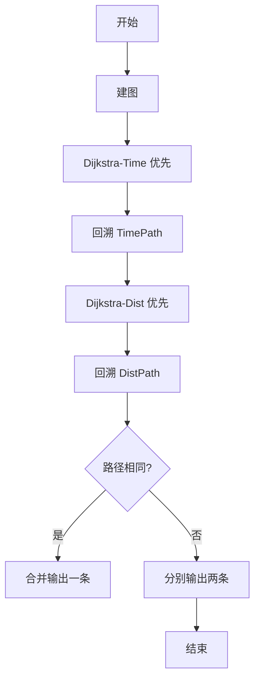
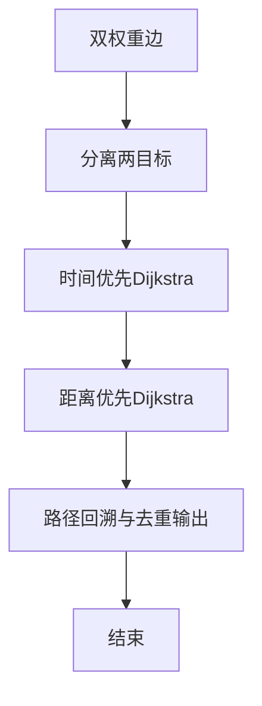

# L3-007 - 天梯地图（30 分）

- **时间限制**: 300 ms
- **内存限制**: 65536 KB
- **代码长度限制**: 16 KB

---

## 题目描述


本题要求你实现一个天梯赛专属在线地图，队员输入自己学校所在地和赛场地点后，该地图应该推荐两条路线：一条是最快到达路线；一条是最短距离的路线。题目保证对任意的查询请求，地图上都至少存在一条可达路线。

### 输入格式:

输入在第一行给出两个正整数`N`（2 $$\le$$ `N` $$\le$$ 500）和`M`，分别为地图中所有标记地点的个数和连接地点的道路条数。随后`M`行，每行按如下格式给出一条道路的信息：

```
V1 V2 one-way length time
```

其中`V1`和`V2`是道路的两个端点的编号（从0到`N`-1）；如果该道路是从`V1`到`V2`的单行线，则`one-way`为1，否则为0；`length`是道路的长度；`time`是通过该路所需要的时间。最后给出一对起点和终点的编号。

### 输出格式:

首先按下列格式输出最快到达的时间`T`和用节点编号表示的路线：

```
Time = T: 起点 => 节点1 => ... => 终点
```

然后在下一行按下列格式输出最短距离`D`和用节点编号表示的路线：

```
Distance = D: 起点 => 节点1 => ... => 终点
```

如果最快到达路线不唯一，则输出几条最快路线中最短的那条，题目保证这条路线是唯一的。而如果最短距离的路线不唯一，则输出途径节点数最少的那条，题目保证这条路线是唯一的。

如果这两条路线是完全一样的，则按下列格式输出：

```
Time = T; Distance = D: 起点 => 节点1 => ... => 终点
```

### 输入样例 1：
```in
10 15
0 1 0 1 1
8 0 0 1 1
4 8 1 1 1
5 4 0 2 3
5 9 1 1 4
0 6 0 1 1
7 3 1 1 2
8 3 1 1 2
2 5 0 2 2
2 1 1 1 1
1 5 0 1 3
1 4 0 1 1
9 7 1 1 3
3 1 0 2 5
6 3 1 2 1
5 3
```

### 输出样例 1：
```out
Time = 6: 5 => 4 => 8 => 3
Distance = 3: 5 => 1 => 3
```

### 输入样例 2：
```in
7 9
0 4 1 1 1
1 6 1 3 1
2 6 1 1 1
2 5 1 2 2
3 0 0 1 1
3 1 1 3 1
3 2 1 2 1
4 5 0 2 2
6 5 1 2 1
3 5
```

### 输出样例 2：
```out
Time = 3; Distance = 4: 3 => 2 => 5
```

## 示例

### 示例 1

**输入:**
```
10 15
0 1 0 1 1
8 0 0 1 1
4 8 1 1 1
5 4 0 2 3
5 9 1 1 4
0 6 0 1 1
7 3 1 1 2
8 3 1 1 2
2 5 0 2 2
2 1 1 1 1
1 5 0 1 3
1 4 0 1 1
9 7 1 1 3
3 1 0 2 5
6 3 1 2 1
5 3
```

**输出:**
```
Time = 6: 5 => 4 => 8 => 3
Distance = 3: 5 => 1 => 3
```

### 示例 2

**输入:**
```
7 9
0 4 1 1 1
1 6 1 3 1
2 6 1 1 1
2 5 1 2 2
3 0 0 1 1
3 1 1 3 1
3 2 1 2 1
4 5 0 2 2
6 5 1 2 1
3 5
```

**输出:**
```
Time = 3; Distance = 4: 3 => 2 => 5
```


### 解题思路
本題為 GPLT L3 難題「天梯地图」，Main.java 採用 **双准则最短路：两次 Dijkstra（时间优先、距离优先）**。

- **核心思想**：每条边有长度 len 与时间 time。最快路径以 time 为主、dist 为次进行 Dijkstra；最短路径以 dist 为主、节点数最少为次进行 Dijkstra。两次均记录前驱，分别回溯还原路径。当两路径完全相同时按题目合并输出。
- **數據結構**：邻接表、双优先队列、路径前缀记录与回溯。
- **複雜度**：時間 O((N+M) log N) 两次；空間 O(N+M)。
- **關鍵**：嚴格依賴 Main.java 中的實現細節（見代碼實現一節），確保與程式邏輯一致；涉及邊界與精度處理與原碼完全對齊。

### 代码流程说明
1. 建图存储 len 与 time
2. 第一次 Dijkstra：按 (time, dist) 字典序求最快路径及距离次优
3. 回溯最快路径 predecessor 得到 TimePath
4. 第二次 Dijkstra：按 (dist, 节点数) 求最短路径
5. 回溯得到 DistPath
6. 比较两路径是否相同，按格式分别输出时间与距离及路径节点序列

### 代码实现
```java
import java.util.*;
import java.io.*;

// L3-007 天梯地图: 双准则最短路
// 时间最优（次短距离）与距离最优（次少节点）两遍 Dijkstra
// 时间复杂度 O((N+M) log N)
public class Main {
    static class Edge {
        int to, len, time;
        Edge(int to,int len,int time){this.to=to;this.len=len;this.time=time;}
    }
    static class StateTime implements Comparable<StateTime>{
        int u; int t; int d;
        StateTime(int u,int t,int d){this.u=u;this.t=t;this.d=d;}
        public int compareTo(StateTime o){
            if(t!=o.t) return Integer.compare(t,o.t);
            return Integer.compare(d,o.d);
        }
    }
    static class StateDist implements Comparable<StateDist>{
        int u; int d; int cnt;
        StateDist(int u,int d,int cnt){this.u=u;this.d=d;this.cnt=cnt;}
        public int compareTo(StateDist o){
            if(d!=o.d) return Integer.compare(d,o.d);
            return Integer.compare(cnt,o.cnt);
        }
    }

    public static void main(String[] args) throws Exception {
        BufferedReader br=new BufferedReader(new InputStreamReader(System.in,"UTF-8"));
        String line;
        // 读取所有整数及图
        List<Integer> nums=new ArrayList<>();
        // 需要保留图结构，先按行解析
        List<String> lines=new ArrayList<>();
        while((line=br.readLine())!=null){
            if(line.trim().isEmpty()) continue;
            lines.add(line);
        }
        if(lines.isEmpty()) return;
        // 第一行 N M
        StringTokenizer st=new StringTokenizer(lines.get(0));
        int N=Integer.parseInt(st.nextToken());
        int M=Integer.parseInt(st.nextToken());
        List<Edge>[] adj=new ArrayList[N];
        for(int i=0;i<N;i++) adj[i]=new ArrayList<>();
        int idx=1;
        for(int i=0;i<M;i++){
            if(idx>=lines.size()) break;
            st=new StringTokenizer(lines.get(idx++));
            // 可能一行被拆开，但按题目每边一行完整
            while(st.countTokens()<4 && idx<lines.size()){
                // 合并下一行（容错）
                String extra=lines.get(idx++);
                lines.set(idx-1, lines.get(idx-1)+" "+extra);
                st=new StringTokenizer(lines.get(idx-1));
            }
            int v1=Integer.parseInt(st.nextToken());
            int v2=Integer.parseInt(st.nextToken());
            int one=Integer.parseInt(st.nextToken());
            int len=Integer.parseInt(st.nextToken());
            int tim=Integer.parseInt(st.nextToken());
            adj[v1].add(new Edge(v2,len,tim));
            if(one==0) adj[v2].add(new Edge(v1,len,tim));
        }
        int S=0,D=0;
        if(idx<lines.size()){
            st=new StringTokenizer(lines.get(idx));
            if(st.countTokens()>=2){
                S=Integer.parseInt(st.nextToken());
                D=Integer.parseInt(st.nextToken());
            } else if(st.countTokens()==1){
                S=Integer.parseInt(st.nextToken());
                if(idx+1<lines.size()){
                    st=new StringTokenizer(lines.get(idx+1));
                    D=Integer.parseInt(st.nextToken());
                }
            }
        }
        // Dijkstra for Time
        final int INF=Integer.MAX_VALUE/4;
        int[] distT=new int[N], distLenT=new int[N], preT=new int[N];
        Arrays.fill(distT, INF); Arrays.fill(distLenT, INF); Arrays.fill(preT, -1);
        distT[S]=0; distLenT[S]=0;
        PriorityQueue<StateTime> pqT=new PriorityQueue<>();
        pqT.offer(new StateTime(S,0,0));
        boolean[] vis=new boolean[N];
        while(!pqT.isEmpty()){
            StateTime cur=pqT.poll();
            int u=cur.u;
            if(cur.t!=distT[u] || cur.d!=distLenT[u]) continue;
            for(Edge e: adj[u]){
                int v=e.to;
                int nt=cur.t + e.time;
                int nd=cur.d + e.len;
                if(nt < distT[v] || (nt==distT[v] && nd < distLenT[v])){
                    distT[v]=nt; distLenT[v]=nd; preT[v]=u;
                    pqT.offer(new StateTime(v, nt, nd));
                }
            }
        }
        // Dijkstra for Distance
        int[] distD=new int[N], cntD=new int[N], preD=new int[N];
        Arrays.fill(distD, INF); Arrays.fill(cntD, INF); Arrays.fill(preD, -1);
        distD[S]=0; cntD[S]=1;
        PriorityQueue<StateDist> pqD=new PriorityQueue<>();
        pqD.offer(new StateDist(S,0,1));
        while(!pqD.isEmpty()){
            StateDist cur=pqD.poll();
            int u=cur.u;
            if(cur.d!=distD[u] || cur.cnt!=cntD[u]) continue;
            for(Edge e: adj[u]){
                int v=e.to;
                int nd=cur.d + e.len;
                int nc=cur.cnt + 1;
                if(nd < distD[v] || (nd==distD[v] && nc < cntD[v])){
                    distD[v]=nd; cntD[v]=nc; preD[v]=u;
                    pqD.offer(new StateDist(v, nd, nc));
                }
            }
        }
        // 重建路径
        List<Integer> pathT=buildPath(preT,S,D);
        List<Integer> pathD=buildPath(preD,S,D);
        boolean same = pathT.equals(pathD);
        if(same){
            System.out.print("Time = "+distT[D]+"; Distance = "+distD[D]+": ");
            printPath(pathT);
        }else{
            System.out.print("Time = "+distT[D]+": ");
            printPath(pathT);
            System.out.print("Distance = "+distD[D]+": ");
            printPath(pathD);
        }
    }
    static List<Integer> buildPath(int[] pre,int s,int t){
        List<Integer> p=new ArrayList<>();
        int cur=t;
        while(cur!=-1){
            p.add(cur);
            if(cur==s) break;
            cur=pre[cur];
        }
        Collections.reverse(p);
        return p;
    }
    static void printPath(List<Integer> p){
        StringBuilder sb=new StringBuilder();
        for(int i=0;i<p.size();i++){
            if(i>0) sb.append(" => ");
            sb.append(p.get(i));
        }
        System.out.println(sb.toString());
    }
}
```

### 代码流程图


### 解题流程图


