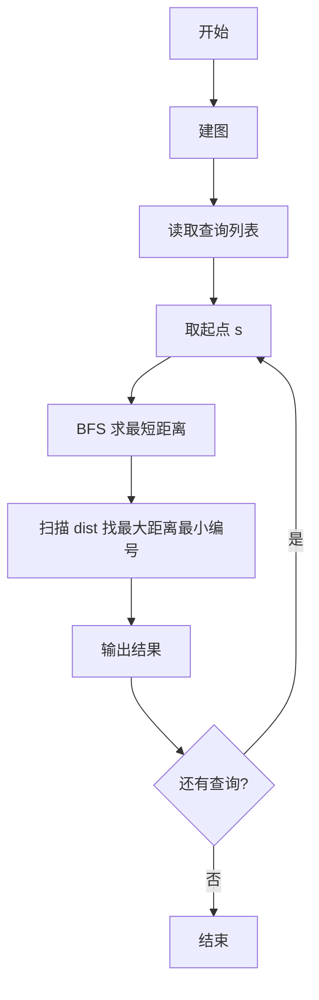
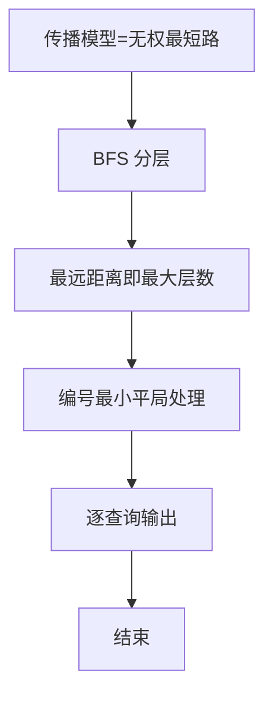

# L3-008 - 喊山（30 分）

- **时间限制**: 150 ms
- **内存限制**: 65536 KB
- **代码长度限制**: 16 KB

---

## 题目描述


喊山，是人双手围在嘴边成喇叭状，对着远方高山发出“喂—喂喂—喂喂喂……”的呼唤。呼唤声通过空气的传递，回荡于深谷之间，传送到人们耳中，发出约定俗成的“讯号”，达到声讯传递交流的目的。原来它是彝族先民用来求援呼救的“讯号”，慢慢地人们在生活实践中发现了它的实用价值，便把它作为一种交流工具世代传袭使用。（图文摘自：http://news.xrxxw.com/newsshow-8018.html）


一个山头呼喊的声音可以被临近的山头同时听到。题目假设每个山头最多有两个能听到它的临近山头。给定任意一个发出原始信号的山头，本题请你找出这个信号最远能传达到的地方。

### 输入格式:

输入第一行给出3个正整数`n`、`m`和`k`，其中`n`（$$\le$$10000）是总的山头数（于是假设每个山头从1到`n`编号）。接下来的`m`行，每行给出2个不超过`n`的正整数，数字间用空格分开，分别代表可以听到彼此的两个山头的编号。这里保证每一对山头只被输入一次，不会有重复的关系输入。最后一行给出`k`（$$\le$$10）个不超过`n`的正整数，数字间用空格分开，代表需要查询的山头的编号。

### 输出格式:

依次对于输入中的每个被查询的山头，在一行中输出其发出的呼喊能够连锁传达到的最远的那个山头。注意：被输出的首先必须是被查询的个山头能连锁传到的。若这样的山头不只一个，则输出编号最小的那个。若此山头的呼喊无法传到任何其他山头，则输出0。

### 输入样例:
```in
7 5 4
1 2
2 3
3 1
4 5
5 6
1 4 5 7
```

### 输出样例:
```out
2
6
4
0
```

## 示例

### 示例 1

**输入:**
```
7 5 4
1 2
2 3
3 1
4 5
5 6
1 4 5 7
```

**输出:**
```
2
6
4
0
```


### 解题思路
本題為 GPLT L3 難題「喊山」，Main.java 採用 **无权图 BFS 求最远可达点（按距离最远、编号最小）**。

- **核心思想**：每个询问从起点 s 出发 BFS 分层扩展，所有边权为 1，首达距离即最短路。记录最大距离层中编号最小的节点即为喊声最远传播点；若无可达点（孤立）则输出 0。利用 BFS 天然按层扩展保证第一次到达即最短。
- **數據結構**：邻接表、队列、BFS 距离数组。
- **複雜度**：時間 O(K·(N+M))，N≤1e4 K≤10；空間 O(N+M)。
- **關鍵**：嚴格依賴 Main.java 中的實現細節（見代碼實現一節），確保與程式邏輯一致；涉及邊界與精度處理與原碼完全對齊。

### 代码流程说明
1. 建无向/有向邻接表（按输入）
2. 对每个查询 s：初始化距离数组 dist=-1，队列加入 s
3. BFS 层序扩展，记录最大 dist 的最小节点 best
4. 若 best 无更新（仅起点）且无邻接则输出 0，否则输出 best
5. 处理全部 K 个查询后结束

### 代码实现
```java
import java.util.*;
import java.io.*;

// L3-008 喊山: 无权图 BFS 求最远可达点，距离最远编号最小
// 时间复杂度 O(K*(N+M)), K<=10, N<=1e4
public class Main {
    public static void main(String[] args) throws Exception {
        BufferedReader br=new BufferedReader(new InputStreamReader(System.in,"UTF-8"));
        StringBuilder all=new StringBuilder();
        String line;
        while((line=br.readLine())!=null){
            all.append(line).append(' ');
        }
        StringTokenizer st=new StringTokenizer(all.toString());
        List<Integer> toks=new ArrayList<>();
        while(st.hasMoreTokens()) toks.add(Integer.parseInt(st.nextToken()));
        if(toks.size()<3) return;
        int n=toks.get(0), m=toks.get(1), k=toks.get(2);
        int idx=3;
        List<Integer>[] adj=new ArrayList[n+1];
        for(int i=1;i<=n;i++) adj[i]=new ArrayList<>();
        for(int i=0;i<m;i++){
            if(idx+1>=toks.size()) break;
            int u=toks.get(idx++), v=toks.get(idx++);
            if(u<1||u>n||v<1||v>n) continue;
            adj[u].add(v);
            adj[v].add(u);
        }
        List<Integer> queries=new ArrayList<>();
        for(int i=0;i<k && idx<toks.size();i++) queries.add(toks.get(idx++));
        StringBuilder out=new StringBuilder();
        int[] dist=new int[n+1];
        int[] q=new int[n+1];
        for(int qi=0; qi<queries.size(); qi++){
            int s=queries.get(qi);
            Arrays.fill(dist, -1);
            int head=0,tail=0;
            q[tail++]=s;
            dist[s]=0;
            while(head<tail){
                int u=q[head++];
                for(int v: adj[u]){
                    if(dist[v]==-1){
                        dist[v]=dist[u]+1;
                        q[tail++]=v;
                    }
                }
            }
            int maxD=-1, ans=0;
            for(int i=1;i<=n;i++){
                if(i==s) continue;
                if(dist[i]==-1) continue;
                if(dist[i] > maxD){
                    maxD=dist[i];
                    ans=i;
                }else if(dist[i]==maxD && i < ans){
                    ans=i;
                }
            }
            if(maxD==-1) out.append(0).append('\n');
            else out.append(ans).append('\n');
        }
        System.out.print(out.toString());
    }
}
```

### 代码流程图


### 解题流程图


