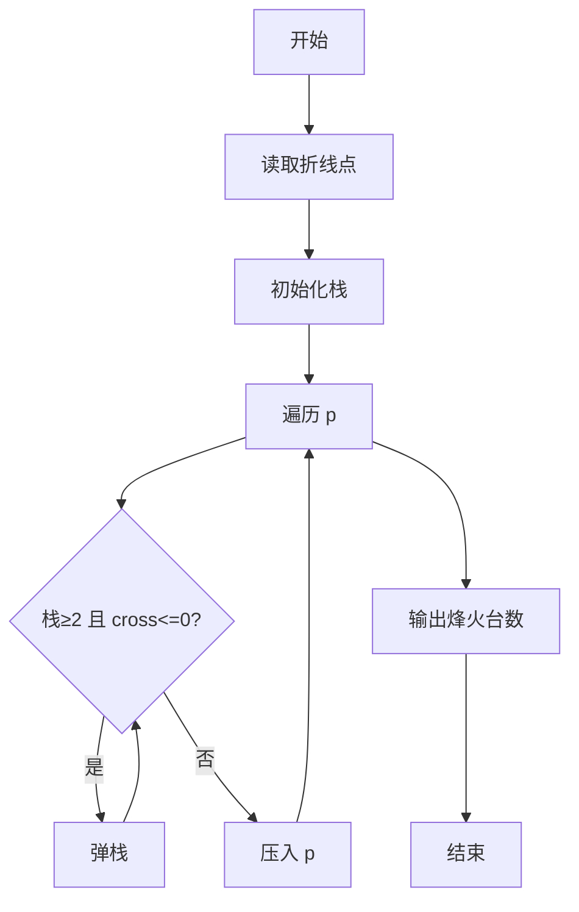
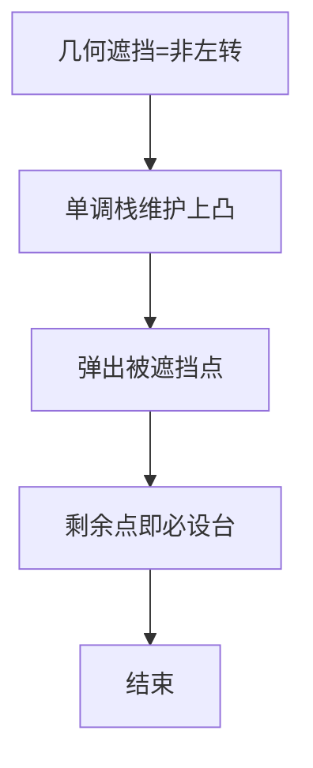

# L3-009 - 长城（30 分）

- **时间限制**: 500 ms
- **内存限制**: 65536 KB
- **代码长度限制**: 16 KB

---

## 题目描述


正如我们所知，中国古代长城的建造是为了抵御外敌入侵。在长城上，建造了许多烽火台。每个烽火台都监视着一个特定的地区范围。一旦某个地区有外敌入侵，值守在对应烽火台上的士兵就会将敌情通报给周围的烽火台，并迅速接力地传递到总部。

现在如图1所示，若水平为南北方向、垂直为海拔高度方向，假设长城就是依次相联的一系列线段，而且在此范围内的任一垂直线与这些线段有且仅有唯一的交点。


**图 1**

进一步地，假设烽火台只能建造在线段的端点处。我们认为烽火台本身是没有高度的，每个烽火台只负责向北方（图1中向左）瞭望，而且一旦有外敌入侵，只要敌人与烽火台之间未被山体遮挡，哨兵就会立即察觉。当然，按照这一军规，对于南侧的敌情各烽火台并不负责任。一旦哨兵发现敌情，他就会立即以狼烟或烽火的形式，向其南方的烽火台传递警报，直到位于最南侧的总部。

以图2中的长城为例，负责守卫的四个烽火台用蓝白圆点示意，最南侧的总部用红色圆点示意。如果红色星形标示的地方出现敌情，将被哨兵们发现并沿红色折线将警报传递到总部。当然，就这个例子而言只需两个烽火台的协作，但其他位置的敌情可能需要更多。

然而反过来，即便这里的4个烽火台全部参与，依然有不能覆盖的（黄色）区域。


**图 2**

另外，为避免歧义，我们在这里约定，与某个烽火台的视线刚好相切的区域都认为可以被该烽火台所监视。以图3中的长城为例，若A、B、C、D点均共线，且在D点设置一处烽火台，则A、B、C以及线段BC上的任何一点都在该烽火台的监视范围之内。


**图 3**

好了，倘若你是秦始皇的太尉，为不致出现更多孟姜女式的悲剧，如何在保证长城安全的前提下，使消耗的民力（建造的烽火台）最少呢？

### 输入格式:

输入在第一行给出一个正整数`N`（3 $$\le$$ `N` $$\le 10^5$$），即刻画长城边缘的折线顶点（含起点和终点）数。随后`N`行，每行给出一个顶点的`x`和`y`坐标，其间以空格分隔。注意顶点从南到北依次给出，第一个顶点为总部所在位置。坐标为区间$$[-10^9, 10^9)$$内的整数，且没有重合点。

### 输出格式:

在一行中输出所需建造烽火台（不含总部）的最少数目。

### 输入样例:
```in
10
67 32
48 -49
32 53
22 -44
19 22
11 40
10 -65
-1 -23
-3 31
-7 59
```

### 输出样例:
```out
2
```

## 示例

### 示例 1

**输入:**
```
10
67 32
48 -49
32 53
22 -44
19 22
11 40
10 -65
-1 -23
-3 31
-7 59
```

**输出:**
```
2
```


### 解题思路
本題為 GPLT L3 難題「长城」，Main.java 採用 **单调栈 / 凸包可见性维护：叉积非左转即遮挡**。

- **核心思想**：按南到北顺序扫描折线顶点，用栈维护当前可见的上凸包。若新点与栈顶两点构成 cross ≤0（非左转），则中间点被遮挡/可被移除，弹出栈顶。未弹出时栈顶为必须设烽火台的凸点，计入答案。最后栈大小即最小烽火台数。叉积判断保证 O(1) 遮挡判定。
- **數據結構**：点数组、栈。
- **複雜度**：時間 O(N)；空間 O(N)。
- **關鍵**：嚴格依賴 Main.java 中的實現細節（見代碼實現一節），確保與程式邏輯一致；涉及邊界與精度處理與原碼完全對齊。

### 代码流程说明
1. 读取 N 个点 (x,y)
2. 初始化空栈与计数 ans
3. 遍历每个点 p：while 栈≥2 且 cross(stack[-2],stack[-1],p)≤0 弹出栈顶
4. 若未弹出且栈非空则该栈顶为必设点（视题目计数方式）统计
5. 将 p 压栈
6. 遍历结束输出栈相关计数（即答案）

### 代码实现
```java
import java.io.*;
import java.util.*;

// L3-009 长城 - 最少烽火台
// 算法：维护可见栈（单调栈），按南到北扫描折线顶点。
// 若新点与栈顶两点构成非左转（cross <= 0），弹出栈顶，说明中间点被遮挡；
// 若未弹出任何点，则栈顶为必须设台的“凸点”，计入答案。
// 时间复杂度 O(N)，空间 O(N)
public class Main {
    static class Point {
        long x, y;
        Point(long x, long y) { this.x = x; this.y = y; }
    }
    static long cross(Point a, Point b, Point c) {
        // (b-a) x (c-a)
        return (b.x - a.x) * (c.y - a.y) - (b.y - a.y) * (c.x - a.x);
    }
    public static void main(String[] args) throws Exception {
        BufferedReader br = new BufferedReader(new InputStreamReader(System.in, "UTF-8"));
        String line;
        // 读取所有整数
        List<Long> vals = new ArrayList<>();
        while ((line = br.readLine()) != null) {
            line = line.trim();
            if (line.isEmpty()) continue;
            StringTokenizer st = new StringTokenizer(line);
            while (st.hasMoreTokens()) vals.add(Long.parseLong(st.nextToken()));
        }
        if (vals.isEmpty()) return;
        int n = vals.get(0).intValue();
        List<Point> pts = new ArrayList<>();
        int idx = 1;
        for (int i = 0; i < n; i++) {
            if (idx + 1 >= vals.size()) break;
            long x = vals.get(idx++);
            long y = vals.get(idx++);
            pts.add(new Point(x, y));
        }
        if (pts.size() != n) {
            // 若输入行数不足，按实际读取
            n = pts.size();
        }
        if (n <= 2) {
            System.out.println(0);
            return;
        }
        List<Point> st = new ArrayList<>();
        st.add(pts.get(0));
        st.add(pts.get(1));
        int ans = 0;
        for (int i = 2; i < n; i++) {
            Point cur = pts.get(i);
            boolean removed = false;
            while (st.size() >= 2) {
                Point a = st.get(st.size() - 2);
                Point b = st.get(st.size() - 1);
                long cr = cross(a, b, cur);
                if (cr <= 0) {
                    st.remove(st.size() - 1);
                    removed = true;
                } else break;
            }
            if (!removed) ans++;
            st.add(cur);
        }
        System.out.println(ans);
    }
}
```

### 代码流程图


### 解题流程图


