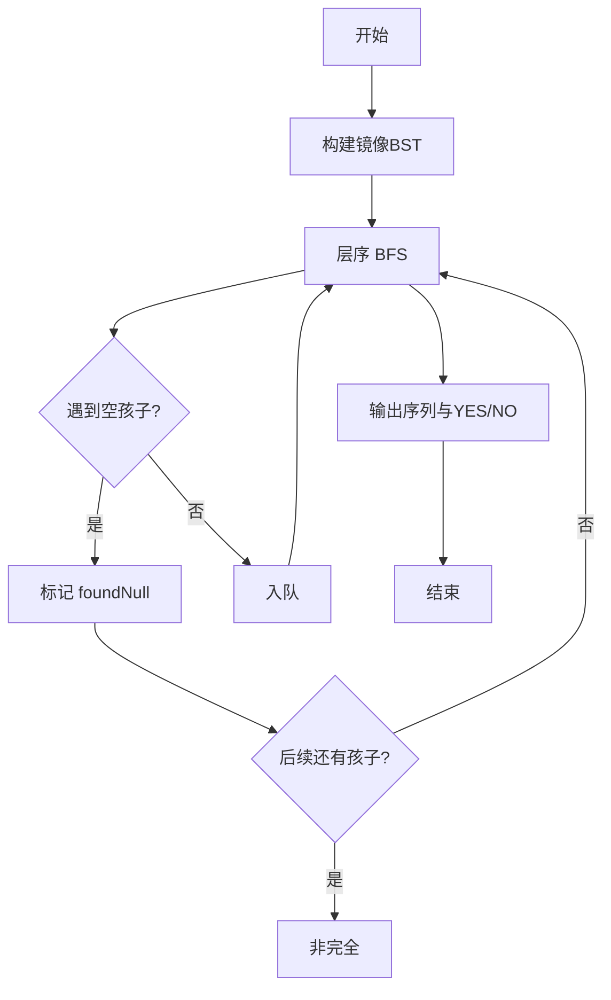
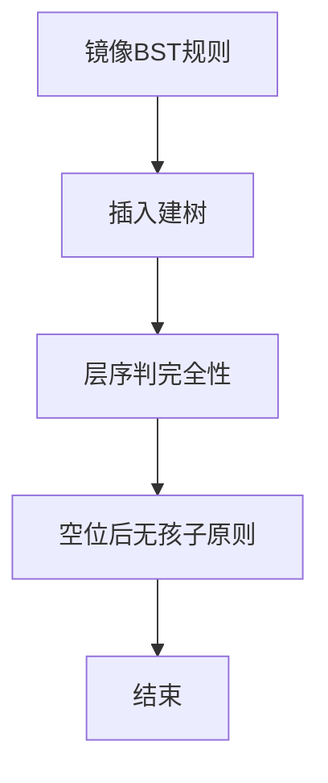

# L3-010 - 是否完全二叉搜索树（30 分）

- **时间限制**: 400 ms
- **内存限制**: 65536 KB
- **代码长度限制**: 16 KB

---

## 题目描述


将一系列给定数字顺序插入一个初始为空的二叉搜索树（定义为左子树键值大，右子树键值小），你需要判断最后的树是否一棵完全二叉树，并且给出其层序遍历的结果。

### 输入格式:

输入第一行给出一个不超过20的正整数`N`；第二行给出`N`个互不相同的正整数，其间以空格分隔。

### 输出格式:

将输入的`N`个正整数顺序插入一个初始为空的二叉搜索树。在第一行中输出结果树的层序遍历结果，数字间以1个空格分隔，行的首尾不得有多余空格。第二行输出`YES`，如果该树是完全二叉树；否则输出`NO`。

### 输入样例 1：
```in
9
38 45 42 24 58 30 67 12 51
```

### 输出样例 1：
```out
38 45 24 58 42 30 12 67 51
YES
```

### 输入样例 2：
```in
8
38 24 12 45 58 67 42 51
```

### 输出样例 2：
```out
38 45 24 58 42 12 67 51
NO
```

## 示例

### 示例 1

**输入:**
```
9
38 45 42 24 58 30 67 12 51
```

**输出:**
```
38 45 24 58 42 30 12 67 51
YES
```

### 示例 2

**输入:**
```
8
38 24 12 45 58 67 42 51
```

**输出:**
```
38 45 24 58 42 12 67 51
NO
```


### 解题思路
本題為 GPLT L3 難題「是否完全二叉搜索树」，Main.java 採用 **镜像 BST 插入 + 层序遍历判完全性**。

- **核心思想**：本题 BST 定义为左大右小（与常规相反）。按序插入构建。完全二叉树判定：层序遍历中一旦遇到空孩子，后续所有节点必须为叶子且不再出现孩子，否则非完全。按此规则遍历输出层序序列并给出 YES/NO。
- **數據結構**：二叉树节点 left/right、队列 BFS。
- **複雜度**：時間 O(N^2) 最坏插入，N≤20 可接受；空間 O(N)。
- **關鍵**：嚴格依賴 Main.java 中的實現細節（見代碼實現一節），確保與程式邏輯一致；涉及邊界與精度處理與原碼完全對齊。

### 代码流程说明
1. 读取 N 与序列
2. 按左大右小规则插入构建 BST
3. 层序遍历：队列初始 root，标记 foundNull=false
4. 弹出节点，若 left 存在：若 foundNull 则非完全；否则入队；若 left 为空则标记 foundNull
5. 同理处理 right
6. 记录层序输出并输出完全性判断

### 代码实现
```java
import java.io.*;
import java.util.*;

// L3-010 是否完全二叉搜索树
// 规则：左子树键值大，右子树键值小（与常规相反）
// 算法：按序插入构建BST，层序遍历判断完全性
// 完全性判断：BFS中一旦遇到空孩子，后续所有节点必须为叶子
// 时间复杂度 O(N^2) 最坏插入，N<=20 可接受；BFS O(N)
public class Main {
    static class Node {
        int val;
        Node left, right;
        Node(int v) { val = v; }
    }
    static Node insert(Node root, int v) {
        if (root == null) return new Node(v);
        Node cur = root;
        while (true) {
            if (v > cur.val) {
                if (cur.left == null) { cur.left = new Node(v); break; }
                else cur = cur.left;
            } else {
                if (cur.right == null) { cur.right = new Node(v); break; }
                else cur = cur.right;
            }
        }
        return root;
    }
    public static void main(String[] args) throws Exception {
        BufferedReader br = new BufferedReader(new InputStreamReader(System.in, "UTF-8"));
        String line;
        List<Integer> nums = new ArrayList<>();
        while ((line = br.readLine()) != null) {
            line = line.trim();
            if (line.isEmpty()) continue;
            StringTokenizer st = new StringTokenizer(line);
            while (st.hasMoreTokens()) nums.add(Integer.parseInt(st.nextToken()));
        }
        if (nums.isEmpty()) return;
        int n = nums.get(0);
        Node root = null;
        for (int i = 1; i <= n && i < nums.size(); i++) {
            root = insert(root, nums.get(i));
        }
        if (root == null) return;
        // 层序遍历 + 完全性判断（标准方法：遇空后不应再有非空）
        Queue<Node> q2 = new LinkedList<>();
        q2.offer(root);
        List<Integer> order = new ArrayList<>();
        boolean seenNull = false;
        boolean complete = true;
        while (!q2.isEmpty()) {
            Node cur = q2.poll();
            if (cur == null) {
                seenNull = true;
            } else {
                if (seenNull) complete = false;
                order.add(cur.val);
                q2.offer(cur.left);
                q2.offer(cur.right);
                // 提前终止：若队列中剩余全为null则结束
                boolean allNull = true;
                for (Node nn : q2) if (nn != null) { allNull = false; break; }
                if (allNull) break;
            }
        }
        // 输出层序（order已按BFS顺序加入非空节点）
        // 上面第二次BFS的order是正确的层序
        // 但我们 need to ensure order is BFS without null gaps: 实际上标准层序就是按队列顺序访问非空节点
        // 上面已按此生成
        StringBuilder sb = new StringBuilder();
        for (int i = 0; i < order.size(); i++) {
            if (i > 0) sb.append(' ');
            sb.append(order.get(i));
        }
        System.out.println(sb.toString());
        System.out.println(complete ? "YES" : "NO");
    }
}
```

### 代码流程图


### 解题流程图


