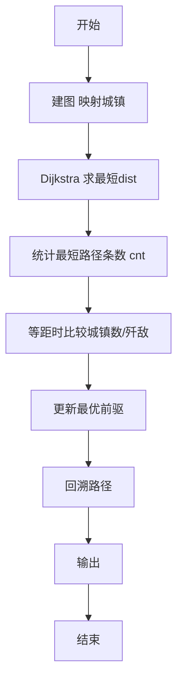
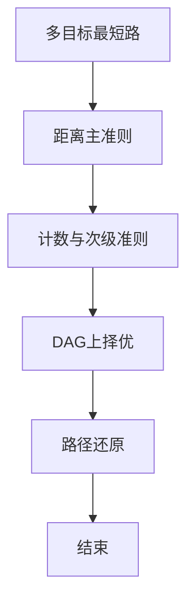

# L3-011 - 直捣黄龙（30 分）

- **时间限制**: 150 ms
- **内存限制**: 65536 KB
- **代码长度限制**: 16 KB

---

## 题目描述


本题是一部战争大片 —— 你需要从己方大本营出发，一路攻城略地杀到敌方大本营。首先时间就是生命，所以你必须选择合适的路径，以最快的速度占领敌方大本营。当这样的路径不唯一时，要求选择可以沿途解放最多城镇的路径。若这样的路径也不唯一，则选择可以有效杀伤最多敌军的路径。

### 输入格式:

输入第一行给出 2 个正整数 N（2 $$\le$$ N $$\le$$ 200，城镇总数）和 K（城镇间道路条数），以及己方大本营和敌方大本营的代号。随后 N-1 行，每行给出除了己方大本营外的一个城镇的代号和驻守的敌军数量，其间以空格分隔。再后面有 K 行，每行按格式`城镇1 城镇2 距离`给出两个城镇之间道路的长度。这里设每个城镇（包括双方大本营）的代号是由 3 个大写英文字母组成的字符串。

### 输出格式:

按照题目要求找到最合适的进攻路径（题目保证速度最快、解放最多、杀伤最强的路径是唯一的），并在第一行按照格式`己方大本营->城镇1->...->敌方大本营`输出。第二行顺序输出最快进攻路径的条数、最短进攻距离、歼敌总数，其间以 1 个空格分隔，行首尾不得有多余空格。

### 输入样例:
```in
10 12 PAT DBY
DBY 100
PTA 20
PDS 90
PMS 40
TAP 50
ATP 200
LNN 80
LAO 30
LON 70
PAT PTA 10
PAT PMS 10
PAT ATP 20
PAT LNN 10
LNN LAO 10
LAO LON 10
LON DBY 10
PMS TAP 10
TAP DBY 10
DBY PDS 10
PDS PTA 10
DBY ATP 10
```

### 输出样例:
```out
PAT->PTA->PDS->DBY
3 30 210
```

## 示例

### 示例 1

**输入:**
```
10 12 PAT DBY
DBY 100
PTA 20
PDS 90
PMS 40
TAP 50
ATP 200
LNN 80
LAO 30
LON 70
PAT PTA 10
PAT PMS 10
PAT ATP 20
PAT LNN 10
LNN LAO 10
LAO LON 10
LON DBY 10
PMS TAP 10
TAP DBY 10
DBY PDS 10
PDS PTA 10
DBY ATP 10
```

**输出:**
```
PAT->PTA->PDS->DBY
3 30 210
```


### 解题思路
本題為 GPLT L3 難題「直捣黄龙」，Main.java 採用 **多准则最短路 Dijkstra + 路径计数 + DAG 上最优选择**。

- **核心思想**：以起点到各点最短距离为主，Dijkstra 求最短路并统计最短路径条数 cnt。等距离松弛时在 DAG 上比较：经城镇数更多优先，其次歼敌更多优先，同时记录最优前驱。终点答案包括最短路条数、最大歼敌及回溯路径。
- **數據結構**：邻接表、距离/计数/歼敌/城镇数数组、前驱。
- **複雜度**：時間 O((N+M) log N)；空間 O(N+M)。
- **關鍵**：嚴格依賴 Main.java 中的實現細節（見代碼實現一節），確保與程式邏輯一致；涉及邊界與精度處理與原碼完全對齊。

### 代码流程说明
1. 映射城镇名称到编号，记录敌人数
2. 建图邻接表
3. Dijkstra：dist 最小优先，相等时更新 cnt 累加
4. 维护最佳城镇数与歼敌数及前驱
5. 结束后回溯前驱得到最优路径序列
6. 按格式输出路径、歼敌与路径条数等

### 代码实现
```java
import java.io.*;
import java.util.*;

// L3-011 直捣黄龙
// 多准则最短路：1)距离最短 2)经过城镇数最多 3)歼敌最多
// 同时统计最短距离路径条数（所有距离最短的路径数）
// 算法：Dijkstra求最短距离 + 计数 + DAG上DP求最优路径
// 时间复杂度 O(N^2) 或 O((N+M) log N)
public class Main {
    static class Edge {
        int to, w;
        Edge(int to, int w) { this.to = to; this.w = w; }
    }
    public static void main(String[] args) throws Exception {
        BufferedReader br = new BufferedReader(new InputStreamReader(System.in, "UTF-8"));
        String line;
        List<String> tokens = new ArrayList<>();
        while ((line = br.readLine()) != null) {
            line = line.trim();
            if (line.isEmpty()) continue;
            StringTokenizer st = new StringTokenizer(line);
            while (st.hasMoreTokens()) tokens.add(st.nextToken());
        }
        if (tokens.isEmpty()) return;
        int idx = 0;
        int N = Integer.parseInt(tokens.get(idx++));
        int K = Integer.parseInt(tokens.get(idx++));
        String startName = tokens.get(idx++);
        String endName = tokens.get(idx++);
        Map<String,Integer> id = new HashMap<>();
        List<String> names = new ArrayList<>();
        // 分配id
        id.put(startName, 0);
        names.add(startName);
        int[] enemy = new int[N];
        // 临时存储城镇信息，N-1行
        for (int i = 1; i < N; i++) {
            String name = tokens.get(idx++);
            int e = Integer.parseInt(tokens.get(idx++));
            id.put(name, i);
            names.add(name);
            enemy[i] = e;
        }
        enemy[0] = 0;
        // 若道路中出现未知名城镇，动态添加（防御）
        List<Edge>[] adj = new ArrayList[N];
        for (int i = 0; i < N; i++) adj[i] = new ArrayList<>();
        for (int i = 0; i < K; i++) {
            if (idx + 2 >= tokens.size()) break;
            String a = tokens.get(idx++);
            String b = tokens.get(idx++);
            int w = Integer.parseInt(tokens.get(idx++));
            Integer ia = id.get(a);
            Integer ib = id.get(b);
            if (ia == null || ib == null) {
                // 动态扩容（理论上不应出现）
                if (ia == null) { ia = names.size(); id.put(a, ia); names.add(a); enemy = Arrays.copyOf(enemy, names.size()); adj = Arrays.copyOf(adj, names.size()); adj[ia] = new ArrayList<>(); }
                if (ib == null) { ib = names.size(); id.put(b, ib); names.add(b); enemy = Arrays.copyOf(enemy, names.size()); adj = Arrays.copyOf(adj, names.size()); adj[ib] = new ArrayList<>(); }
                N = names.size();
            }
            adj[ia].add(new Edge(ib, w));
            adj[ib].add(new Edge(ia, w));
        }
        int s = id.get(startName);
        int t = id.get(endName);
        int n = names.size();
        final int INF = Integer.MAX_VALUE/4;
        int[] dist = new int[n];
        Arrays.fill(dist, INF);
        long[] cnt = new long[n]; // 最短路径条数
        dist[s] = 0;
        cnt[s] = 1;
        boolean[] vis = new boolean[n];
        // Dijkstra for distances and counting all shortest paths
        for (int iter = 0; iter < n; iter++) {
            int u = -1, best = INF;
            for (int i = 0; i < n; i++) if (!vis[i] && dist[i] < best) { best = dist[i]; u = i; }
            if (u == -1) break;
            vis[u] = true;
            for (Edge e : adj[u]) {
                int v = e.to;
                int nd = dist[u] + e.w;
                if (nd < dist[v]) {
                    dist[v] = nd;
                    cnt[v] = cnt[u];
                } else if (nd == dist[v]) {
                    cnt[v] += cnt[u];
                }
            }
        }
        // 在最短路DAG上求解放城镇最多、歼敌最多的最优路径
        int[] bestTown = new int[n];
        int[] bestKill = new int[n];
        int[] pre = new int[n];
        Arrays.fill(bestTown, -1);
        Arrays.fill(pre, -1);
        bestTown[s] = 0;
        bestKill[s] = 0;
        // 按dist升序处理节点（拓扑）
        Integer[] order = new Integer[n];
        for (int i = 0; i < n; i++) order[i] = i;
        Arrays.sort(order, Comparator.comparingInt(a -> dist[a]));
        for (int u : order) {
            if (dist[u] == INF) continue;
            if (bestTown[u] < 0) continue;
            for (Edge e : adj[u]) {
                int v = e.to;
                if (dist[u] + e.w == dist[v]) {
                    int candTown = bestTown[u] + 1;
                    int candKill = bestKill[u] + enemy[v];
                    if (candTown > bestTown[v] || (candTown == bestTown[v] && candKill > bestKill[v])) {
                        bestTown[v] = candTown;
                        bestKill[v] = candKill;
                        pre[v] = u;
                    }
                }
            }
        }
        // 重建路径
        List<Integer> path = new ArrayList<>();
        int cur = t;
        while (cur != -1) {
            path.add(cur);
            if (cur == s) break;
            cur = pre[cur];
        }
        Collections.reverse(path);
        StringBuilder sb = new StringBuilder();
        for (int i = 0; i < path.size(); i++) {
            if (i > 0) sb.append("->");
            sb.append(names.get(path.get(i)));
        }
        System.out.println(sb.toString());
        System.out.println(cnt[t] + " " + dist[t] + " " + bestKill[t]);
    }
}
```

### 代码流程图


### 解题流程图


