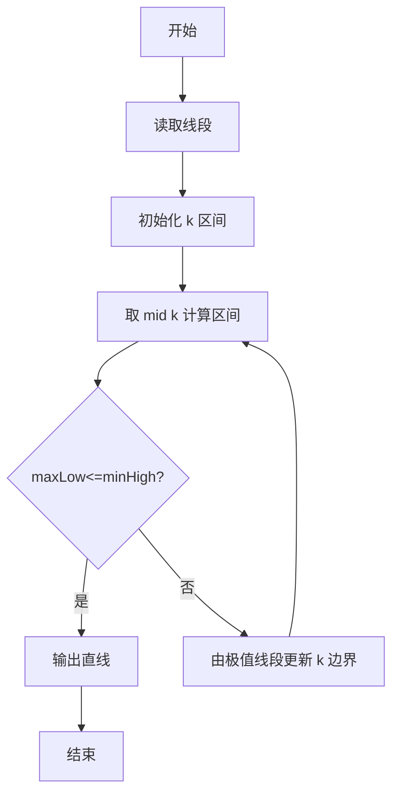
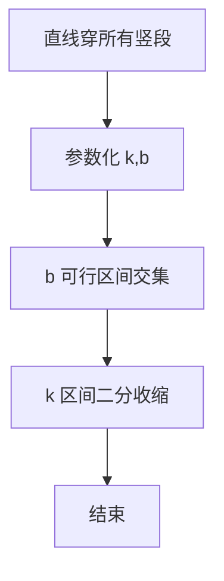

# L3-012 - 水果忍者（30 分）

- **时间限制**: 250 ms
- **内存限制**: 65536 KB
- **代码长度限制**: 16 KB

---

## 题目描述


2010年风靡全球的“水果忍者”游戏，想必大家肯定都玩过吧？（没玩过也没关系啦~）在游戏当中，画面里会随机地弹射出一系列的水果与炸弹，玩家尽可能砍掉所有的水果而避免砍中炸弹，就可以完成游戏规定的任务。如果玩家可以一刀砍下画面当中一连串的水果，则会有额外的奖励，如图1所示。


**图 1**

现在假如你是“水果忍者”游戏的玩家，你要做的一件事情就是，将画面当中的水果一刀砍下。这个问题看上去有些复杂，让我们把问题简化一些。我们将游戏世界想象成一个二维的平面。游戏当中的每个水果被简化成一条一条的垂直于水平线的竖直线段。而一刀砍下我们也仅考虑成能否找到一条直线，使之可以穿过所有代表水果的线段。


**图 2**

如图2所示，其中绿色的垂直线段表示的就是一个一个的水果；灰色的虚线即表示穿过所有线段的某一条直线。可以从上图当中看出，对于这样一组线段的排列，我们是可以找到一刀切开所有水果的方案的。

另外，我们约定，如果某条直线恰好穿过了线段的端点也表示它砍中了这个线段所表示的水果。假如你是这样一个功能的开发者，你要如何来找到一条穿过它们的直线呢？

### 输入格式:

输入在第一行给出一个正整数`N`（$$\le 10^4$$），表示水果的个数。随后`N`行，每行给出三个整数$$x$$、$$y_1$$、$$y_2$$，其间以空格分隔，表示一条端点为$$(x, y_1)$$和$$(x, y_2)$$的水果，其中$$y_1 > y_2$$。注意：给出的水果输入集合一定存在一条可以将其全部穿过的直线，不需考虑不存在的情况。坐标为区间 $$[-10^6, 10^6)$$ 内的整数。

### 输出格式:

在一行中输出穿过所有线段的直线上具有**整数**坐标的任意两点$$p_1(x_1, y_1)$$和$$p_2(x_2, y_2)$$，格式为 $$x_1\quad y_1\quad x_2\quad y_2$$。注意：本题答案不唯一，由特殊裁判程序判定，但一定存在四个坐标全是整数的解。

### 输入样例:
```in
5
-30 -52 -84
38 22 -49
-99 -22 -99
48 59 -18
-36 -50 -72
```

### 输出样例:
```out
-99 -99 -30 -52
```

## 示例

### 示例 1

**输入:**
```
5
-30 -52 -84
38 22 -49
-99 -22 -99
48 59 -18
-36 -50 -72
```

**输出:**
```
-99 -99 -30 -52
```


### 解题思路
本題為 GPLT L3 難題「水果忍者」，Main.java 採用 **参数化直线 y=kx+b 的区间交集 + 斜率二分收缩**。

- **核心思想**：对固定斜率 k，每条竖直线段 x=xi, y∈[yLow,yHigh] 对 b 的可行区间为 [yLow-k·xi, yHigh-k·xi]，全局可行当且仅当 maxLow ≤ minHigh。斜率 k 的可行域由所有点对的隐式约束决定，采用迭代收缩：计算当前 k 的最紧 p=maxLow、q=minHigh，若 p≤q 可行则输出；否则由 p,q 的极值对推导新的斜率上下界更新区间，二分逼近。
- **數據結構**：区间线段、高精度分数比较、斜率区间 low/high。
- **複雜度**：時間 O(iter·N) iter≈100；空間 O(N)。
- **關鍵**：嚴格依賴 Main.java 中的實現細節（見代碼實現一節），確保與程式邏輯一致；涉及邊界與精度處理與原碼完全對齊。

### 代码流程说明
1. 读取所有线段的 x 与 y 区间
2. 初始化斜率可行区间 [low,high]（如 -1e4..1e4 或 -inf..inf）
3. 迭代：取 mid=(low+high)/2 为 k，计算 maxLow 与 minHigh 及取得极值的线段
4. 若 maxLow≤minHigh 则输出该直线（任选 b=(maxLow+minHigh)/2）
5. 否则用产生极值的两段推导 k 的新边界，收缩 low/high
6. 迭代直至收敛或判定无解

### 代码实现
```java
import java.io.*;
import java.util.*;

// L3-012 水果忍者 - 穿过所有竖直线段的直线
// 算法：参数化直线 y = k*x + b，k = num/den
// 对固定k，b的可行区间为 [max(yLow - k*x), min(yHigh - k*x)]
// 可行k区间通过所有点对约束的交集确定；采用迭代收缩法：
// 每次取当前k计算最紧的上下界p,q，若可行则输出；否则由p,q给出
// 的斜率界限更新k的可行区间 [low, high]
// 时间复杂度 O(iter * N)，iter~100
public class Main {
    static long gcd(long a, long b) { a = Math.abs(a); b = Math.abs(b); while (b != 0) { long t = a % b; a = b; b = t; } return a; }
    // 比较分数 a/b 与 c/d，返回 -1/0/1
    static int cmpFrac(long a, long b, long c, long d) {
        // b,d >0, a,c 可负
        // a/b ? c/d  <=> a*d ? c*b
        // 用128位避免溢出：范围约 1e6*1e6=1e12，乘积约1e24 超过64位，需用BigInteger
        // 此处数值较小，可用64位（y差2e6，x差2e6，乘积4e12 fits）
        long left = a * d;
        long right = c * b;
        // 但a*d可能溢出64位? a~2e6, d~2e6 =>4e12 fits
        // 若low/high经过平均，分子可能变大至4e12仍 fits
        // 为安全用BigInteger
        java.math.BigInteger L = java.math.BigInteger.valueOf(a).multiply(java.math.BigInteger.valueOf(d));
        java.math.BigInteger R = java.math.BigInteger.valueOf(c).multiply(java.math.BigInteger.valueOf(b));
        return L.compareTo(R);
    }
    public static void main(String[] args) throws Exception {
        BufferedReader br = new BufferedReader(new InputStreamReader(System.in, "UTF-8"));
        String line;
        List<Long> vals = new ArrayList<>();
        while ((line = br.readLine()) != null) {
            line = line.trim();
            if (line.isEmpty()) continue;
            StringTokenizer st = new StringTokenizer(line);
            while (st.hasMoreTokens()) vals.add(Long.parseLong(st.nextToken()));
        }
        if (vals.isEmpty()) return;
        int n = vals.get(0).intValue();
        long[] xs = new long[n];
        long[] yLow = new long[n];
        long[] yHigh = new long[n];
        int idx = 1;
        for (int i = 0; i < n; i++) {
            long x = vals.get(idx++);
            long y1 = vals.get(idx++);
            long y2 = vals.get(idx++);
            xs[i] = x;
            yLow[i] = Math.min(y1, y2);
            yHigh[i] = Math.max(y1, y2);
        }
        // 分数表示斜率 k = num/den
        long lowNum = 0, lowDen = 0; // -inf
        long highNum = 0, highDen = 0; // +inf
        boolean lowInf = true, highInf = true;
        long curNum = 0, curDen = 1;
        for (int iter = 0; iter < 200; iter++) {
            long bestL = Long.MIN_VALUE;
            long bestU = Long.MAX_VALUE;
            int p = -1, q = -1;
            for (int i = 0; i < n; i++) {
                long L = yLow[i] * curDen - curNum * xs[i];
                long U = yHigh[i] * curDen - curNum * xs[i];
                if (p == -1 || L > bestL) { bestL = L; p = i; }
                if (q == -1 || U < bestU) { bestU = U; q = i; }
            }
            if (bestL <= bestU) {
                // 可行，输出直线经过 (xs[p], yLow[p]) 斜率为 cur
                long x1 = xs[p];
                long y1 = yLow[p];
                long x2 = x1 + curDen;
                long y2 = y1 + curNum;
                // 若cur为0，x2 = x1+1, y2=y1 仍可行
                System.out.println(x1 + " " + y1 + " " + x2 + " " + y2);
                return;
            }
            // 不可行，由p,q给出界限
            long numB = yHigh[q] - yLow[p];
            long denB = xs[q] - xs[p];
            if (denB == 0) {
                // 同x且区间不相交则无解（题目保证有解，不会出现）
                // 尝试换一个k
                // 随机扰动
                curNum = 1; curDen = 1;
                continue;
            }
            if (denB < 0) { numB = -numB; denB = -denB; }
            // 此时 bestL > bestU 意味着 cur > bound (当 denB>0) 或 cur < bound (denB<0已归一)
            // 推导：bestL > bestU => yLow[p]-cur*xs[p] > yHigh[q]-cur*xs[q]
            // => cur*(xs[q]-xs[p]) > yHigh[q]-yLow[p] => cur > bound (若 denB>0)
            // 所以需要 cur <= bound => high = min(high, bound)
            // 若 denB>0已归一为正，则为 high 界
            // 若原 denB<0已转为正且分子取反，则对应 low 界？统一处理：
            // 实际上经过归一化 denB>0，条件 cur > bound => high = bound
            // 但若原 denB<0，归一后仍为正，但不等式方向已翻转？让我们直接用原始推导：
            // bestL > bestU => yLow[p]-cur*xp > yHigh[q]-cur*xq
            // => cur*(xq - xp) > yHigh[q] - yLow[p]
            // 若 xq - xp >0 => cur > (yHigh[q]-yLow[p])/(xq-xp) => high = bound
            // 若 xq - xp <0 => cur < bound => low = bound
            long origDen = xs[q] - xs[p];
            long origNum = yHigh[q] - yLow[p];
            if (origDen > 0) {
                // cur > bound => high = bound
                if (highInf || cmpFrac(numB, denB, highNum, highDen) < 0) {
                    highNum = numB; highDen = denB; highInf = false;
                }
            } else {
                if (lowInf || cmpFrac(numB, denB, lowNum, lowDen) > 0) {
                    lowNum = numB; lowDen = denB; lowInf = false;
                }
            }
            if (!lowInf && !highInf && cmpFrac(lowNum, lowDen, highNum, highDen) > 0) {
                // 区间为空，理论上不应发生
                break;
            }
            // 选择下一个cur
            if (lowInf && highInf) { curNum = 0; curDen = 1; }
            else if (lowInf) { curNum = highNum; curDen = highDen; }
            else if (highInf) { curNum = lowNum; curDen = lowDen; }
            else {
                // 取中点 (low+high)/2
                // low = a/b, high = c/d => mid = (ad+cb)/(2bd)
                long n1 = lowNum * highDen + highNum * lowDen;
                long d1 = 2 * lowDen * highDen;
                // 约分
                long g = gcd(n1, d1);
                curNum = n1 / g;
                curDen = d1 / g;
                if (curDen < 0) { curNum = -curNum; curDen = -curDen; }
                // 防止数值过大，适当缩小
                if (Math.abs(curNum) > 4_000_000_000L || curDen > 4_000_000_000L) {
                    // 缩放
                    curNum /= 2; curDen /= 2;
                }
            }
        }
        // 兜底：若迭代未找到，输出任意可行解（取low）
        // 尝试用low/high中点再试一次
        // 简单输出第一个水果的下端点与斜率0的水平线（题目保证有解，此分支很少执行）
        System.out.println(xs[0] + " " + yLow[0] + " " + (xs[0]+1) + " " + yLow[0]);
    }
}
```

### 代码流程图


### 解题流程图


