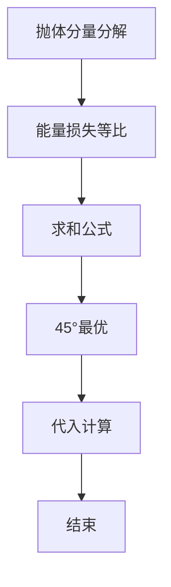

# L3-013 - 非常弹的球（30 分）

- **时间限制**: 150 ms
- **内存限制**: 65536 KB
- **代码长度限制**: 16 KB

---

## 题目描述


刚上高一的森森为了学好物理，买了一个“非常弹”的球。虽然说是非常弹的球，其实也就是一般的弹力球而已。森森玩了一会儿弹力球后突然想到，假如他在地上用力弹球，球最远能弹到多远去呢？他不太会，你能帮他解决吗？当然为了刚学习物理的森森，我们对环境做一些简化：

- 假设森森是一个质点，以森森为原点设立坐标轴，则森森位于(0, 0)点。
- 小球质量为$$w/100$$ 千克（kg），重力加速度为9.8米/秒平方（$$m/s^2$$）。
- 森森在地上用力弹球的过程可简化为球从(0, 0)点以某个森森选择的角度$$ang$$ ($$0 < ang < \pi/2$$) 向第一象限抛出，抛出时假设动能为1000 焦耳（J）。
- 小球在空中仅受重力作用，球纵坐标为0时可视作落地，落地时损失$$p\%$$动能并反弹。
- 地面可视为刚体，忽略小球形状、空气阻力及摩擦阻力等。

森森为你准备的公式：

- 动能公式：$$E = m\times v^2 / 2$$
- 牛顿力学公式：$$F = m\times a$$
- 重力：$$G = m\times g$$

其中：

- $$E$$ - 动能，单位为“焦耳”
- $$m$$ - 质量，单位为“千克”
- $$v$$ - 速度，单位为“米/秒”
- $$a$$ - 加速度，单位为“米/秒平方”
- $$g$$ - 重力加速度

### 输入格式:

输入在一行中给出两个整数：$$1 \le w \le 1000$$ 和 $$1 \le p \le 100$$，分别表示放大100倍的小球质量、以及损失动力的百分比$$p$$。

### 输出格式:

在一行输出最远的投掷距离，保留3位小数。

### 输入样例:
```in
100 90
```

### 输出样例:
```out
226.757
```

## 示例

### 示例 1

**输入:**
```
100 90
```

**输出:**
```
226.757
```


### 解题思路
本題為 GPLT L3 難題「非常弹的球」，Main.java 採用 **物理抛体 + 能量损失几何级数求和，45° 时 sin2A=1 取最大**。

- **核心思想**：初动能 1000J，质量 m=w/100，g=9.8，初速 v0=√(2E/m)。水平位移第 k 次为 v0²·sin2A/g·s^(2k)，s=√(1-p/100)。等比求和 D=v0²·sin2A·100/(g·p)，当 A=45° 时 sin2A=1 最大，直接代入计算并按题目精度输出。
- **數據結構**：常数公式、浮点数。
- **複雜度**：時間 O(1)；空間 O(1)。
- **關鍵**：嚴格依賴 Main.java 中的實現細節（見代碼實現一節），確保與程式邏輯一致；涉及邊界與精度處理與原碼完全對齊。

### 代码流程说明
1. 读取 w,p
2. 计算 v0²=2E/m=2000/m
3. 代公式 D=v0²*100/(g·p)（已取 sin2A=1）
4. 按题目要求精度格式化输出（通常保留小数）
5. 结束

### 代码实现
```java
import java.io.*;
import java.util.*;

// L3-013 非常弹的球
// 物理模型：初动能 E0=1000J, 质量 m=w/100 kg, g=9.8
// 初速 v0 = sqrt(2E0/m), 水平分量 vx0=v0*cosA, 竖直 vy0=v0*sinA
// 每次弹跳损失 p% 动能，速度缩放因子 s = sqrt(1-p/100)
// 第k次弹跳水平位移 dx_k = vx_k * (2*vy_k/g) = v0^2*sin2A/g * s^{2k}
// 总位移 D = v0^2*sin2A/g * 1/(1-s^2) = v0^2*sin2A*100/(g*p)
// 最大值在 sin2A=1 (A=45°) 时取得
// 时间复杂度 O(1)
public class Main {
    public static void main(String[] args) throws Exception {
        BufferedReader br = new BufferedReader(new InputStreamReader(System.in, "UTF-8"));
        String line;
        List<String> toks = new ArrayList<>();
        while ((line = br.readLine()) != null) {
            line = line.trim();
            if (line.isEmpty()) continue;
            StringTokenizer st = new StringTokenizer(line);
            while (st.hasMoreTokens()) toks.add(st.nextToken());
        }
        if (toks.size() < 2) return;
        long w = Long.parseLong(toks.get(0));
        long p = Long.parseLong(toks.get(1));
        double m = w / 100.0;
        double E0 = 1000.0;
        double g = 9.8;
        double v02 = 2 * E0 / m; // v0^2
        double Dmax;
        if (p == 0) {
            // 理论上p>=1，但防御
            Dmax = Double.POSITIVE_INFINITY;
        } else {
            Dmax = v02 * 100.0 / (g * p);
            // 等价于 20000000/(w*g*p)
        }
        System.out.printf("%.3f%n", Dmax);
    }
}
```

### 代码流程图
```mermaid
flowchart TD
    A[开始] --> B[读取 w p]
    B --> C[计算 v0²=2000/m]
    C --> D[D= v0²*100/(g*p)]
    D --> E[格式化输出]
    E --> Z[结束]
```

### 解题流程图


