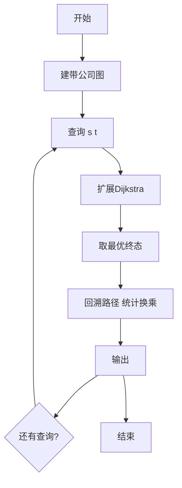
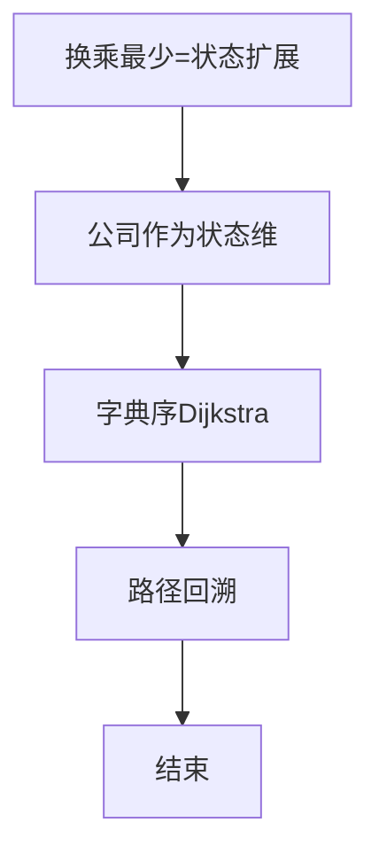

# L3-014 - 周游世界（30 分）

- **时间限制**: 200 ms
- **内存限制**: 65536 KB
- **代码长度限制**: 16 KB

---

## 题目描述


周游世界是件浪漫事，但规划旅行路线就不一定了…… 全世界有成千上万条航线、铁路线、大巴线，令人眼花缭乱。所以旅行社会选择部分运输公司组成联盟，每家公司提供一条线路，然后帮助客户规划由联盟内企业支持的旅行路线。本题就要求你帮旅行社实现一个自动规划路线的程序，使得对任何给定的起点和终点，可以找出最顺畅的路线。所谓“最顺畅”，首先是指中途经停站最少；如果经停站一样多，则取需要换乘线路次数最少的路线。

### 输入格式:

输入在第一行给出一个正整数$$N$$（$$\le 100$$），即联盟公司的数量。接下来有$$N$$行，第$$i$$行（$$i=1, \cdots , N$$）描述了第$$i$$家公司所提供的线路。格式为：

$$M$$ S[1] S[2] $$\cdots$$ S[$$M$$]

其中$$M$$（$$\le 100$$）是经停站的数量，S[$$i$$]（$$i=1, \cdots , M$$）是经停站的编号（由4位0-9的数字组成）。这里假设每条线路都是简单的一条可以双向运行的链路，并且输入保证是按照正确的经停顺序给出的 —— 也就是说，任意一对相邻的S[$$i$$]和S[$$i+1$$]（$$i=1, \cdots , M-1$$）之间都不存在其他经停站点。我们称相邻站点之间的线路为一个运营区间，每个运营区间只承包给一家公司。环线是有可能存在的，但不会不经停任何中间站点就从出发地回到出发地。当然，不同公司的线路是可能在某些站点有交叉的，这些站点就是客户的换乘点，我们假设任意换乘点涉及的不同公司的线路都不超过5条。

在描述了联盟线路之后，题目将给出一个正整数$$K$$（$$\le 10$$），随后$$K$$行，每行给出一位客户的需求，即始发地的编号和目的地的编号，中间以一空格分隔。

### 输出格式:

处理每一位客户的需求。如果没有现成的线路可以使其到达目的地，就在一行中输出“Sorry, no line is available.”；如果目的地可达，则首先在一行中输出最顺畅路线的经停站数量（始发地和目的地不包括在内），然后按下列格式给出旅行路线：

```
Go by the line of company #X1 from S1 to S2.
Go by the line of company #X2 from S2 to S3.
......
```

其中`Xi`是线路承包公司的编号，`Si`是经停站的编号。但必须只输出始发地、换乘点和目的地，不能输出中间的经停站。题目保证满足要求的路线是唯一的。

### 输入样例:
```in
4
7 1001 3212 1003 1204 1005 1306 7797
9 9988 2333 1204 2006 2005 2004 2003 2302 2001
13 3011 3812 3013 3001 1306 3003 2333 3066 3212 3008 2302 3010 3011
4 6666 8432 4011 1306
4
3011 3013
6666 2001
2004 3001
2222 6666
```

### 输出样例:
```out
2
Go by the line of company #3 from 3011 to 3013.
10
Go by the line of company #4 from 6666 to 1306.
Go by the line of company #3 from 1306 to 2302.
Go by the line of company #2 from 2302 to 2001.
6
Go by the line of company #2 from 2004 to 1204.
Go by the line of company #1 from 1204 to 1306.
Go by the line of company #3 from 1306 to 3001.
Sorry, no line is available.
```

## 示例

### 示例 1

**输入:**
```
4
7 1001 3212 1003 1204 1005 1306 7797
9 9988 2333 1204 2006 2005 2004 2003 2302 2001
13 3011 3812 3013 3001 1306 3003 2333 3066 3212 3008 2302 3010 3011
4 6666 8432 4011 1306
4
3011 3013
6666 2001
2004 3001
2222 6666
```

**输出:**
```
2
Go by the line of company #3 from 3011 to 3013.
10
Go by the line of company #4 from 6666 to 1306.
Go by the line of company #3 from 1306 to 2302.
Go by the line of company #2 from 2302 to 2001.
6
Go by the line of company #2 from 2004 to 1204.
Go by the line of company #1 from 1204 to 1306.
Go by the line of company #3 from 1306 to 3001.
Sorry, no line is available.
```


### 解题思路
本題為 GPLT L3 難題「周游世界」，Main.java 採用 **扩展图 Dijkstra：主权重边数最少，次权重换乘最少**。

- **核心思想**：每条边属于某公司线路。状态扩展为 (站点, 上一条公司)，走一条边 costEdges+1，若公司不同则 costTransfers+1。Dijkstra 字典序比较 (edges, transfers)。终点取所有 lastCompany 中最优者，回溯前驱还原路径及换乘点。
- **數據結構**：带公司标签的邻接表、状态 (node,lastCompany) 距离。
- **複雜度**：時間 O(K·(V+E) log V)；空間 O(V+E)。
- **關鍵**：嚴格依賴 Main.java 中的實現細節（見代碼實現一節），確保與程式邏輯一致；涉及邊界與精度處理與原碼完全對齊。

### 代码流程说明
1. 解析多条线路，建带 company 的邻接表
2. 对每次查询 s→t：在扩展状态上 Dijkstra
3. 优先队列按 (边数, 换乘) 弹出并松弛
4. 记录前驱与使用公司
5. 到达 t 时选择最优状态回溯路径，统计换乘并按格式输出站点序列
6. 无通路则输出相应提示

### 代码实现
```java
import java.util.*;

// L3-014 周游世界
// 多公司线路的换乘最优路径：先经停站最少（边数最少），再换乘最少
// 算法：对每个查询在扩展图（站点, 上一条线路公司）上 Dijkstra，
// 主权重为边数，次权重为换乘次数
// 时间复杂度 O(K * (V+E) log V)
public class Main {
    static class Edge {
        int to, company;
        Edge(int to, int company) { this.to = to; this.company = company; }
    }
    static class State implements Comparable<State> {
        int node, lastCompany, edges, transfers;
        State(int node, int lastCompany, int edges, int transfers) {
            this.node = node; this.lastCompany = lastCompany; this.edges = edges; this.transfers = transfers;
        }
        public int compareTo(State o) {
            if (edges != o.edges) return Integer.compare(edges, o.edges);
            return Integer.compare(transfers, o.transfers);
        }
    }
    public static void main(String[] args) {
        Scanner sc = new Scanner(System.in);
        if (!sc.hasNextInt()) return;
        int N = sc.nextInt();
        Map<Integer,Integer> stationToIdx = new HashMap<>();
        List<Integer> idxToStation = new ArrayList<>();
        List<List<Edge>> adj = new ArrayList<>();
        for (int i = 1; i <= N; i++) {
            int M = sc.nextInt();
            int[] sts = new int[M];
            for (int j = 0; j < M; j++) {
                String s = sc.next();
                int st = Integer.parseInt(s);
                sts[j] = st;
                if (!stationToIdx.containsKey(st)) {
                    stationToIdx.put(st, idxToStation.size());
                    idxToStation.add(st);
                    adj.add(new ArrayList<>());
                }
            }
            for (int j = 0; j + 1 < M; j++) {
                int a = sts[j], b = sts[j+1];
                int ia = stationToIdx.get(a);
                int ib = stationToIdx.get(b);
                adj.get(ia).add(new Edge(ib, i));
                adj.get(ib).add(new Edge(ia, i));
            }
        }
        int K = sc.nextInt();
        StringBuilder out = new StringBuilder();
        for (int qi = 0; qi < K; qi++) {
            String sStr = sc.next();
            String tStr = sc.next();
            int sVal = Integer.parseInt(sStr);
            int tVal = Integer.parseInt(tStr);
            Integer sIdxObj = stationToIdx.get(sVal);
            Integer tIdxObj = stationToIdx.get(tVal);
            if (sIdxObj == null || tIdxObj == null) {
                out.append("Sorry, no line is available.\n");
                continue;
            }
            int sIdx = sIdxObj, tIdx = tIdxObj;
            int V = idxToStation.size();
            int maxC = N + 1;
            int[][] distEdges = new int[V][maxC];
            int[][] distTrans = new int[V][maxC];
            int[][] prevNode = new int[V][maxC];
            int[][] prevComp = new int[V][maxC];
            for (int i = 0; i < V; i++) {
                Arrays.fill(distEdges[i], Integer.MAX_VALUE/4);
                Arrays.fill(distTrans[i], Integer.MAX_VALUE/4);
                Arrays.fill(prevNode[i], -1);
                Arrays.fill(prevComp[i], -1);
            }
            PriorityQueue<State> pq = new PriorityQueue<>();
            distEdges[sIdx][0] = 0;
            distTrans[sIdx][0] = 0;
            pq.offer(new State(sIdx, 0, 0, 0));
            while (!pq.isEmpty()) {
                State cur = pq.poll();
                if (cur.edges != distEdges[cur.node][cur.lastCompany] || cur.transfers != distTrans[cur.node][cur.lastCompany]) continue;
                for (Edge e : adj.get(cur.node)) {
                    int nv = e.to;
                    int nc = e.company;
                    int ne = cur.edges + 1;
                    int nt = cur.transfers + (cur.lastCompany != 0 && cur.lastCompany != nc ? 1 : 0);
                    if (ne < distEdges[nv][nc] || (ne == distEdges[nv][nc] && nt < distTrans[nv][nc])) {
                        distEdges[nv][nc] = ne;
                        distTrans[nv][nc] = nt;
                        prevNode[nv][nc] = cur.node;
                        prevComp[nv][nc] = cur.lastCompany;
                        pq.offer(new State(nv, nc, ne, nt));
                    }
                }
            }
            int bestC = -1, bestE = Integer.MAX_VALUE/4, bestT = Integer.MAX_VALUE/4;
            for (int c = 0; c < maxC; c++) {
                if (distEdges[tIdx][c] < bestE || (distEdges[tIdx][c] == bestE && distTrans[tIdx][c] < bestT)) {
                    bestE = distEdges[tIdx][c];
                    bestT = distTrans[tIdx][c];
                    bestC = c;
                }
            }
            if (bestC == -1 || bestE == Integer.MAX_VALUE/4) {
                out.append("Sorry, no line is available.\n");
                continue;
            }
            List<Integer> stations = new ArrayList<>();
            List<Integer> comps = new ArrayList<>();
            int curNode = tIdx, curComp = bestC;
            stations.add(curNode);
            while (!(curNode == sIdx && curComp == 0)) {
                int pn = prevNode[curNode][curComp];
                int pc = prevComp[curNode][curComp];
                if (pn == -1) break;
                comps.add(curComp);
                stations.add(pn);
                curNode = pn;
                curComp = pc;
            }
            Collections.reverse(stations);
            Collections.reverse(comps);
            int edges = bestE;
            out.append(edges).append("\n");
            if (comps.isEmpty()) {
                // 起点即终点情况
                continue;
            }
            int segCompany = comps.get(0);
            int segStartStation = stations.get(0);
            for (int i = 1; i < comps.size(); i++) {
                if (comps.get(i) != segCompany) {
                    int segEndStation = stations.get(i);
                    out.append(String.format("Go by the line of company #%d from %04d to %04d.\n", segCompany, idxToStation.get(segStartStation), idxToStation.get(segEndStation)));
                    segCompany = comps.get(i);
                    segStartStation = segEndStation;
                }
            }
            int lastStation = stations.get(stations.size() - 1);
            out.append(String.format("Go by the line of company #%d from %04d to %04d.\n", segCompany, idxToStation.get(segStartStation), idxToStation.get(lastStation)));
        }
        System.out.print(out.toString());
    }
}
```

### 代码流程图


### 解题流程图


