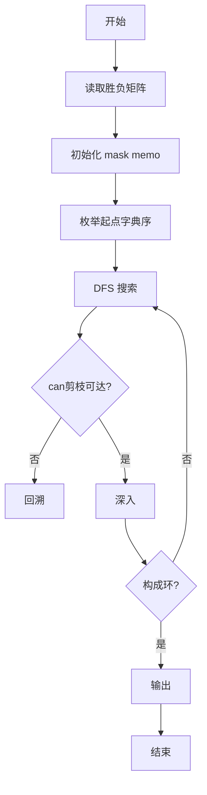
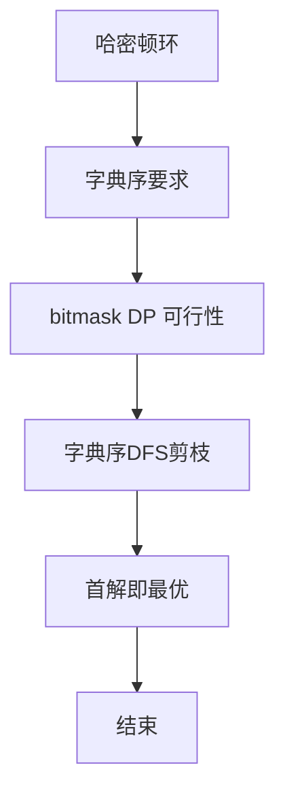

# L3-015 - 球队“食物链”（30 分）

- **时间限制**: 2000 ms
- **内存限制**: 131072 KB
- **代码长度限制**: 16 KB

---

## 题目描述


某国的足球联赛中有$$N$$支参赛球队，编号从1至$$N$$。联赛采用主客场双循环赛制，参赛球队两两之间在双方主场各赛一场。

联赛战罢，结果已经尘埃落定。此时，联赛主席突发奇想，希望从中找出一条包含所有球队的“食物链”，来说明联赛的精彩程度。“食物链”为一个1至$$N$$的排列{ $$T_1$$ $$T_2$$ $$\cdots$$ $$T_N$$ }，满足：球队$$T_1$$战胜过球队$$T_2$$，球队$$T_2$$战胜过球队$$T_3$$，$$\cdots$$，球队$$T_{(N-1)}$$战胜过球队$$T_N$$，球队$$T_N$$战胜过球队$$T_1$$。

现在主席请你从联赛结果中找出“食物链”。若存在多条“食物链”，请找出字典序最小的。

注：排列{ $$a_1$$ $$a_2$$ $$\cdots$$ $$a_N$$}在字典序上小于排列{ $$b_1$$ $$b_2$$ $$\cdots$$ $$b_N$$ }，当且仅当存在整数$$K$$（$$1 \le K \le N$$），满足：$$a_K < b_K$$且对于任意小于$$K$$的正整数$$i$$，$$a_i=b_i$$。

### 输入格式:

输入第一行给出一个整数$$N$$（$$2 \le N \le 20$$），为参赛球队数。随后$$N$$行，每行$$N$$个字符，给出了$$N\times N$$的联赛结果表，其中第$$i$$行第$$j$$列的字符为球队$$i$$在主场对阵球队$$j$$的比赛结果：`W`表示球队$$i$$战胜球队$$j$$，`L`表示球队$$i$$负于球队$$j$$，`D`表示两队打平，`-`表示无效（当$$i=j$$时）。输入中无多余空格。

### 输出格式:

按题目要求找到“食物链”$$T_1$$ $$T_2$$ $$\cdots$$ $$T_N$$，将这$$N$$个数依次输出在一行上，数字间以1个空格分隔，行的首尾不得有多余空格。若不存在“食物链”，输出“No Solution”。

### 输入样例 1：
```in
5
-LWDW
W-LDW
WW-LW
DWW-W
DDLW-
```

### 输出样例 1：
```out
1 3 5 4 2
```

### 输入样例 2：
```in
5
-WDDW
D-DWL
DD-DW
DDW-D
DDDD-
```

### 输出样例 2：
```out
No Solution
```

## 示例

### 示例 1

**输入:**
```
5
-LWDW
W-LDW
WW-LW
DWW-W
DDLW-
```

**输出:**
```
1 3 5 4 2
```

### 示例 2

**输入:**
```
5
-WDDW
D-DWL
DD-DW
DDW-D
DDDD-
```

**输出:**
```
No Solution
```


### 解题思路
本題為 GPLT L3 難題「球队“食物链”」，Main.java 採用 **哈密顿回路字典序最小：DFS + bitmask DP 可行性剪枝**。

- **核心思想**：题目求字典序最小的哈密顿环（起点可任意，但输出要求最小字典序序列）。按字典序枚举起点与 DFS 顺序，定义 can(mask,cur) 是否能从 cur 补全至哈密顿环（记忆化）。搜索时若当前分支不可达则剪枝，保证首次找到即为字典序最小解。
- **數據結構**：邻接矩阵 win、mask 记忆 memo、路径 perm。
- **複雜度**：時間 O(N²·2^N) 最坏，N≤20 剪枝后通过；空間 O(N·2^N)。
- **關鍵**：嚴格依賴 Main.java 中的實現細節（見代碼實現一節），確保與程式邏輯一致；涉及邊界與精度處理與原碼完全對齊。

### 代码流程说明
1. 读取胜负矩阵 win
2. 初始化 allMask=(1<<N)-1，memo 未知
3. 定义递归 can(mask,cur)：若 mask==allMask 返回 win[cur][start]
4. 否则尝试下一个未访问点 nxt，若 win[cur][nxt] 且 can(mask|1<<nxt,nxt) 则可达
5. 主循环按字典序尝试起点 start，DFS 按递增编号尝试 nxt 并用 can 剪枝
6. 找到则输出路径，未找到输出 No Solution

### 代码实现
```java
import java.io.*;
import java.util.*;

// L3-015 球队“食物链” - 哈密顿回路字典序最小
// 算法：按字典序DFS + 记忆化可行性剪枝（bitmask DP）
// N<=20, 用 int mask 表示已访问集合
// 时间复杂度 O(N^2 * 2^N) 最坏，实际剪枝后可接受
public class Main {
    static int N;
    static boolean[][] win;
    static int allMask;
    static int start;
    static byte[] memo; // 2:未知 1:可达 0:不可达
    static int[] perm;
    static boolean found;

    static boolean can(int mask, int cur) {
        if (mask == allMask) {
            return win[cur][start];
        }
        int idx = mask * N + cur;
        byte v = memo[idx];
        if (v != 2) return v == 1;
        for (int nxt = 0; nxt < N; nxt++) {
            if ((mask & (1 << nxt)) != 0) continue;
            if (!win[cur][nxt]) continue;
            if (can(mask | (1 << nxt), nxt)) {
                memo[idx] = 1;
                return true;
            }
        }
        memo[idx] = 0;
        return false;
    }

    static boolean dfs(int pos, int mask, int cur) {
        if (pos == N) {
            return win[cur][start];
        }
        // 按字典序尝试 nxt 从小到大
        for (int nxt = 0; nxt < N; nxt++) {
            if ((mask & (1 << nxt)) != 0) continue;
            if (!win[cur][nxt]) continue;
            int nmask = mask | (1 << nxt);
            if (!can(nmask, nxt)) continue;
            perm[pos] = nxt;
            if (dfs(pos + 1, nmask, nxt)) return true;
        }
        return false;
    }

    public static void main(String[] args) throws Exception {
        BufferedReader br = new BufferedReader(new InputStreamReader(System.in, "UTF-8"));
        String line = br.readLine();
        if (line == null) return;
        line = line.trim();
        while (line.isEmpty()) line = br.readLine();
        N = Integer.parseInt(line.trim());
        win = new boolean[N][N];
        for (int i = 0; i < N; i++) {
            String s = br.readLine();
            while (s != null && s.trim().isEmpty()) s = br.readLine();
            if (s == null) s = "";
            s = s.trim();
            for (int j = 0; j < N && j < s.length(); j++) {
                char c = s.charAt(j);
                win[i][j] = (c == 'W');
            }
        }
        allMask = (1 << N) - 1;
        perm = new int[N];
        // 按字典序枚举起点
        for (int s = 0; s < N; s++) {
            start = s;
            int size = (1 << N) * N;
            memo = new byte[size];
            Arrays.fill(memo, (byte)2);
            int mask0 = 1 << s;
            if (!can(mask0, s)) continue;
            perm[0] = s;
            if (dfs(1, mask0, s)) {
                StringBuilder sb = new StringBuilder();
                for (int i = 0; i < N; i++) {
                    if (i > 0) sb.append(' ');
                    sb.append(perm[i] + 1);
                }
                System.out.println(sb.toString());
                return;
            }
        }
        System.out.println("No Solution");
    }
}
```

### 代码流程图


### 解题流程图


