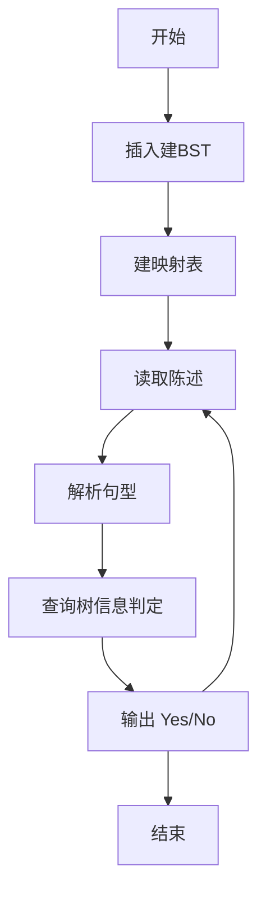
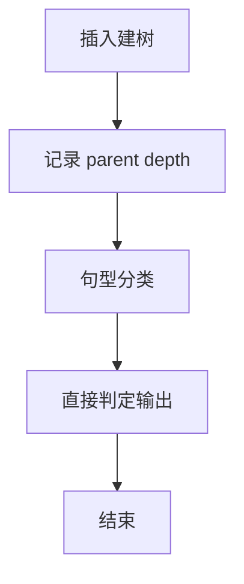

# L3-016 - 二叉搜索树的结构（30 分）

- **时间限制**: 400 ms
- **内存限制**: 65536 KB
- **代码长度限制**: 16 KB

---

## 题目描述


二叉搜索树或者是一棵空树，或者是具有下列性质的二叉树： 若它的左子树不空，则左子树上所有结点的值均小于它的根结点的值；若它的右子树不空，则右子树上所有结点的值均大于它的根结点的值；它的左、右子树也分别为二叉搜索树。（摘自百度百科）

给定一系列互不相等的整数，将它们顺次插入一棵初始为空的二叉搜索树，然后对结果树的结构进行描述。你需要能判断给定的描述是否正确。例如将{ 2 4 1 3 0 }插入后，得到一棵二叉搜索树，则陈述句如“2是树的根”、“1和4是兄弟结点”、“3和0在同一层上”（指自顶向下的深度相同）、“2是4的双亲结点”、“3是4的左孩子”都是正确的；而“4是2的左孩子”、“1和3是兄弟结点”都是不正确的。

### 输入格式:

输入在第一行给出一个正整数$$N$$（$$\le 100$$），随后一行给出$$N$$个互不相同的整数，数字间以空格分隔，要求将之顺次插入一棵初始为空的二叉搜索树。之后给出一个正整数$$M$$（$$\le 100$$），随后$$M$$行，每行给出一句待判断的陈述句。陈述句有以下6种：

- `A is the root`，即"`A`是树的根"；
- `A and B are siblings`，即"`A`和`B`是兄弟结点"；
- `A is the parent of B`，即"`A`是`B`的双亲结点"；
- `A is the left child of B`，即"`A`是`B`的左孩子"；
- `A is the right child of B`，即"`A`是`B`的右孩子"；
- `A and B are on the same level`，即"`A`和`B`在同一层上"。

题目保证所有给定的整数都在整型范围内。

### 输出格式:

对每句陈述，如果正确则输出`Yes`，否则输出`No`，每句占一行。

### 输入样例:
```in
5
2 4 1 3 0
8
2 is the root
1 and 4 are siblings
3 and 0 are on the same level
2 is the parent of 4
3 is the left child of 4
1 is the right child of 2
4 and 0 are on the same level
100 is the right child of 3
```

### 输出样例:
```out
Yes
Yes
Yes
Yes
Yes
No
No
No
```

## 示例

### 示例 1

**输入:**
```
5
2 4 1 3 0
8
2 is the root
1 and 4 are siblings
3 and 0 are on the same level
2 is the parent of 4
3 is the left child of 4
1 is the right child of 2
4 and 0 are on the same level
100 is the right child of 3
```

**输出:**
```
Yes
Yes
Yes
Yes
Yes
No
No
No
```


### 解题思路
本題為 GPLT L3 難題「二叉搜索树的结构」，Main.java 採用 **按序插入构 BST + 六类陈述解析查询**。

- **核心思想**：正常 BST 左小右大插入，记录父节点、深度与左右孩子指针。查询共 6 种句型：A is the root、A and B are siblings、A is the parent of B、A is the left/right child of B、A 和 B 在同一层 等，通过映射与树信息直接判定 true/false 输出 Yes/No。
- **數據結構**：节点对象 parent/left/right/depth、HashMap 值→节点。
- **複雜度**：時間 O(N²) 最坏插入 + O(M·L)；空間 O(N)。
- **關鍵**：嚴格依賴 Main.java 中的實現細節（見代碼實現一節），確保與程式邏輯一致；涉及邊界與精度處理與原碼完全對齊。

### 代码流程说明
1. 读取初始序列逐个 insert 构建 BST 并记录映射
2. 读取陈述数 M
3. 对每条陈述字符串解析句型（正则或关键词匹配）提取 A,B
4. 根据句型查询树信息：parent、depth、child 方向、兄弟等
5. 输出 Yes/No
6. 结束

### 代码实现
```java
import java.io.*;
import java.util.*;

// L3-016 二叉搜索树的结构
// 算法：按序插入构建BST，记录parent、depth、left/right，查询时解析6种陈述
// 时间复杂度 O(N^2) 最坏插入 + O(M * L)，N,M<=100，可接受
public class Main {
    static class Node {
        int val;
        Node left, right, parent;
        int depth;
        Node(int v, int d, Node p) { val=v; depth=d; parent=p; }
    }
    static Map<Integer, Node> map = new HashMap<>();
    static Node root;

    static void insert(int v) {
        if (root == null) {
            root = new Node(v, 0, null);
            map.put(v, root);
            return;
        }
        Node cur = root;
        while (true) {
            if (v < cur.val) {
                if (cur.left == null) {
                    Node nd = new Node(v, cur.depth + 1, cur);
                    cur.left = nd;
                    map.put(v, nd);
                    break;
                } else cur = cur.left;
            } else { // v > cur.val
                if (cur.right == null) {
                    Node nd = new Node(v, cur.depth + 1, cur);
                    cur.right = nd;
                    map.put(v, nd);
                    break;
                } else cur = cur.right;
            }
        }
    }

    public static void main(String[] args) throws Exception {
        BufferedReader br = new BufferedReader(new InputStreamReader(System.in, "UTF-8"));
        String line;
        // 读取 N
        line = br.readLine();
        while (line != null && line.trim().isEmpty()) line = br.readLine();
        if (line == null) return;
        int N = Integer.parseInt(line.trim());
        // 读取 N 个整数，可能跨行
        List<Integer> vals = new ArrayList<>();
        while (vals.size() < N) {
            line = br.readLine();
            if (line == null) break;
            if (line.trim().isEmpty()) continue;
            StringTokenizer st = new StringTokenizer(line);
            while (st.hasMoreTokens() && vals.size() < N) {
                vals.add(Integer.parseInt(st.nextToken()));
            }
        }
        for (int v : vals) insert(v);

        // 读取 M
        line = br.readLine();
        while (line != null && line.trim().isEmpty()) line = br.readLine();
        if (line == null) return;
        int M = Integer.parseInt(line.trim());
        StringBuilder out = new StringBuilder();
        for (int i = 0; i < M; i++) {
            String s = br.readLine();
            while (s != null && s.isEmpty()) s = br.readLine(); // keep spaces? but statement lines have fixed format; empty not expected
            if (s == null) s = "";
            s = s.trim();
            boolean ans = judge(s);
            out.append(ans ? "Yes" : "No").append('\n');
        }
        System.out.print(out.toString());
    }

    static boolean judge(String s) {
        // 分词，保留原符号但用空格切分
        // 6种句型通过关键词区分
        String[] t = s.split("\\s+");
        if (s.contains("is the root")) {
            // A is the root
            int A = Integer.parseInt(t[0]);
            Node nd = map.get(A);
            if (nd == null) return false;
            return nd == root;
        } else if (s.contains("are siblings")) {
            // A and B are siblings
            int A = Integer.parseInt(t[0]);
            int B = Integer.parseInt(t[2]);
            Node na = map.get(A);
            Node nb = map.get(B);
            if (na == null || nb == null) return false;
            if (na.parent == null || nb.parent == null) return false;
            return na.parent == nb.parent;
        } else if (s.contains("is the parent of")) {
            // A is the parent of B
            int A = Integer.parseInt(t[0]);
            int B = Integer.parseInt(t[t.length - 1]);
            Node na = map.get(A);
            Node nb = map.get(B);
            if (na == null || nb == null) return false;
            return nb.parent == na;
        } else if (s.contains("is the left child of")) {
            int A = Integer.parseInt(t[0]);
            int B = Integer.parseInt(t[t.length - 1]);
            Node na = map.get(A);
            Node nb = map.get(B);
            if (na == null || nb == null) return false;
            return nb.left == na;
        } else if (s.contains("is the right child of")) {
            int A = Integer.parseInt(t[0]);
            int B = Integer.parseInt(t[t.length - 1]);
            Node na = map.get(A);
            Node nb = map.get(B);
            if (na == null || nb == null) return false;
            return nb.right == na;
        } else if (s.contains("are on the same level")) {
            int A = Integer.parseInt(t[0]);
            int B = Integer.parseInt(t[2]);
            Node na = map.get(A);
            Node nb = map.get(B);
            if (na == null || nb == null) return false;
            return na.depth == nb.depth;
        }
        return false;
    }
}
```

### 代码流程图


### 解题流程图


