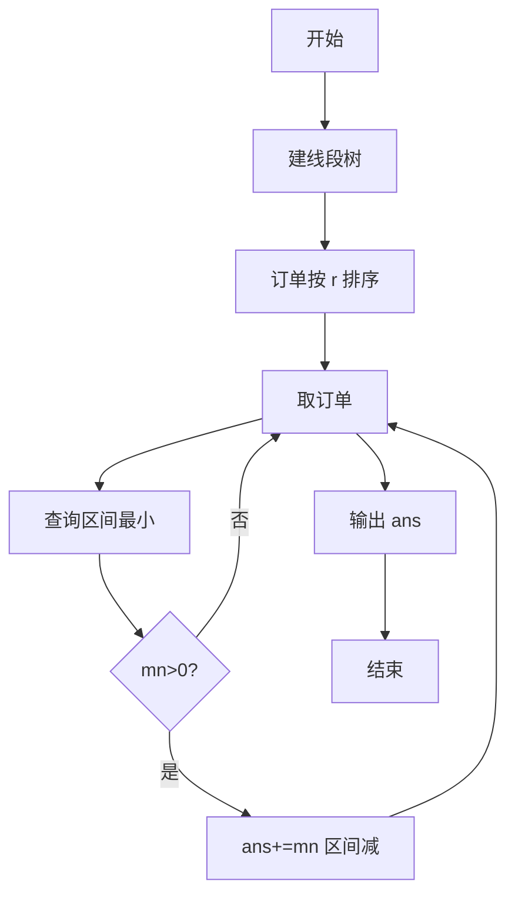
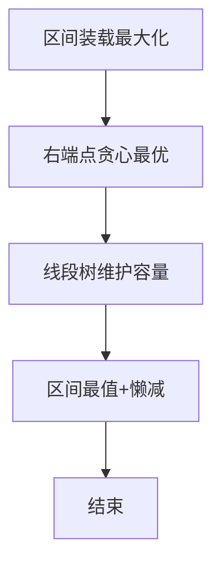

# L3-017 - 森森快递（30 分）

- **时间限制**: 400 ms
- **内存限制**: 65536 KB
- **代码长度限制**: 16 KB

---

## 题目描述


森森开了一家快递公司，叫森森快递。因为公司刚刚开张，所以业务路线很简单，可以认为是一条直线上的$$N$$个城市，这些城市从左到右依次从0到$$(N-1)$$编号。由于道路限制，第$$i$$号城市（$$i=0, \cdots , N-2$$）与第$$(i+1)$$号城市中间往返的运输货物重量在同一时刻不能超过$$C_i$$公斤。

公司开张后很快接到了$$Q$$张订单，其中$$j$$张订单描述了某些指定的货物要从$$S_j$$号城市运输到$$T_j$$号城市。这里我们简单地假设所有货物都有无限货源，森森会不定时地挑选其中一部分货物进行运输。安全起见，这些货物不会在中途卸货。

为了让公司整体效益更佳，森森想知道如何安排订单的运输，能使得运输的货物重量最大且符合道路的限制？要注意的是，发货时间有可能是任何时刻，所以我们安排订单的时候，必须保证共用同一条道路的所有货车的总重量不超载。例如我们安排1号城市到4号城市以及2号城市到4号城市两张订单的运输，则这两张订单的运输同时受2-3以及3-4两条道路的限制，因为两张订单的货物可能会同时在这些道路上运输。

### 输入格式:

输入在第一行给出两个正整数$$N$$和$$Q$$（$$2 \le N \le 10^5$$, $$1 \le Q \le 10^5$$），表示总共的城市数以及订单数量。

第二行给出$$(N-1)$$个数，顺次表示相邻两城市间的道路允许的最大运货重量$$C_i$$（$$i=0, \cdots , N-2$$）。题目保证每个$$C_i$$是不超过$$2^{31}$$的非负整数。

接下来$$Q$$行，每行给出一张订单的起始及终止运输城市编号。题目保证所有编号合法，并且不存在起点和终点重合的情况。

### 输出格式:

在一行中输出可运输货物的最大重量。

### 输入样例:
```in
10 6
0 7 8 5 2 3 1 9 10
0 9
1 8
2 7
6 3
4 5
4 2
```

### 输出样例:
```out
7
```

## 示例

### 示例 1

**输入:**
```
10 6
0 7 8 5 2 3 1 9 10
0 9
1 8
2 7
6 3
4 5
4 2
```

**输出:**
```
7
```


### 解题思路
本題為 GPLT L3 難題「森森快递」，Main.java 採用 **区间贪心按右端点排序 + 线段树区间最小值与区间减**。

- **核心思想**：将每个订单视为线段 [l,r)，按 r 升序贪心可最优。维护每段区间剩余容量 mn，查询区间最小可运输量 take = queryMin(l,r-1)，计入答案并对区间执行 rangeAdd(-take)。线段树支持区间最值与懒加。
- **數據結構**：线段树（区间最小、懒标记）、订单列表。
- **複雜度**：時間 O((N+Q) log N)；空間 O(N)。
- **關鍵**：嚴格依賴 Main.java 中的實現細節（見代碼實現一節），確保與程式邏輯一致；涉及邊界與精度處理與原碼完全對齊。

### 代码流程说明
1. 读取 N,Q 与各段初始容量，建线段树
2. 读取订单并按右端点排序
3. 遍历每订单：mn = queryMin(l,r-1)
4. 若 mn>0：ans+=mn；updateAdd(l,r-1,-mn)
5. 处理完所有订单输出 ans
6. 结束

### 代码实现
```java
import java.io.*;
import java.util.*;

// L3-017 森森快递
// 算法：按区间右端点排序，线段树维护区间最小剩余容量 + 区间减
// 每个订单取区间最小可运输量，累计答案并对区间做减法
// 时间复杂度 O((N+Q) log N)， N,Q<=1e5
public class Main {
    static class Order {
        int l, r;
        Order(int l, int r) { this.l = l; this.r = r; }
    }
    static class SegTree {
        int n;
        long[] mn, lazy;
        SegTree(long[] arr) {
            n = arr.length;
            mn = new long[4 * n];
            lazy = new long[4 * n];
            build(1, 0, n - 1, arr);
        }
        void build(int node, int l, int r, long[] arr) {
            if (l == r) { mn[node] = arr[l]; return; }
            int mid = (l + r) >>> 1;
            build(node << 1, l, mid, arr);
            build(node << 1 | 1, mid + 1, r, arr);
            mn[node] = Math.min(mn[node << 1], mn[node << 1 | 1]);
        }
        void apply(int node, long v) {
            mn[node] += v;
            lazy[node] += v;
        }
        void push(int node) {
            if (lazy[node] != 0) {
                apply(node << 1, lazy[node]);
                apply(node << 1 | 1, lazy[node]);
                lazy[node] = 0;
            }
        }
        long queryMin(int L, int R) { return queryMin(1, 0, n - 1, L, R); }
        long queryMin(int node, int l, int r, int L, int R) {
            if (L <= l && r <= R) return mn[node];
            push(node);
            int mid = (l + r) >>> 1;
            long ans = Long.MAX_VALUE;
            if (L <= mid) ans = Math.min(ans, queryMin(node << 1, l, mid, L, R));
            if (R > mid) ans = Math.min(ans, queryMin(node << 1 | 1, mid + 1, r, L, R));
            return ans;
        }
        void rangeAdd(int L, int R, long v) { rangeAdd(1, 0, n - 1, L, R, v); }
        void rangeAdd(int node, int l, int r, int L, int R, long v) {
            if (L <= l && r <= R) { apply(node, v); return; }
            push(node);
            int mid = (l + r) >>> 1;
            if (L <= mid) rangeAdd(node << 1, l, mid, L, R, v);
            if (R > mid) rangeAdd(node << 1 | 1, mid + 1, r, L, R, v);
            mn[node] = Math.min(mn[node << 1], mn[node << 1 | 1]);
        }
    }

    public static void main(String[] args) throws Exception {
        BufferedReader br = new BufferedReader(new InputStreamReader(System.in, "UTF-8"));
        StringTokenizer st;
        String line = br.readLine();
        while (line != null && line.trim().isEmpty()) line = br.readLine();
        if (line == null) return;
        st = new StringTokenizer(line);
        int N = Integer.parseInt(st.nextToken());
        int Q = Integer.parseInt(st.nextToken());

        long[] C = new long[Math.max(0, N - 1)];
        int idx = 0;
        while (idx < C.length) {
            line = br.readLine();
            if (line == null) break;
            if (line.trim().isEmpty()) continue;
            st = new StringTokenizer(line);
            while (st.hasMoreTokens() && idx < C.length) {
                C[idx++] = Long.parseLong(st.nextToken());
            }
        }
        List<Order> orders = new ArrayList<>(Q);
        for (int i = 0; i < Q; i++) {
            line = br.readLine();
            while (line != null && line.trim().isEmpty()) line = br.readLine();
            if (line == null) break;
            st = new StringTokenizer(line);
            int s = Integer.parseInt(st.nextToken());
            int t = Integer.parseInt(st.nextToken());
            int l = Math.min(s, t);
            int r = Math.max(s, t) - 1; // 边的区间 [l,r]
            if (l <= r && r < C.length && l >= 0) {
                orders.add(new Order(l, r));
            } else if (l <= r) {
                // 区间非法时仍需处理（若 N=1 无边？但 N>=2）
                // 若越界忽略
            }
        }
        if (C.length == 0) {
            System.out.println(0);
            return;
        }
        // 按右端点升序，右相同按左降序（区间短的先）
        orders.sort((a, b) -> {
            if (a.r != b.r) return Integer.compare(a.r, b.r);
            return Integer.compare(b.l, a.l);
        });

        SegTree seg = new SegTree(C);
        long ans = 0;
        for (Order o : orders) {
            long curMin = seg.queryMin(o.l, o.r);
            if (curMin > 0) {
                ans += curMin;
                seg.rangeAdd(o.l, o.r, -curMin);
            } else if (curMin < 0) {
                // C 可能是负？题目说非负，忽略
            }
        }
        System.out.println(ans);
    }
}
```

### 代码流程图


### 解题流程图


