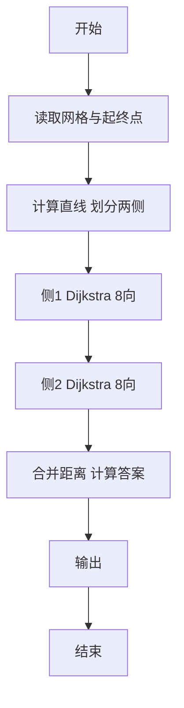
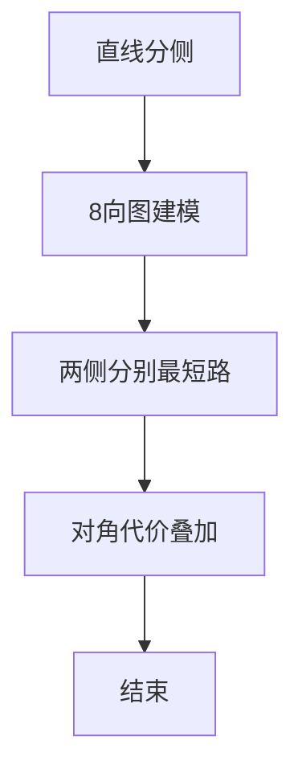

# L3-018 - 森森美图（30 分）

- **时间限制**: 400 ms
- **内存限制**: 65536 KB
- **代码长度限制**: 16 KB

---

## 题目描述


森森最近想让自己的朋友圈熠熠生辉，所以他决定自己写个美化照片的软件，并起名为森森美图。众所周知，在合照中美化自己的面部而不美化合照者的面部是让自己占据朋友圈高点的绝好方法，因此森森美图里当然得有这个功能。 这个功能的第一步是将自己的面部选中。森森首先计算出了一个图像中所有像素点与周围点的相似程度的分数，分数越低表示某个像素点越“像”一个轮廓边缘上的点。 森森认为，任意连续像素点的得分之和越低，表示它们组成的曲线和轮廓边缘的重合程度越高。为了选择出一个完整的面部，森森决定让用户选择面部上的两个像素点A和B，则连接这两个点的直线就将图像分为两部分，然后在这两部分中分别寻找一条从A到B且与轮廓重合程度最高的曲线，就可以拼出用户的面部了。 然而森森计算出来得分矩阵后，突然发现自己不知道怎么找到这两条曲线了，你能帮森森当上朋友圈的小王子吗？

为了解题方便，我们做出以下补充说明：

- 图像的左上角是坐标原点(0,0)，我们假设所有像素按矩阵格式排列，其坐标均为非负整数（即横轴向右为正，纵轴向下为正）。
- 忽略正好位于连接A和B的直线（注意不是线段）上的像素点，即不认为这部分像素点在任何一个划分部分上，因此曲线也不能经过这部分像素点。
- 曲线是八连通的（即任一像素点可与其周围的8个像素连通），但为了计算准确，某像素连接对角相邻的斜向像素时，得分**额外增加**两个像素分数和的$$\sqrt{2}$$倍减一。例如样例中，经过坐标为(3,1)和(4,2)的两个像素点的曲线，其得分应该是这两个像素点的分数和(2+2)，再加上额外的(2+2)乘以($$\sqrt{2}-1$$)，即约为5.66。

### 输入格式:

输入在第一行给出两个正整数$$N$$和$$M$$（$$5 \le N, M \le 100$$），表示像素得分矩阵的行数和列数。

接下来$$N$$行，每行$$M$$个不大于1000的非负整数，即为像素点的分值。

最后一行给出用户选择的起始和结束像素点的坐标$$(X_{start}, Y_{start})$$和$$(X_{end}, Y_{end})$$。4个整数用空格分隔。

### 输出格式:

在一行中输出划分图片后找到的轮廓曲线的得分和，保留小数点后两位。注意起点和终点的得分不要重复计算。

### 输入样例:
```in
6 6
9 0 1 9 9 9
9 9 1 2 2 9
9 9 2 0 2 9
9 9 1 1 2 9
9 9 3 3 1 1
9 9 9 9 9 9
2 1 5 4
```

### 输出样例:
```out
27.04
```

## 示例

### 示例 1

**输入:**
```
6 6
9 0 1 9 9 9
9 9 1 2 2 9
9 9 2 0 2 9
9 9 1 1 2 9
9 9 3 3 1 1
9 9 9 9 9 9
2 1 5 4
```

**输出:**
```
27.04
```


### 解题思路
本題為 GPLT L3 難題「森森美图」，Main.java 採用 **直线划分两侧分别 8 方向 Dijkstra（含对角额外代价）**。

- **核心思想**：给定两点决定直线，网格点按叉积分到两侧（含线上）。两侧（除线上点外）各自在 8 邻接网格上跑 Dijkstra，直线上的点不计代价但可通行。对角移动额外代价 (score_u+score_v)*(√2-1)，总代价为两侧最短路之和加上相应起终点 score。
- **數據結構**：二维分数矩阵、网格图邻接（8 向）、优先队列。
- **複雜度**：時間 O(NM log NM)；空間 O(NM)。
- **關鍵**：嚴格依賴 Main.java 中的實現細節（見代碼實現一節），確保與程式邏輯一致；涉及邊界與精度處理與原碼完全對齊。

### 代码流程说明
1. 读取 N,M 分数矩阵与起点终点坐标
2. 计算直线方程，划分两侧集合 side[][]
3. 分别以起终点为源在对应侧子图上跑 8 方向 Dijkstra
4. 得到 dist1 与 dist2，答案为两者和（处理线上点特殊）
5. 按浮点精度输出（保留几位小数/取整）
6. 结束

### 代码实现
```java
import java.io.*;
import java.util.*;

// L3-018 森森美图
// 算法：按直线划分两侧，分别在两侧（除直线点外）做8方向最短路
// 对角移动额外代价 (score_u+score_v)*(sqrt2-1)
// 时间复杂度 O(NM log NM)，NM<=1e4
public class Main {
    static int N, M;
    static int[][] score;
    static int sx, sy, ex, ey;
    static double SQRT2 = Math.sqrt(2.0);

    static class Node implements Comparable<Node> {
        int x, y;
        double d;
        Node(int x, int y, double d) { this.x = x; this.y = y; this.d = d; }
        public int compareTo(Node o) { return Double.compare(d, o.d); }
    }

    static double dijkstra(boolean positiveSide) {
        // blocked: 点在直线上（除起点终点）
        // allowed: cross>0 为正侧，cross<0 为负侧
        double INF = 1e100;
        double[][] dist = new double[N][M];
        for (int i = 0; i < N; i++) Arrays.fill(dist[i], INF);
        boolean[][] blocked = new boolean[N][M];
        // 预计算 blocked 与 side
        for (int y = 0; y < N; y++) {
            for (int x = 0; x < M; x++) {
                if ((x == sx && y == sy) || (x == ex && y == ey)) {
                    blocked[y][x] = false;
                    continue;
                }
                long cross = (long)(ex - sx) * (y - sy) - (long)(ey - sy) * (x - sx);
                if (cross == 0) blocked[y][x] = true;
            }
        }
        // Dijkstra
        PriorityQueue<Node> pq = new PriorityQueue<>();
        if (blocked[sy][sx] || blocked[ey][ex]) return INF;
        dist[sy][sx] = score[sy][sx];
        pq.offer(new Node(sx, sy, dist[sy][sx]));
        int[] dx = {-1,0,1,-1,1,-1,0,1};
        int[] dy = {-1,-1,-1,0,0,1,1,1};
        while (!pq.isEmpty()) {
            Node cur = pq.poll();
            if (cur.d > dist[cur.y][cur.x] + 1e-12) continue;
            if (cur.x == ex && cur.y == ey) break;
            for (int dir = 0; dir < 8; dir++) {
                int nx = cur.x + dx[dir];
                int ny = cur.y + dy[dir];
                if (nx < 0 || nx >= M || ny < 0 || ny >= N) continue;
                if (blocked[ny][nx]) continue;
                // 侧面限制：起点终点例外，否则检查 cross 符号
                if (!((nx == sx && ny == sy) || (nx == ex && ny == ey))) {
                    long cross = (long)(ex - sx) * (ny - sy) - (long)(ey - sy) * (nx - sx);
                    if (positiveSide) {
                        if (cross <= 0) continue;
                    } else {
                        if (cross >= 0) continue;
                    }
                }
                boolean diagonal = (dx[dir] != 0 && dy[dir] != 0);
                double extra = 0;
                if (diagonal) {
                    extra = (score[cur.y][cur.x] + score[ny][nx]) * (SQRT2 - 1);
                }
                double nd = cur.d + score[ny][nx] + extra;
                if (nd + 1e-12 < dist[ny][nx]) {
                    dist[ny][nx] = nd;
                    pq.offer(new Node(nx, ny, nd));
                }
            }
        }
        return dist[ey][ex];
    }

    public static void main(String[] args) throws Exception {
        BufferedReader br = new BufferedReader(new InputStreamReader(System.in, "UTF-8"));
        String line = br.readLine();
        while (line != null && line.trim().isEmpty()) line = br.readLine();
        if (line == null) return;
        StringTokenizer st = new StringTokenizer(line);
        N = Integer.parseInt(st.nextToken());
        M = Integer.parseInt(st.nextToken());
        score = new int[N][M];
        for (int i = 0; i < N; i++) {
            st = new StringTokenizer(br.readLine());
            // 可能一行不够
            int j = 0;
            while (j < M) {
                while (!st.hasMoreTokens()) {
                    st = new StringTokenizer(br.readLine());
                }
                score[i][j++] = Integer.parseInt(st.nextToken());
            }
        }
        line = br.readLine();
        while (line != null && line.trim().isEmpty()) line = br.readLine();
        if (line == null) return;
        st = new StringTokenizer(line);
        sx = Integer.parseInt(st.nextToken());
        sy = Integer.parseInt(st.nextToken());
        ex = Integer.parseInt(st.nextToken());
        ey = Integer.parseInt(st.nextToken());
        // 输入题目坐标是 (X,Y)，X 对应列，Y 对应行，已按此存储

        double dPos = dijkstra(true);
        double dNeg = dijkstra(false);
        double INF = 1e90;
        double ans;
        if (dPos >= INF/2 || dNeg >= INF/2) {
            // 若一侧不可达，按可达那侧？题目保证两侧均可达
            ans = Math.min(dPos, dNeg);
            // 仍需去重逻辑？若只有一侧，答案即为单侧路径
            // 但题要求两条曲线和，去重后若一侧不可达则不合理
            // 按题面应当两侧均存在
        } else {
            ans = dPos + dNeg - score[sy][sx] - score[ey][ex];
        }
        // 保留两位小数，四舍五入
        System.out.printf(Locale.ROOT, "%.2f%n", ans);
    }
}
```

### 代码流程图


### 解题流程图


