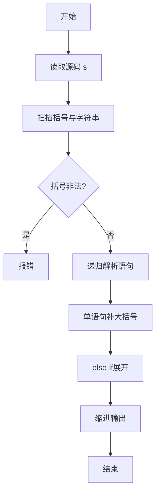
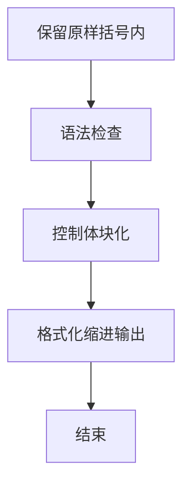

# L3-019 - 代码排版（30 分）

- **时间限制**: 150 ms
- **内存限制**: 65536 KB
- **代码长度限制**: 16 KB

---

## 题目描述


某编程大赛中设计有一个挑战环节，选手可以查看其他选手的代码，发现错误后，提交一组测试数据将对手挑落马下。为了减小被挑战的几率，有些选手会故意将代码写得很难看懂，比如把所有回车去掉，提交所有内容都在一行的程序，令挑战者望而生畏。

为了对付这种选手，现请你编写一个代码排版程序，将写成一行的程序重新排版。当然要写一个完美的排版程序可太难了，这里只简单地要求处理C语言里的for、while、if-else这三种特殊结构，而将其他所有句子都当成顺序执行的语句处理。输出的要求如下：

- 默认程序起始没有缩进；每一级缩进是 2 个空格；
- 每行开头除了规定的缩进空格外，不输出多余的空格；
- 顺序执行的程序体是以分号“;”结尾的，遇到分号就换行；
- 在一对大括号“{”和“}”中的程序体输出时，两端的大括号单独占一行，内部程序体每行加一级缩进，即：

```
{
  程序体
}
```

- for的格式为：

```
for (条件) {
  程序体
}
```

- while的格式为：

```
while (条件) {
  程序体
}
```

- if-else的格式为：

```
if (条件) {
  程序体
}
else {
  程序体
}
```

### 输入格式:

输入在一行中给出不超过 331 个字符的非空字符串，以回车结束。题目保证输入的是一个语法正确、可以正常编译运行的 main 函数模块。

### 输出格式:

按题面要求的格式，输出排版后的程序。

### 输入样例:
```in
int main()  {int n, i;  scanf("%d", &n);if( n>0)n++;else if (n<0) n--; else while(n<10)n++; for(i=0;  i<n; i++ ){ printf("n=%d\n", n);}return  0; }
```

### 输出样例:
```out
int main()
{
  int n, i;
  scanf("%d", &n);
  if ( n>0) {
    n++;
  }
  else {
    if (n<0) {
      n--;
    }
    else {
      while (n<10) {
        n++;
      }
    }
  }
  for (i=0;  i<n; i++ ) {
    printf("n=%d\n", n);
  }
  return  0;
}
```

## 示例

### 示例 1

**输入:**
```
int main()  {int n, i;  scanf("%d", &n);if( n>0)n++;else if (n<0) n--; else while(n<10)n++; for(i=0;  i<n; i++ ){ printf("n=%d\n", n);}return  0; }
```

**输出:**
```
int main()
{
  int n, i;
  scanf("%d", &n);
  if ( n>0) {
    n++;
  }
  else {
    if (n<0) {
      n--;
    }
    else {
      while (n<10) {
        n++;
      }
    }
  }
  for (i=0;  i<n; i++ ) {
    printf("n=%d\n", n);
  }
  return  0;
}
```


### 解题思路
本題為 GPLT L3 難題「代码排版」，Main.java 採用 **手写递归下降解析 + 括号保留 + if/for/while 体块化与 else-if 展开**。

- **核心思想**：先对输入代码做预处理：字符串字面量内按原样保留，括号匹配检测错误。在语法层面：非法括号直接报错；语义上对单语句控制体自动补大括号（缩进层级体现），else-if 改写为 else { if } 的展开形式，最后按 2 空格缩进格式化输出，每层正确换行。
- **數據結構**：字符指针 pos、输出 StringBuilder、缩进栈、临时缓冲区。
- **複雜度**：時間 O(L) L≤331；空間 O(L)。
- **關鍵**：嚴格依賴 Main.java 中的實現細節（見代碼實現一節），確保與程式邏輯一致；涉及邊界與精度處理與原碼完全對齊。

### 代码流程说明
1. 读取全部输入到字符串 s
2. 扫描处理字符串常量与括号匹配，检测错误
3. 递归下降解析语句/块/控制结构，维护 indent
4. 对非块单语句补大括号并缩进
5. 对 else-if 进行展开重构
6. 按缩进级别拼接输出格式化代码

### 代码实现
```java
import java.io.*;
import java.util.*;

// L3-019 代码排版
// 算法：手写递归下降 + 括号匹配，手写格式化（保留字符串内字符，括号内原样保留）
// 额外处理：if/for/while 体若非块则自动补大括号；else-if 展开为 else { if ... }
// 时间复杂度 O(L)，L<=331
public class Main {
    static String s;
    static int n;
    static int pos;
    static StringBuilder out;
    static int indent;

    static String indentStr(int k) {
        StringBuilder sb = new StringBuilder(k * 2);
        for (int i = 0; i < k; i++) sb.append("  ");
        return sb.toString();
    }

    static void skipSpaces() {
        while (pos < n && Character.isWhitespace(s.charAt(pos))) pos++;
    }

    static boolean startsWithKw(String kw) {
        if (pos + kw.length() > n) return false;
        if (!s.regionMatches(pos, kw, 0, kw.length())) return false;
        if (pos + kw.length() < n) {
            char c = s.charAt(pos + kw.length());
            if (Character.isLetterOrDigit(c) || c == '_') return false;
        }
        return true;
    }

    // 寻找不在字符串内的匹配 ')'
    static String captureParen() {
        // 调用前 pos 指向 '('
        int start = pos;
        int depth = 0;
        boolean inD = false, inS = false;
        boolean esc = false;
        for (int i = start; i < n; i++) {
            char c = s.charAt(i);
            if (esc) { esc = false; continue; }
            if (inD) {
                if (c == '\\') esc = true;
                else if (c == '"') inD = false;
                continue;
            }
            if (inS) {
                if (c == '\\') esc = true;
                else if (c == '\'') inS = false;
                continue;
            }
            if (c == '"') { inD = true; continue; }
            if (c == '\'') { inS = true; continue; }
            if (c == '(') depth++;
            else if (c == ')') {
                depth--;
                if (depth == 0) {
                    String ret = s.substring(start, i + 1);
                    pos = i + 1;
                    return ret;
                }
            }
        }
        // 非法
        String ret = s.substring(start);
        pos = n;
        return ret;
    }

    static int findNextSemi(int from) {
        boolean inD = false, inS = false;
        boolean esc = false;
        int depth = 0;
        for (int i = from; i < n; i++) {
            char c = s.charAt(i);
            if (esc) { esc = false; continue; }
            if (inD) {
                if (c == '\\') esc = true;
                else if (c == '"') inD = false;
                continue;
            }
            if (inS) {
                if (c == '\\') esc = true;
                else if (c == '\'') inS = false;
                continue;
            }
            if (c == '"') { inD = true; continue; }
            if (c == '\'') { inS = true; continue; }
            if (c == '(') depth++;
            else if (c == ')') { if (depth > 0) depth--; }
            else if (c == ';' && depth == 0) {
                return i;
            } else if (c == '{' || c == '}') {
                // 遇到块边界，说明语句结束不应跨块，但题目保证简单语句以;结尾
                // 继续找分号；这里不返回
            }
        }
        return n - 1;
    }

    static int findNextBrace(int from) {
        boolean inD = false, inS = false;
        boolean esc = false;
        for (int i = from; i < n; i++) {
            char c = s.charAt(i);
            if (esc) { esc = false; continue; }
            if (inD) {
                if (c == '\\') esc = true;
                else if (c == '"') inD = false;
                continue;
            }
            if (inS) {
                if (c == '\\') esc = true;
                else if (c == '\'') inS = false;
                continue;
            }
            if (c == '"') { inD = true; continue; }
            if (c == '\'') { inS = true; continue; }
            if (c == '{') return i;
        }
        return -1;
    }

    static void parseStatements(int curIndent) {
        while (true) {
            skipSpaces();
            if (pos >= n) break;
            char c = s.charAt(pos);
            if (c == '}') break;
            if (startsWithKw("if")) {
                parseIf(curIndent);
            } else if (startsWithKw("for")) {
                parseFor(curIndent);
            } else if (startsWithKw("while")) {
                parseWhile(curIndent);
            } else if (c == '{') {
                // 裸块
                out.append(indentStr(curIndent)).append("{\n");
                pos++;
                parseStatements(curIndent + 1);
                skipSpaces();
                if (pos < n && s.charAt(pos) == '}') {
                    out.append(indentStr(curIndent)).append("}\n");
                    pos++;
                }
            } else {
                // 简单语句
                int semi = findNextSemi(pos);
                String stmt = s.substring(pos, semi + 1);
                // 去掉首尾空白，但保留内部原样
                stmt = stmt.trim();
                out.append(indentStr(curIndent)).append(stmt).append("\n");
                pos = semi + 1;
            }
        }
    }

    // 解析单条语句作为块体（用于 if/for/while 的非块体）
    static void parseSingleAsBody(int curIndent) {
        skipSpaces();
        if (pos >= n) return;
        if (startsWithKw("if")) {
            parseIf(curIndent);
        } else if (startsWithKw("for")) {
            parseFor(curIndent);
        } else if (startsWithKw("while")) {
            parseWhile(curIndent);
        } else if (s.charAt(pos) == '{') {
            // 理论上此分支不应在 parseSingleAsBody 中出现（块体已在外层处理）
            out.append(indentStr(curIndent)).append("{\n");
            pos++;
            parseStatements(curIndent + 1);
            skipSpaces();
            if (pos < n && s.charAt(pos) == '}') {
                out.append(indentStr(curIndent)).append("}\n");
                pos++;
            }
        } else {
            int semi = findNextSemi(pos);
            String stmt = s.substring(pos, semi + 1).trim();
            out.append(indentStr(curIndent)).append(stmt).append("\n");
            pos = semi + 1;
        }
    }

    static void parseIf(int curIndent) {
        // if 关键字
        pos += 2; // "if"
        skipSpaces();
        String cond = "";
        if (pos < n && s.charAt(pos) == '(') cond = captureParen();
        out.append(indentStr(curIndent)).append("if ").append(cond).append(" {\n");
        skipSpaces();
        if (pos < n && s.charAt(pos) == '{') {
            pos++;
            parseStatements(curIndent + 1);
            skipSpaces();
            if (pos < n && s.charAt(pos) == '}') {
                out.append(indentStr(curIndent)).append("}\n");
                pos++;
            }
        } else {
            parseSingleAsBody(curIndent + 1);
            out.append(indentStr(curIndent)).append("}\n");
        }
        // 检查 else
        int saved = pos;
        skipSpaces();
        if (pos < n && startsWithKw("else")) {
            pos += 4;
            skipSpaces();
            if (pos < n && startsWithKw("if")) {
                // else if -> else { if ... }
                out.append(indentStr(curIndent)).append("else {\n");
                parseIf(curIndent + 1);
                out.append(indentStr(curIndent)).append("}\n");
            } else if (pos < n && s.charAt(pos) == '{') {
                out.append(indentStr(curIndent)).append("else {\n");
                pos++;
                parseStatements(curIndent + 1);
                skipSpaces();
                if (pos < n && s.charAt(pos) == '}') {
                    out.append(indentStr(curIndent)).append("}\n");
                    pos++;
                }
            } else if (pos < n && (startsWithKw("for") || startsWithKw("while"))) {
                out.append(indentStr(curIndent)).append("else {\n");
                if (startsWithKw("for")) parseFor(curIndent + 1);
                else parseWhile(curIndent + 1);
                out.append(indentStr(curIndent)).append("}\n");
            } else {
                // else 后简单语句
                out.append(indentStr(curIndent)).append("else {\n");
                // 此时 pos 指向语句开头
                int semi = findNextSemi(pos);
                // 防止 else 后无语句（如空）？
                if (pos <= semi && semi < n) {
                    String stmt = s.substring(pos, semi + 1).trim();
                    // 避免空语句（如 else 后误判）
                    if (!stmt.isEmpty()) {
                        out.append(indentStr(curIndent + 1)).append(stmt).append("\n");
                    }
                    pos = semi + 1;
                }
                out.append(indentStr(curIndent)).append("}\n");
            }
        } else {
            pos = saved; // 回退 skipSpaces 造成的空隙（但不影响，因为我们已判断无 else，需要把 pos 恢复到 skip 前？实际上 skipSpaces 已跳过空白，无 else 时需要保留 pos 在空白后也无所谓）
            // 保持 pos 在 else 判断前的空白后位置（已跳过）
            // 若没有 else，我们已经通过 skipSpaces 移动 pos，保留即可
            // 若回退会导致多余空白，但不影响解析（parseStatements 会再 skip）
            // 统一：不恢复
        }
    }

    static void parseWhile(int curIndent) {
        pos += 5; // while
        skipSpaces();
        String cond = "";
        if (pos < n && s.charAt(pos) == '(') cond = captureParen();
        out.append(indentStr(curIndent)).append("while ").append(cond).append(" {\n");
        skipSpaces();
        if (pos < n && s.charAt(pos) == '{') {
            pos++;
            parseStatements(curIndent + 1);
            skipSpaces();
            if (pos < n && s.charAt(pos) == '}') {
                out.append(indentStr(curIndent)).append("}\n");
                pos++;
            }
        } else {
            parseSingleAsBody(curIndent + 1);
            out.append(indentStr(curIndent)).append("}\n");
        }
    }

    static void parseFor(int curIndent) {
        pos += 3; // for
        skipSpaces();
        String cond = "";
        if (pos < n && s.charAt(pos) == '(') cond = captureParen();
        out.append(indentStr(curIndent)).append("for ").append(cond).append(" {\n");
        skipSpaces();
        if (pos < n && s.charAt(pos) == '{') {
            pos++;
            parseStatements(curIndent + 1);
            skipSpaces();
            if (pos < n && s.charAt(pos) == '}') {
                out.append(indentStr(curIndent)).append("}\n");
                pos++;
            }
        } else {
            parseSingleAsBody(curIndent + 1);
            out.append(indentStr(curIndent)).append("}\n");
        }
    }

    public static void main(String[] args) throws Exception {
        BufferedReader br = new BufferedReader(new InputStreamReader(System.in, "UTF-8"));
        StringBuilder sb = new StringBuilder();
        String line;
        while ((line = br.readLine()) != null) {
            if (sb.length() > 0) sb.append('\n');
            sb.append(line);
        }
        s = sb.toString();
        // 处理全空
        if (s.trim().isEmpty()) return;
        n = s.length();
        pos = 0;
        out = new StringBuilder();

        skipSpaces();
        // 处理开头的 int main() 头
        int bracePos = findNextBrace(pos);
        if (bracePos != -1) {
            String header = s.substring(pos, bracePos).trim();
            out.append(header).append("\n");
            out.append("{\n");
            pos = bracePos + 1;
            parseStatements(1);
            skipSpaces();
            if (pos < n && s.charAt(pos) == '}') {
                out.append("}\n");
                pos++;
            }
        } else {
            // 无块情况
            parseStatements(0);
        }
        System.out.print(out.toString());
    }
}
```

### 代码流程图


### 解题流程图


