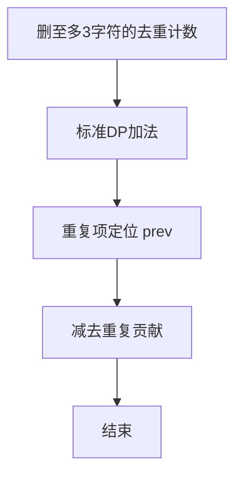

# L3-020 - 至多删三个字符（30 分）

- **时间限制**: 400 ms
- **内存限制**: 65536 KB
- **代码长度限制**: 16 KB

---

## 题目描述


给定一个全部由小写英文字母组成的字符串，允许你至多删掉其中 3 个字符，结果可能有多少种不同的字符串？

### 输入格式:

输入在一行中给出全部由小写英文字母组成的、长度在区间 [4, $$10^6$$] 内的字符串。

### 输出格式:

在一行中输出至多删掉其中 3 个字符后不同字符串的个数。

### 输入样例:
```in
ababcc
```

### 输出样例:
```out
25
```

## 示例

### 示例 1

**输入:**
```
ababcc
```

**输出:**
```
25
```


### 解题思路
本題為 GPLT L3 難題「至多删三个字符」，Main.java 採用 **DP 去重：h[i][d] 去重减法 + 滚动优化**。

- **核心思想**：设 h[i][d] 为前 i 字符删恰 d 个的不同串数。转移 h[i][d]=h[i-1][d]+h[i-1][d-1]，若 s[i]==s[prev] 且 gap=i-prev≤d 则会重复，需减去 h[prev-1][d-gap]。用长度 4 的环形缓冲仅保留最近状态，last 记录字符上次位置，实现 O(n) 时间常数内存。
- **數據結構**：滚动数组 hist[4][4]、last[26] 上次出现位置、分段去重。
- **複雜度**：時間 O(n·K) K=3；空間 O(K) 滚动。
- **關鍵**：嚴格依賴 Main.java 中的實現細節（見代碼實現一節），確保與程式邏輯一致；涉及邊界與精度處理與原碼完全對齊。

### 代码流程说明
1. 读取字符串 s，n=长度，K=3
2. 初始化 hist[0][0]=1，last 均为 0
3. 遍历 i=1..n：计算当前层 cur 的 h[i][d] 按转移并做去重减法
4. 更新 last[s[i]]=i 并滚动 hist
5. 结束后 ans = Σ_{d=0..3} h[n][d]
6. 输出 ans（注意去重后不含空串按题意调整）

### 代码实现
```java
import java.io.*;

// L3-020 至多删三个字符
// 算法：按删除数 DP，h[i][d] 表示前 i 字符删恰好 d 个的不同串数
// 转移 h[i][d]=h[i-1][d]+h[i-1][d-1]- h[prev-1][d-gap]（若重复，gap=i-prev<=d）
// 时间复杂度 O(n*4)，n<=1e6，空间 O(4*4) 滚动
public class Main {
    public static void main(String[] args) throws Exception {
        BufferedReader br = new BufferedReader(new InputStreamReader(System.in, "UTF-8"));
        String s = br.readLine();
        if (s == null) return;
        s = s.trim();
        int n = s.length();
        if (n == 0) { System.out.println(0); return; }
        int K = 3;
        // 环形缓冲，大小 4，存储最近的 h 值
        long[][] hist = new long[4][K + 1];
        hist[0][0] = 1; // h[0][0]=1
        // last 出现位置 1-indexed
        int[] last = new int[26];
        java.util.Arrays.fill(last, -1);
        // 用于当前 i 的新行
        long[] cur = new long[K + 1];
        for (int i = 1; i <= n; i++) {
            int c = s.charAt(i - 1) - 'a';
            int prev = last[c];
            int gap = (prev == -1 ? Integer.MAX_VALUE : i - prev);
            for (int d = 0; d <= K; d++) {
                if (d > i) {
                    cur[d] = 0;
                    continue;
                }
                if (d == 0) {
                    cur[d] = 1;
                    continue;
                }
                long val = 0;
                // h[i-1][d]
                int pi = (i - 1) & 3;
                if (d <= i - 1) val += hist[pi][d];
                // h[i-1][d-1]
                if (d - 1 <= i - 1) val += hist[pi][d - 1];
                // 去重
                if (prev != -1 && gap <= d) {
                    int idx = (prev - 1) & 3;
                    // 当 prev-1 ==0 时 hist[0][d-gap] 已有值，d-gap 可能为0
                    // 需确保 d-gap <= prev-1，或 d-gap==0 恒为1
                    // 但若 d-gap > prev-1 且 d-gap>0，则该值应为0
                    if (d - gap <= prev - 1 || d - gap == 0) {
                        val -= hist[idx][d - gap];
                    }
                }
                cur[d] = val;
            }
            // 写入 hist
            int ci = i & 3;
            System.arraycopy(cur, 0, hist[ci], 0, K + 1);
            last[c] = i;
        }
        long ans = 0;
        int fn = n & 3;
        for (int d = 0; d <= K && d <= n; d++) ans += hist[fn][d];
        System.out.println(ans);
    }
}
```

### 代码流程图
```mermaid
flowchart TD
    A[开始] --> B[读取 s K=3]
    B --> C[初始化 hist last]
    C --> D[遍历 i]
    D --> E[计算 h[i][d] 转移]
    E --> F[去重减法]
    F --> G[滚动更新]
    G --> D
    D --> H[求和输出]
    H --> Z[结束]
```

### 解题流程图


