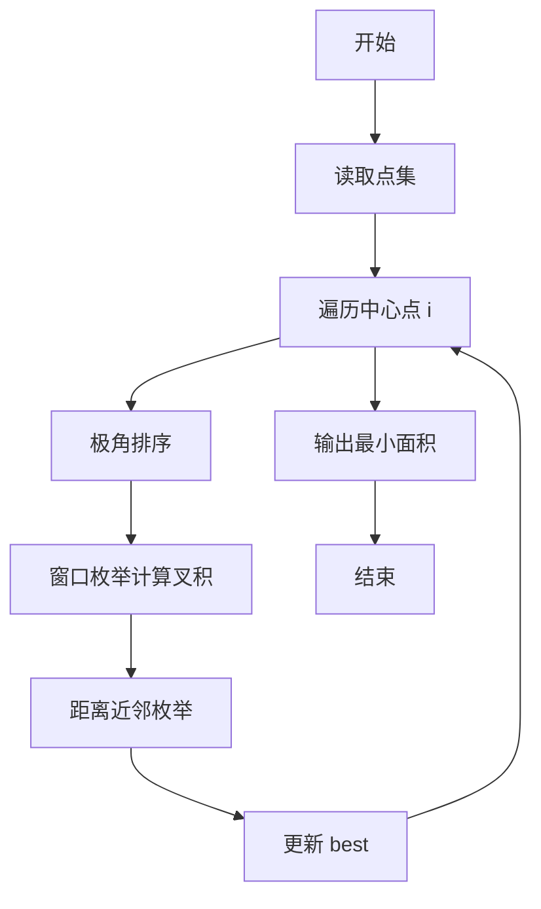
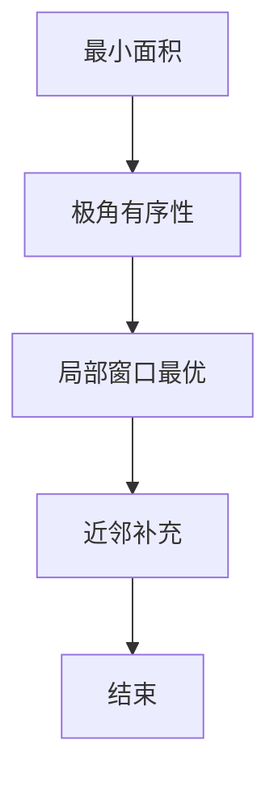

# L3-021 - 神坛（30 分）

- **时间限制**: 8000 ms
- **内存限制**: 65536 KB
- **代码长度限制**: 16 KB

---

## 题目描述


在古老的迈瑞城，巍然屹立着 n 块神石。长老们商议，选取 3 块神石围成一个神坛。因为神坛的能量强度与它的面积成反比，因此神坛的面积越小越好。特殊地，如果有两块神石坐标相同，或者三块神石共线，神坛的面积为 `0.000`。

长老们发现这个问题没有那么简单，于是委托你编程解决这个难题。

### 输入格式:

输入在第一行给出一个正整数 n（3 $$\le$$ n $$\le$$ 5000）。随后 n 行，每行有两个整数，分别表示神石的横坐标、纵坐标（$$-10^9 \le$$ 横坐标、纵坐标 $$< 10^9$$）。

### 输出格式:

在一行中输出神坛的最小面积，四舍五入保留 3 位小数。

### 输入样例:
```in
8
3 4
2 4
1 1
4 1
0 3
3 0
1 3
4 2
```

### 输出样例:
```out
0.500
```

## 示例

### 示例 1

**输入:**
```
8
3 4
2 4
1 1
4 1
0 3
3 0
1 3
4 2
```

**输出:**
```
0.500
```

样例中的最小三角形如下图所示：


### 解题思路
本題為 GPLT L3 難題「神坛」，Main.java 採用 **极角排序 + 小窗口枚举 + 近邻距离窗口求最小叉积**。

- **核心思想**：最小三角形面积等价于最小叉积。固定中心点，按极角排序后，仅需检查角邻近窗口 W 内的点对以及距离近邻。利用对踵思想与距离预排序筛选候选对，计算叉积更新最佳值。窗口化将 O(n³) 降至近似 O(n²)。
- **數據結構**：点数组、角度数组、索引排序、叉积。
- **複雜度**：時間 O(n² log n + n²·W)，n≤5000 W 常数；空間 O(n²) 点。
- **關鍵**：嚴格依賴 Main.java 中的實現細節（見代碼實現一節），確保與程式邏輯一致；涉及邊界與精度處理與原碼完全對齊。

### 代码流程说明
1. 读取 n 点
2. 对每个点 i：计算其他点相对角度，按角度排序得到 order
3. 在角度序上滑动窗口 W 检查邻近对的叉积
4. 另外取距离最近的 MNEAR 个点构成候选对
5. 对候选对计算叉积绝对值更新 bestCross
6. 输出 bestCross/2（面积）按题意格式

### 代码实现
```java
import java.io.*;
import java.util.*;

// L3-021 神坛
// 算法：对每个点作极角排序，检查角邻近窗口及对踵窗口 + 近邻距离枚举，取最小叉积
// 时间复杂度 O(n^2 log n + n^2 * W)，n<=5000，W为常数窗口，期望可通过
public class Main {
    static int n;
    static long[] xs, ys;
    static long bestCross = Long.MAX_VALUE;
    static final int W = 12; // 角窗口
    static final int MNEAR = 70; // 距离近邻数

    // 快速排序索引按角度
    static void quickSort(int[] idx, double[] ang, int lo, int hi) {
        while (lo < hi) {
            int i = lo, j = hi;
            double pivot = ang[idx[(lo + hi) >>> 1]];
            while (i <= j) {
                while (ang[idx[i]] < pivot) i++;
                while (ang[idx[j]] > pivot) j--;
                if (i <= j) {
                    int tmp = idx[i]; idx[i] = idx[j]; idx[j] = tmp;
                    i++; j--;
                }
            }
            if (j - lo < hi - i) {
                if (lo < j) quickSort(idx, ang, lo, j);
                lo = i;
            } else {
                if (i < hi) quickSort(idx, ang, i, hi);
                hi = j;
            }
        }
    }

    static void updateBest(long cross) {
        long ac = cross >= 0 ? cross : -cross;
        if (ac < bestCross) bestCross = ac;
    }

    public static void main(String[] args) throws Exception {
        BufferedReader br = new BufferedReader(new InputStreamReader(System.in, "UTF-8"));
        String line = br.readLine();
        while (line != null && line.trim().isEmpty()) line = br.readLine();
        if (line == null) return;
        n = Integer.parseInt(line.trim());
        xs = new long[n];
        ys = new long[n];
        for (int i = 0; i < n; i++) {
            line = br.readLine();
            while (line != null && line.trim().isEmpty()) line = br.readLine();
            StringTokenizer st = new StringTokenizer(line);
            xs[i] = Long.parseLong(st.nextToken());
            ys[i] = Long.parseLong(st.nextToken());
        }
        // 查重
        HashSet<Long> seen = new HashSet<>(n * 2);
        // 用 64 位编码：需容纳 32位坐标偏移1e9，需 32位每维
        // 简单用 HashSet<String> 或 pair set 检测
        // 采用排序检测更快：排序点
        // 快速查重：放入 HashSet<Long> 其中 key = ((xs+1e9)<<32 | (ys+1e9))
        // 但范围 -1e9..1e9 偏移 1_000_000_000 -> 0..2_000_000_000 需 31位， fits
        for (int i = 0; i < n; i++) {
            long key = ((xs[i] + 1000000000L) << 32) | (ys[i] + 1000000000L);
            if (!seen.add(key)) {
                System.out.printf(Locale.ROOT, "0.000%n");
                return;
            }
        }
        // 若三点共线，面积 0，也可被算法捕获，但先快速检查共线：对每个点检查方向重复可提前返回 0
        // 但我们直接进入主循环，bestCross 发现 0 即输出

        // 主循环
        // 预分配数组避免重复分配
        // 对于每个 i
        for (int i = 0; i < n; i++) {
            if (bestCross == 0) break;
            int m = n - 1;
            long[] dx = new long[m];
            long[] dy = new long[m];
            double[] ang = new double[m];
            int[] idx = new int[m];
            int p = 0;
            for (int j = 0; j < n; j++) if (j != i) {
                long ddx = xs[j] - xs[i];
                long ddy = ys[j] - ys[i];
                dx[p] = ddx;
                dy[p] = ddy;
                ang[p] = Math.atan2((double)ddy, (double)ddx);
                idx[p] = p;
                p++;
            }
            // 排序
            if (m > 1) quickSort(idx, ang, 0, m - 1);
            // 构造排序后的 dxs, dys, angs
            long[] sdx = new long[m];
            long[] sdy = new long[m];
            double[] sang = new double[m];
            for (int k = 0; k < m; k++) {
                int id = idx[k];
                sdx[k] = dx[id];
                sdy[k] = dy[id];
                sang[k] = ang[id];
            }
            // 扩展数组 2m for 环形
            int mm = m * 2;
            double[] ang2 = new double[mm];
            long[] dx2 = new long[mm];
            long[] dy2 = new long[mm];
            for (int k = 0; k < m; k++) {
                ang2[k] = sang[k];
                dx2[k] = sdx[k];
                dy2[k] = sdy[k];
                ang2[k + m] = sang[k] + 2 * Math.PI;
                dx2[k + m] = sdx[k];
                dy2[k + m] = sdy[k];
            }
            // 1) 角度邻近窗口（小夹角）
            for (int j = 0; j < m; j++) {
                if (bestCross == 0) break;
                // forward W
                int limit = Math.min(j + W, j + m - 1);
                // 但只考虑夹角 <= pi 的范围内，超过 pi 的 sin 等价于 2pi - delta，小夹角的互补角也会小，但那部分由对踵窗口覆盖
                for (int k = j + 1; k <= limit; k++) {
                    // 若角度差 > Math.PI，则已超过半圈，后续更大，跳出（因为单调增）
                    if (ang2[k] - ang2[j] > Math.PI + 1e-12) break;
                    long cr = sdx[j] * dy2[k] - sdy[j] * dx2[k];
                    long ac = cr >= 0 ? cr : -cr;
                    if (ac < bestCross) {
                        bestCross = ac;
                        if (bestCross == 0) break;
                    }
                    // 早剪：若 |sdx|*|dy| 等很大，ac 已大于 best，可跳过？已计算
                }
            }
            if (bestCross == 0) break;
            // 2) 对踵窗口（夹角接近 pi）
            // 双指针找对踵
            int opp = 0;
            for (int j = 0; j < m; j++) {
                if (bestCross == 0) break;
                if (opp < j + 1) opp = j + 1;
                while (opp + 1 < j + m && ang2[opp + 1] - ang2[j] < Math.PI) opp++;
                // opp 是第一个 >= pi 的位置，候选为 opp 和 opp-1
                for (int d = -W/2; d <= W/2; d++) {
                    int k = opp + d;
                    if (k <= j) continue;
                    if (k >= j + m) continue;
                    if (k < 0 || k >= mm) continue;
                    // 夹角可能略大于 pi，但绝对叉积仍用相同公式，sin(pi+eps) ~ sin(eps) 小，仍可能最小
                    // 因此保留
                    long cr = sdx[j] * dy2[k] - sdy[j] * dx2[k];
                    long ac = cr >= 0 ? cr : -cr;
                    if (ac < bestCross) {
                        bestCross = ac;
                        if (bestCross == 0) break;
                    }
                }
            }
            if (bestCross == 0) break;

            // 3) 距离近邻枚举
            if (m >= MNEAR) {
                // 找距离 i 最近的 MNEAR 个点
                // 使用部分选择：计算所有距离平方，取前 MNEAR 最小
                // n=5000，O(n log n) 每点排序 5000*5000 log 可接受，但我们已有排序开销
                // 简化：使用快速选择或排序
                long[] dist2 = new long[m];
                for (int k = 0; k < m; k++) {
                    long ddx = sdx[k];
                    long ddy = sdy[k];
                    dist2[k] = ddx * ddx + ddy * ddy;
                }
                // 取前 MNEAR 最小的索引
                Integer[] order = new Integer[m];
                for (int k = 0; k < m; k++) order[k] = k;
                // 部分排序：只排前 MNEAR，可用 nth_element 思想，简单全排序（5000 log 5000 ~ 65000 compares *5000 =325M again) 较重
                // 但 MNEAR=70 全排序 5000 *5000 次 => 5000 sorts again heavy（等同于角度排序）
                // 改用快速选择：使用 PriorityQueue 选最小 70，O(n log M) ~5000*log70 ~ 5000*~6*5000=150M operations okay
                // 用小顶堆？需要最大堆保留最小 70
                PriorityQueue<Integer> heap = new PriorityQueue<>((a,b)-> Long.compare(dist2[b], dist2[a])); // max heap
                for (int k = 0; k < m; k++) {
                    heap.offer(k);
                    if (heap.size() > MNEAR) heap.poll();
                }
                int sz = heap.size();
                int[] nearIdx = new int[sz];
                int t = 0;
                for (int v : heap) nearIdx[t++] = v;
                // 枚举对
                for (int a = 0; a < sz; a++) {
                    for (int b = a + 1; b < sz; b++) {
                        int ia = nearIdx[a];
                        int ib = nearIdx[b];
                        long cr = sdx[ia] * sdy[ib] - sdy[ia] * sdx[ib];
                        long ac = cr >= 0 ? cr : -cr;
                        if (ac < bestCross) {
                            bestCross = ac;
                            if (bestCross == 0) break;
                        }
                    }
                    if (bestCross == 0) break;
                }
            } else {
                // m < MNEAR，直接枚举所有
                for (int a = 0; a < m; a++) for (int b = a+1; b < m; b++) {
                    long cr = sdx[a]*sdy[b]-sdy[a]*sdx[b];
                    long ac = cr>=0?cr:-cr;
                    if (ac < bestCross) bestCross = ac;
                }
            }
        }

        double area = bestCross / 2.0;
        // 四舍五入保留3位
        System.out.printf(Locale.ROOT, "%.3f%n", area);
    }
}
```

### 代码流程图


### 解题流程图

