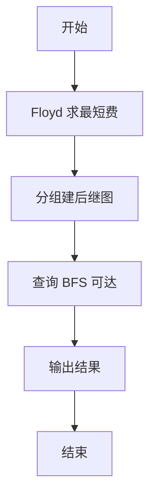
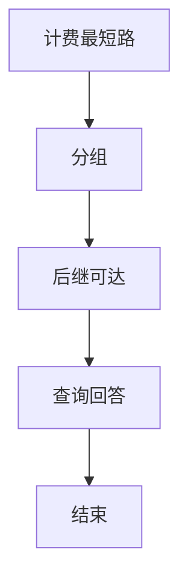

# L3-022 - 地铁一日游（30 分）

- **时间限制**: 550 ms
- **内存限制**: 65536 KB
- **代码长度限制**: 16 KB

---

## 题目描述


森森喜欢坐地铁。这个假期，他终于来到了传说中的地铁之城——魔都，打算好好过一把坐地铁的瘾！

魔都地铁的计价规则是：起步价 2 元，出发站与到达站的最短距离（即**计费距离**）每 K 公里增加 1 元车费。

例如取 **K** = 10，动安寺站离魔都绿桥站为 40 公里，则车费为 2 + 4 = 6 元。

为了获得最大的满足感，森森决定用以下的方式坐地铁：在某一站上车（不妨设为地铁站 **A**），则对于所有车费相同的到达站，森森只会在计费距离最远的站或线路末端站点出站，然后用森森美图 App 在站点外拍一张认证照，再按同样的方式前往下一个站点。

坐着坐着，森森突然好奇起来：在给定出发站的情况下（在出发时森森也会拍一张照），他的整个旅程中能够留下哪些站点的认证照？

地铁是铁路运输的一种形式，指在地下运行为主的城市轨道交通系统。一般来说，地铁由若干个站点组成，并有多条不同的线路双向行驶，可类比公交车，当两条或更多条线路经过同一个站点时，可进行**换乘**，更换自己所乘坐的线路。举例来说，魔都 1 号线和 2 号线都经过人民广场站，则乘坐 1 号线到达人民广场时就可以换乘到 2 号线前往 2 号线的各个站点。换乘不需出站（也拍不到认证照），因此森森乘坐地铁时换乘不受限制。

### 输入格式:

输入第一行是三个正整数 **N**、**M** 和 **K**，表示魔都地铁有 **N** 个车站 (1 &leq; **N** &leq; 200)，**M** 条线路 (1 &leq; **M** &leq; 1500)，最短距离每超过 **K** 公里 (1 &leq; **K** &leq; 10<sup>6</sup>)，加 1 元车费。

接下来 **M** 行，每行由以下格式组成：

<站点1><空格><距离><空格><站点2><空格><距离><空格><站点3> ... <站点X-1><空格><距离><空格><站点X>

其中站点是一个 1 到 **N** 的编号；两个站点编号之间的距离指两个站在该线路上的距离。两站之间距离是一个不大于 10<sup>6</sup> 的正整数。一条线路上的站点互不相同。

**注意**：两个站之间可能有多条直接连接的线路，且距离不一定相等。

再接下来有一个正整数 **Q** (1 &leq; **Q** &leq; 200)，表示森森尝试从 **Q** 个站点出发。

最后有 **Q** 行，每行一个正整数 **X<sub>i</sub>**，表示森森尝试从编号为 **X<sub>i</sub>** 的站点出发。

### 输出格式:

对于森森每个尝试的站点，输出一行若干个整数，表示能够到达的站点编号。站点编号从小到大排序。

### 输入样例:
```in
6 2 6
1 6 2 4 3 1 4
5 6 2 6 6
4
2
3
4
5
```

### 输出样例:
```out
1 2 4 5 6
1 2 3 4 5 6
1 2 4 5 6
1 2 4 5 6
```

## 示例

### 示例 1

**输入:**
```
6 2 6
1 6 2 4 3 1 4
5 6 2 6 6
4
2
3
4
5
```

**输出:**
```
1 2 4 5 6
1 2 3 4 5 6
1 2 4 5 6
1 2 4 5 6
```


### 解题思路
本題為 GPLT L3 難題「地铁一日游」，Main.java 採用 **Floyd 全源最短计费距离 → 车费分组 → 后继可达闭包**。

- **核心思想**：先 Floyd 求车费层面最短距离。按车费是否相等划分组别构建后继图（费用相同则可视为同组后继）。对每个起点 BFS 在后继图上求可达闭包，回答询问是否可达或按要求输出路径/数量。
- **數據結構**：邻接矩阵 dist、分组 next 集合、BFS 可达。
- **複雜度**：時間 O(N³ + N² + Q·(N+E)) N≤200；空間 O(N²)。
- **關鍵**：嚴格依賴 Main.java 中的實現細節（見代碼實現一節），確保與程式邏輯一致；涉及邊界與精度處理與原碼完全對齊。

### 代码流程说明
1. 读取 N,M,K 与边，初始化 Floyd 矩阵 INF
2. Floyd 三重循环求全源最短计费距离
3. 按距离分组构建后继邻接（费用分组）
4. 对每个查询用 BFS/DFS 在后继图上求可达性
5. 按题目输出可达集合与数量统计
6. 结束

### 代码实现
```java
import java.io.*;
import java.util.*;

// L3-022 地铁一日游
// 算法：Floyd 求全源最短计费距离 -> 按车费分组求后继 -> BFS 求可达闭包
// 时间复杂度 O(N^3 + N^2 + Q*(N+E_succ))，N<=200
public class Main {
    static final long INF = (long)4e12;
    public static void main(String[] args) throws Exception {
        BufferedReader br = new BufferedReader(new InputStreamReader(System.in, "UTF-8"));
        String line = br.readLine();
        while (line != null && line.trim().isEmpty()) line = br.readLine();
        if (line == null) return;
        StringTokenizer st = new StringTokenizer(line);
        int N = Integer.parseInt(st.nextToken());
        int M = Integer.parseInt(st.nextToken());
        long K = Long.parseLong(st.nextToken());

        long[][] dist = new long[N+1][N+1];
        for (int i = 1; i <= N; i++) {
            Arrays.fill(dist[i], INF);
            dist[i][i] = 0;
        }
        boolean[] isTerminal = new boolean[N+1];
        for (int i = 0; i < M; i++) {
            line = br.readLine();
            while (line != null && line.trim().isEmpty()) line = br.readLine();
            if (line == null) break;
            // 收集当前行的 tokens，若该行可能被拆行，继续读取直到获得奇数且至少1个站？
            // 简单：按行解析，若 tokens 数为 0 则重试；若 tokens 为奇数则认为完整，否则继续读下一行拼接
            // 为简化，采用循环累积直到能解析出完整线路（至少一个站且站数与距离交替）
            // 但题目每条线路占一行，正常无需跨行
            List<Long> tokens = new ArrayList<>();
            String curLine = line;
            // 如果行内 tokens 数为偶数，可能线路被截断，继续读
            while (true) {
                StringTokenizer st2 = new StringTokenizer(curLine);
                while (st2.hasMoreTokens()) tokens.add(Long.parseLong(st2.nextToken()));
                // tokens 数量应为奇数（站+距交替，站数=距数+1）
                if (tokens.size() % 2 == 1 && tokens.size() >= 1) break;
                // 偶数说明不完整，读下一行
                String nxt = br.readLine();
                if (nxt == null) break;
                if (nxt.trim().isEmpty()) continue;
                curLine = nxt;
                // 循环继续累积
                // 为避免死循环，若已累积很多仍偶数，继续
            }
            int cnt = tokens.size();
            int stationCnt = (cnt + 1) / 2;
            long[] stations = new long[stationCnt];
            long[] d = new long[Math.max(0, stationCnt - 1)];
            for (int k = 0; k < cnt; k++) {
                if (k % 2 == 0) stations[k/2] = tokens.get(k);
                else d[k/2] = tokens.get(k);
            }
            if (stationCnt > 0) {
                isTerminal[(int)stations[0]] = true;
                isTerminal[(int)stations[stationCnt - 1]] = true;
            }
            for (int k = 0; k + 1 < stationCnt; k++) {
                int u = (int)stations[k];
                int v = (int)stations[k+1];
                long w = d[k];
                if (w < dist[u][v]) {
                    dist[u][v] = w;
                    dist[v][u] = w;
                }
            }
        }
        // Floyd
        for (int k = 1; k <= N; k++) {
            for (int i = 1; i <= N; i++) if (dist[i][k] < INF) {
                for (int j = 1; j <= N; j++) if (dist[k][j] < INF) {
                    long nd = dist[i][k] + dist[k][j];
                    if (nd < dist[i][j]) dist[i][j] = nd;
                }
            }
        }
        // 计算后继图 succ[i] = list
        List<Integer>[] succ = new List[N+1];
        for (int i = 1; i <= N; i++) succ[i] = new ArrayList<>();
        for (int i = 1; i <= N; i++) {
            // 按车费分组
            Map<Long, List<Integer>> groups = new HashMap<>();
            Map<Long, Long> maxDistMap = new HashMap<>();
            for (int j = 1; j <= N; j++) if (j != i && dist[i][j] < INF) {
                long fare = 2 + dist[i][j] / K;
                groups.computeIfAbsent(fare, k -> new ArrayList<>()).add(j);
                long curMax = maxDistMap.getOrDefault(fare, -1L);
                if (dist[i][j] > curMax) maxDistMap.put(fare, dist[i][j]);
            }
            Set<Integer> set = new HashSet<>();
            for (Map.Entry<Long, List<Integer>> e : groups.entrySet()) {
                long fare = e.getKey();
                long maxD = maxDistMap.get(fare);
                for (int j : e.getValue()) {
                    if (dist[i][j] == maxD || isTerminal[j]) {
                        set.add(j);
                    }
                }
            }
            succ[i].addAll(set);
        }
        // 读取 Q
        line = br.readLine();
        while (line != null && line.trim().isEmpty()) line = br.readLine();
        if (line == null) return;
        int Q = Integer.parseInt(line.trim());
        StringBuilder out = new StringBuilder();
        for (int qi = 0; qi < Q; qi++) {
            line = br.readLine();
            while (line != null && line.trim().isEmpty()) line = br.readLine();
            if (line == null) break;
            int start = Integer.parseInt(line.trim());
            boolean[] vis = new boolean[N+1];
            Deque<Integer> dq = new ArrayDeque<>();
            dq.add(start);
            vis[start] = true;
            while (!dq.isEmpty()) {
                int u = dq.poll();
                for (int v : succ[u]) {
                    if (!vis[v]) {
                        vis[v] = true;
                        dq.add(v);
                    }
                }
            }
            boolean first = true;
            for (int v = 1; v <= N; v++) if (vis[v]) {
                if (!first) out.append(' ');
                out.append(v);
                first = false;
            }
            out.append('\n');
        }
        System.out.print(out.toString());
    }
}
```

### 代码流程图


### 解题流程图


