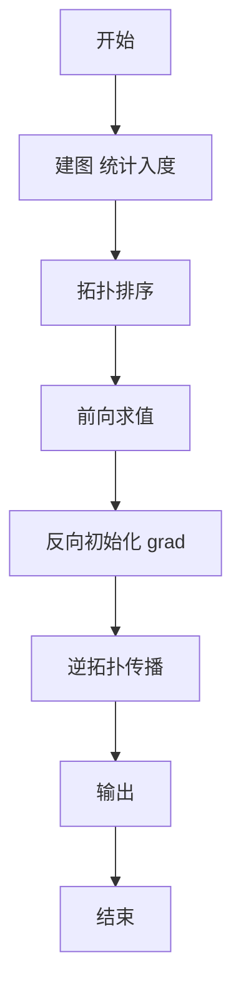
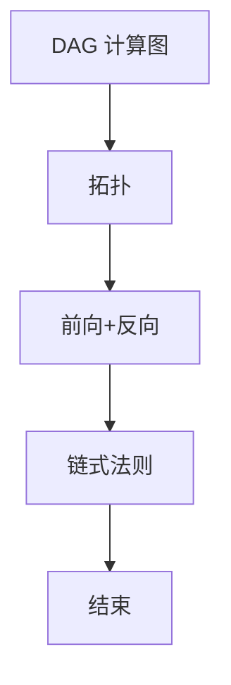

# L3-023 - 计算图（30 分）

- **时间限制**: 400 ms
- **内存限制**: 65536 KB
- **代码长度限制**: 16 KB

---

## 题目描述


“计算图”（computational graph）是现代深度学习系统的基础执行引擎，提供了一种表示任意数学表达式的方法，例如用有向无环图表示的神经网络。 图中的节点表示基本操作或输入变量，边表示节点之间的中间值的依赖性。 例如，下图就是一个函数
$$f(x_1,x_2)=\ln x_1 + x_1 x_2 - \sin x_2$$
的计算图。


现在给定一个计算图，请你根据所有输入变量计算函数值及其偏导数（即梯度）。 例如，给定输入$$ x_1 = 2, x_2 = 5 $$，上述计算图获得函数值 $$ f(2,5)=\ln (2) + 2\times 5 - \sin (5) = 11.652$$；并且根据微分链式法则，上图得到的梯度 $$\nabla f = [\partial f / \partial x_1 , \partial f / \partial x_2 ] =   [ 1/x_1 + x_2 , x_1 - \cos x_2] = [5.500,1.716]$$。

知道你已经把微积分忘了，所以这里只要求你处理几个简单的算子：加法、减法、乘法、指数（$$e^x$$，即编程语言中的 exp(x) 函数）、对数（$$\ln x$$，即编程语言中的 log(x) 函数）和正弦函数（$$\sin x$$，即编程语言中的 sin(x) 函数）。

友情提醒：

- 常数的导数是 0；$$x$$ 的导数是 1；$$e^x$$ 的导数还是 $$e^x$$；$$\ln x$$ 的导数是 $$1/x$$；$$\sin x$$ 的导数是 $$\cos x$$。
- 回顾一下什么是**偏导数**：在数学中，一个多变量的函数的偏导数，就是它关于其中一个变量的导数而保持其他变量恒定。在上面的例子中，当我们对 $$x_1$$ 求偏导数 $$\partial f / \partial x_1$$ 时，就将 $$x_2$$ 当成常数，所以得到 $$\ln x_1$$ 的导数是 $$1/x_1$$，$$x_1 x_2$$ 的导数是 $$x_2$$，$$\sin x_2$$ 的导数是 0。
- 回顾一下**链式法则**：复合函数的导数是构成复合这有限个函数在相应点的导数的乘积，即若有 $$u=f(y)$$，$$y=g(x)$$，则 $$du/dx = du/dy \cdot dy/dx$$。例如对 $$\sin (\ln x)$$ 求导，就得到 $$\cos (\ln x) \cdot (1/x)$$。

如果你注意观察，可以发现在计算图中，计算函数值是一个从左向右进行的计算，而计算偏导数则正好相反。

### 输入格式:

输入在第一行给出正整数 $$N$$（$$\le 5\times 10^4$$），为计算图中的顶点数。

以下 $$N$$ 行，第 $$i$$ 行给出第 $$i$$ 个顶点的信息，其中 $$i=0, 1, \cdots , N-1$$。第一个值是顶点的类型编号，分别为：

- 0 代表输入变量
- 1 代表加法，对应 $$x_1 + x_2$$
- 2 代表减法，对应 $$x_1 - x_2$$
- 3 代表乘法，对应 $$x_1 \times x_2$$
- 4 代表指数，对应 $$e^x$$
- 5 代表对数，对应 $$\ln x$$
- 6 代表正弦函数，对应 $$\sin x$$

对于输入变量，后面会跟它的双精度浮点数值；对于单目算子，后面会跟它对应的单个变量的顶点编号（编号从 0 开始）；对于双目算子，后面会跟它对应两个变量的顶点编号。

题目保证只有一个输出顶点（即没有出边的顶点，例如上图最右边的 `-`），且计算过程不会超过双精度浮点数的计算精度范围。

### 输出格式:

首先在第一行输出给定计算图的函数值。在第二行顺序输出函数对于每个变量的偏导数的值，其间以一个空格分隔，行首尾不得有多余空格。偏导数的输出顺序与输入变量的出现顺序相同。输出小数点后 3 位。

### 输入样例:
```in
7
0 2.0
0 5.0
5 0
3 0 1
6 1
1 2 3
2 5 4
```

### 输出样例:
```out
11.652
5.500 1.716
```

## 示例

### 示例 1

**输入:**
```
7
0 2.0
0 5.0
5 0
3 0 1
6 1
1 2 3
2 5 4
```

**输出:**
```
11.652
5.500 1.716
```


### 解题思路
本題為 GPLT L3 難題「计算图」，Main.java 採用 **拓扑排序前向求值 + 反向传播求梯度（自动微分）**。

- **核心思想**：计算图为 DAG。按拓扑序前向计算每个节点值（常量、加、乘、sigmoid 等）。反向时初始化 dL/dRoot=1，按逆拓扑通过链式法则传播梯度：加法分发、乘法乘以对方值、非线性乘导数。最终输出某变量梯度或全部值。
- **數據結構**：节点类型数组、输入边 in1/in2、出边列表 out[]、拓扑队列、梯度数组。
- **複雜度**：時間 O(N)；空間 O(N)。
- **關鍵**：嚴格依賴 Main.java 中的實現細節（見代碼實現一節），確保與程式邏輯一致；涉及邊界與精度處理與原碼完全對齊。

### 代码流程说明
1. 读取 N 节点类型与输入连接
2. 建出边表并统计入度，拓扑排序
3. 前向遍历拓扑序计算 val
4. 反向初始化 grad[root]=1，逆拓扑传播 grad
5. 对每种算子按导数规则更新前驱 grad
6. 输出要求的梯度/前向值

### 代码实现
```java
import java.io.*;
import java.util.*;

// L3-023 计算图
// 算法：拓扑排序前向求值 + 反向传播求梯度
// 时间复杂度 O(N)
public class Main {
    public static void main(String[] args) throws Exception {
        BufferedReader br = new BufferedReader(new InputStreamReader(System.in, "UTF-8"));
        String line = br.readLine();
        while (line != null && line.trim().isEmpty()) line = br.readLine();
        if (line == null) return;
        int N = Integer.parseInt(line.trim());
        int[] type = new int[N];
        double[] val = new double[N];
        int[] in1 = new int[N];
        int[] in2 = new int[N];
        Arrays.fill(in1, -1);
        Arrays.fill(in2, -1);
        List<Integer>[] out = new List[N];
        for (int i = 0; i < N; i++) out[i] = new ArrayList<>();
        int[] indeg = new int[N];
        List<Integer> inputOrder = new ArrayList<>();

        for (int i = 0; i < N; i++) {
            line = br.readLine();
            while (line != null && line.trim().isEmpty()) line = br.readLine();
            if (line == null) break;
            StringTokenizer st = new StringTokenizer(line);
            int t = Integer.parseInt(st.nextToken());
            type[i] = t;
            if (t == 0) {
                double v = Double.parseDouble(st.nextToken());
                val[i] = v;
                indeg[i] = 0;
                inputOrder.add(i);
            } else if (t == 1 || t == 2 || t == 3) {
                int a = Integer.parseInt(st.nextToken());
                int b = Integer.parseInt(st.nextToken());
                in1[i] = a; in2[i] = b;
                indeg[i] = 2;
                out[a].add(i);
                out[b].add(i);
            } else { // 4,5,6 单目
                int a = Integer.parseInt(st.nextToken());
                in1[i] = a;
                indeg[i] = 1;
                out[a].add(i);
            }
        }
        // 拓扑排序
        Deque<Integer> q = new ArrayDeque<>();
        for (int i = 0; i < N; i++) if (indeg[i] == 0) q.add(i);
        List<Integer> topo = new ArrayList<>(N);
        while (!q.isEmpty()) {
            int u = q.poll();
            topo.add(u);
            for (int v : out[u]) {
                if (--indeg[v] == 0) q.add(v);
            }
        }
        // 若图中存在环或未全部入队（可能输入已按拓扑序但我们用 Kahn 已处理）
        if (topo.size() != N) {
            // 退化：按索引顺序作为拓扑（若仍有环则无法计算）
            topo.clear();
            for (int i = 0; i < N; i++) topo.add(i);
        }
        // 前向求值（按 topo 顺序）
        for (int u : topo) {
            int t = type[u];
            if (t == 0) continue;
            else if (t == 1) {
                val[u] = val[in1[u]] + val[in2[u]];
            } else if (t == 2) {
                val[u] = val[in1[u]] - val[in2[u]];
            } else if (t == 3) {
                val[u] = val[in1[u]] * val[in2[u]];
            } else if (t == 4) {
                val[u] = Math.exp(val[in1[u]]);
            } else if (t == 5) {
                val[u] = Math.log(val[in1[u]]);
            } else if (t == 6) {
                val[u] = Math.sin(val[in1[u]]);
            }
        }
        // 找输出节点（无出边）
        int outNode = -1;
        for (int i = 0; i < N; i++) if (out[i].isEmpty()) outNode = i;
        if (outNode == -1) outNode = topo.get(topo.size() - 1);
        double funcVal = val[outNode];

        // 反向传播
        double[] grad = new double[N];
        grad[outNode] = 1.0;
        for (int idx = topo.size() - 1; idx >= 0; idx--) {
            int u = topo.get(idx);
            double g = grad[u];
            if (g == 0) continue;
            int t = type[u];
            if (t == 1) {
                grad[in1[u]] += g;
                grad[in2[u]] += g;
            } else if (t == 2) {
                grad[in1[u]] += g;
                grad[in2[u]] -= g;
            } else if (t == 3) {
                grad[in1[u]] += g * val[in2[u]];
                grad[in2[u]] += g * val[in1[u]];
            } else if (t == 4) {
                // exp' = exp
                grad[in1[u]] += g * val[u];
            } else if (t == 5) {
                grad[in1[u]] += g / val[in1[u]];
            } else if (t == 6) {
                grad[in1[u]] += g * Math.cos(val[in1[u]]);
            }
        }
        System.out.printf(Locale.ROOT, "%.3f%n", funcVal);
        StringBuilder sb = new StringBuilder();
        for (int i = 0; i < inputOrder.size(); i++) {
            if (i > 0) sb.append(' ');
            double gv = grad[inputOrder.get(i)];
            // 处理 -0.000
            if (Math.abs(gv) < 0.0005) gv = 0;
            sb.append(String.format(Locale.ROOT, "%.3f", gv));
        }
        System.out.println(sb.toString());
    }
}
```

### 代码流程图


### 解题流程图


