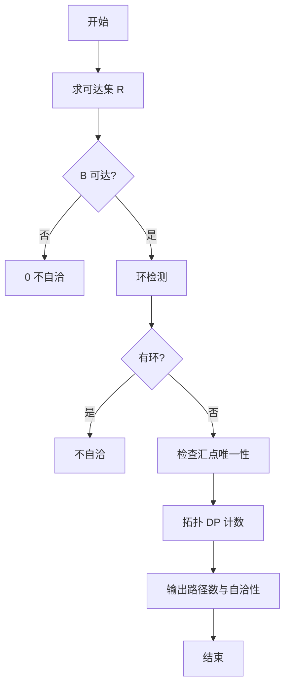
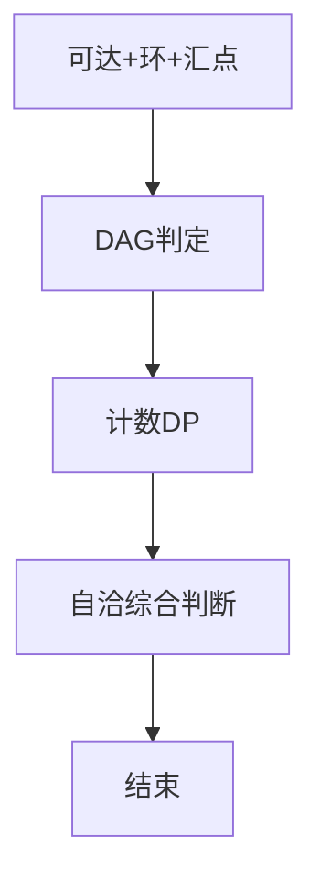

# L3-025 - 那就别担心了（30 分）

- **时间限制**: 400 ms
- **内存限制**: 65536 KB
- **代码长度限制**: 16 KB

---

## 题目描述


下图转自“英式没品笑话百科”的新浪微博 —— 所以无论有没有遇到难题，其实都不用担心。


博主将这种逻辑推演称为“逻辑自洽”，即从某个命题出发的所有推理路径都会将结论引导到同一个最终命题（开玩笑的，千万别以为这是真正的逻辑自洽的定义……）。现给定一个更为复杂的逻辑推理图，本题就请你检查从一个给定命题到另一个命题的推理是否是“逻辑自洽”的，以及存在多少种不同的推理路径。例如上图，从“你遇到难题了吗？”到“那就别担心了”就是一种“逻辑自洽”的推理，一共有 3 条不同的推理路径。

### 输入格式:

输入首先在一行中给出两个正整数 $$N$$（$$1 < N \le 500$$）和 $$M$$，分别为命题个数和推理个数。这里我们假设命题从 1 到 $$N$$ 编号。

接下来 $$M$$ 行，每行给出一对命题之间的推理关系，即两个命题的编号 `S1 S2`，表示可以从 `S1` 推出 `S2`。题目保证任意两命题之间只存在最多一种推理关系，且任一命题不能循环自证（即从该命题出发推出该命题自己）。

最后一行给出待检验的两个命题的编号 `A B`。

### 输出格式:

在一行中首先输出从 `A` 到 `B` 有多少种不同的推理路径，然后输出 `Yes` 如果推理是“逻辑自洽”的，或 `No` 如果不是。

题目保证输出数据不超过 $$10^9$$。

### 输入样例 1：
```in
7 8
7 6
7 4
6 5
4 1
5 2
5 3
2 1
3 1
7 1
```

### 输出样例 1：
```out
3 Yes
```

### 输入样例 2：
```in
7 8
7 6
7 4
6 5
4 1
5 2
5 3
6 1
3 1
7 1
```

### 输出样例 2：
```out
3 No
```

## 示例

### 示例 1

**输入:**
```
7 8
7 6
7 4
6 5
4 1
5 2
5 3
2 1
3 1
7 1
```

**输出:**
```
3 Yes
```

### 示例 2

**输入:**
```
7 8
7 6
7 4
6 5
4 1
5 2
5 3
6 1
3 1
7 1
```

**输出:**
```
3 No
```


### 解题思路
本題為 GPLT L3 難題「那就别担心了」，Main.java 採用 **可达集 + 环检测 + 汇点唯一性 + DAG 上路径 DP**。

- **核心思想**：逻辑自洽定义为从 A 出发的所有极大路径均终止于 B 且无环。步骤：BFS 求 A 可达集 R，若 B∉R 则不自洽路径0；三色 DFS 检测 R 诱导子图环，有环不自洽；检查 R 中出度0汇点是否唯一且为 B；若为 DAG 则按拓扑 DP 计数从 A 到 B 路径，B 视为终止不继续扩展。计数带记忆截断避免环无限递归。
- **數據結構**：邻接表、可达布尔数组、三色 DFS、拓扑序、DP 计数。
- **複雜度**：時間 O(N+M)；空間 O(N+M)。
- **關鍵**：嚴格依賴 Main.java 中的實現細節（見代碼實現一節），確保與程式邏輯一致；涉及邊界與精度處理與原碼完全對齊。

### 代码流程说明
1. 建图，BFS/DFS 求 A 可达集合 R
2. 若 B 不可达：输出 0 与不自洽
3. 三色 DFS 判环（仅在 R 上）标记不自洽
4. 统计 R 中出度 0 节点，若存在 ≠B 的汇点则不自洽
5. 拓扑排序 DAG，在其上 DP：dp[A]=1，顺拓扑转移，若 u==B 不向后继转移
6. 输出 dp[B] 与是否自洽（需同时满足无环与唯一汇点）

### 代码实现
```java
import java.util.*;
import java.io.*;

/**
 * L3-025 那就别担心了
 * 题意：给定有向图 N<=500，M条边，查询A到B的推理路径数及是否逻辑自洽。
 * 逻辑自洽定义：从A出发的所有极大推理路径（无法继续延伸）都终止于B，且不存在从A可达的环。
 * 等价于：从A可达的子图是DAG且唯一汇点是B。
 * 路径数：从A到B的不同有向路径条数（保证<=1e9）。图为DAG时可用DP；若存在环则不一致且路径数视为有限（按DAG截断B的后继）。
 * 实现：
 * 1) BFS/DFS求A可达集合R。
 * 2) 若B不可达：计数0，不自洽。
 * 3) 检测R诱导子图的环（DFS三色）。有环 => 不自洽。
 * 4) 检查汇点：R中出度为0的点若不是B => 不自洽；若B出度>0且B可达且图无环但B有后继会经由后继找到另一汇点，已被上步覆盖，故也判不自洽。
 * 5) 计数：对DAG按拓扑排序DP。count[A]=1，顺拓扑转移，若u==B则不向后继转移（把B视为终止）。最终count[B]即为路径数。
 * 若图有环但仍需计数，采用带记忆的DFS截断B后继并检测环避免无限递归，环分支计为0并标记不自洽。
 * 时间复杂度：O(N+M)  BFS/DFS + O(N+M) 拓扑 + O(N+M) DP。
 * 空间 O(N+M)。
 */
public class Main {
    static List<Integer>[] adj;
    static int N,M,A,B;
    static int[] color;
    static boolean hasCycle;
    static boolean[] reachable;
    static long[] dp;
    static int[] indeg;

    static void dfsReach(int u){
        reachable[u]=true;
        for(int v: adj[u]) if(!reachable[v]) dfsReach(v);
    }
    static void dfsCycle(int u){
        color[u]=1;
        for(int v: adj[u]){
            if(!reachable[v]) continue;
            if(color[v]==1){ hasCycle=true; return; }
            if(color[v]==0){ dfsCycle(v); if(hasCycle) return;}
        }
        color[u]=2;
    }

    public static void main(String[] args) throws Exception{
        BufferedReader br=new BufferedReader(new InputStreamReader(System.in, "UTF-8"));
        String line;
        // 读取所有整数
        List<Integer> vals=new ArrayList<>();
        StringBuilder sb=new StringBuilder();
        String l;
        while((l=br.readLine())!=null){ sb.append(l).append(" "); }
        StringTokenizer st=new StringTokenizer(sb.toString());
        while(st.hasMoreTokens()){
            try{ vals.add(Integer.parseInt(st.nextToken())); }catch(Exception e){}
        }
        if(vals.size()<4) return;
        int idx=0;
        N=vals.get(idx++); M=vals.get(idx++);
        adj=new ArrayList[N+1];
        for(int i=1;i<=N;i++) adj[i]=new ArrayList<>();
        indeg=new int[N+1];
        for(int i=0;i<M;i++){
            if(idx+1>=vals.size()) break;
            int s1=vals.get(idx++), s2=vals.get(idx++);
            if(s1>=1 && s1<=N && s2>=1 && s2<=N){
                adj[s1].add(s2);
                indeg[s2]++;
            }
        }
        if(idx+1 >= vals.size()) return;
        A=vals.get(idx++); B=vals.get(idx++);
        reachable=new boolean[N+1];
        dfsReach(A);
        boolean consistent=true;
        long pathCount=0;

        if(!reachable[B]){
            // B不可达
            pathCount=0;
            consistent=false;
        } else {
            // 环检测
            color=new int[N+1];
            hasCycle=false;
            for(int i=1;i<=N;i++) if(reachable[i] && color[i]==0){
                dfsCycle(i);
                if(hasCycle) break;
            }
            if(hasCycle){
                consistent=false;
            } else {
                // 汇点检查
                for(int i=1;i<=N;i++) if(reachable[i]){
                    if(adj[i].isEmpty()){
                        if(i!=B) { consistent=false; break; }
                    } else {
                        // 有出度的可达点若是B，B有后继意味着存在从B出发的路径延伸到汇点，汇点若不是B则已在上一步检出；
                        // 但若B本身是唯一汇点的充要条件已被覆盖：若B有出度且图无环，则B的后继最终会到汇点，该汇点必不是B（因为B有出度不是汇），已判不一致
                        // 因此无需单独处理，但为了明确：若B有出度则不一致
                        if(i==B && !adj[i].isEmpty()){
                            // 检查B的后继是否仍可达汇点不是B，前面已会判；但直接判不一致更符合题意中“最终命题”应为汇点
                            consistent=false; break;
                        }
                    }
                }
                // 额外检查：所有可达点是否都能到达B（在DAG且唯一汇点已保证，但显式检查更安全）
                if(consistent){
                    // 反图BFS从B反向可达
                    List<Integer>[] radj=new ArrayList[N+1];
                    for(int i=1;i<=N;i++) radj[i]=new ArrayList<>();
                    for(int u=1;u<=N;u++) for(int v: adj[u]) radj[v].add(u);
                    boolean[] canReachB=new boolean[N+1];
                    Deque<Integer> dq=new ArrayDeque<>();
                    dq.add(B); canReachB[B]=true;
                    while(!dq.isEmpty()){
                        int u=dq.poll();
                        for(int pre: radj[u]) if(!canReachB[pre]){canReachB[pre]=true; dq.add(pre);}
                    }
                    for(int i=1;i<=N;i++) if(reachable[i] && !canReachB[i]){ consistent=false; break; }
                }
            }
            // 路径计数（DAG且截断B）
            // 构造拓扑序（仅对 reachable 子图）
            // Kahn
            int[] indeg2=new int[N+1];
            for(int u=1;u<=N;u++) if(reachable[u]) for(int v: adj[u]) if(reachable[v]) indeg2[v]++;
            Deque<Integer> q=new ArrayDeque<>();
            for(int i=1;i<=N;i++) if(reachable[i] && indeg2[i]==0) q.add(i);
            List<Integer> topo=new ArrayList<>();
            while(!q.isEmpty()){
                int u=q.poll(); topo.add(u);
                for(int v: adj[u]) if(reachable[v]){
                    if(--indeg2[v]==0) q.add(v);
                }
            }
            // 若有环，topo大小 < reachableCount，此时计数用DFS备选
            if(topo.size() < countReachable()){
                // 有环情况用记忆化DFS计数（截断B）
                dp=new long[N+1];
                Arrays.fill(dp, -1);
                boolean[] vis=new boolean[N+1];
                boolean[] inStack=new boolean[N+1];
                pathCount=dfsCount(A);
            } else {
                dp=new long[N+1];
                dp[A]=1;
                for(int u: topo){
                    if(u==B) continue; // B截断，不向后转移（路径到达B即停止）
                    if(dp[u]==0) continue;
                    for(int v: adj[u]) if(reachable[v]){
                        dp[v] += dp[u];
                        if(dp[v] > 1000000000L) dp[v]=1000000000L+1; // 题目保证不超过1e9，截断防溢出
                    }
                }
                pathCount=dp[B];
                if(pathCount>1000000000L) pathCount=1000000000L;
            }
        }
        System.out.println(pathCount + " " + (consistent ? "Yes" : "No"));
    }
    static int countReachable(){
        int c=0; for(int i=1;i<=N;i++) if(reachable[i]) c++; return c;
    }
    static long dfsCount(int u){
        if(u==B) return 1;
        if(dp[u]!=-1) return dp[u];
        long sum=0;
        for(int v: adj[u]){
            if(v==B){
                sum+=1;
            }else{
                // 避免环无限递归：若检测到栈中环则跳过（不一致已标记）
                sum+=dfsCount(v);
            }
            if(sum>1000000000L) sum=1000000000L+1;
        }
        dp[u]=sum;
        return sum;
    }
}
```

### 代码流程图


### 解题流程图


