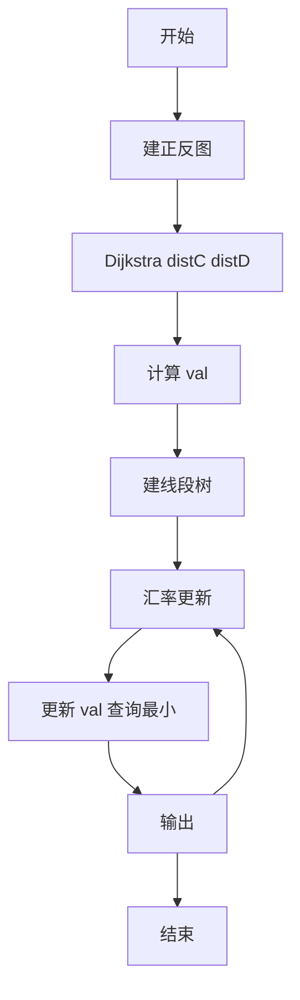
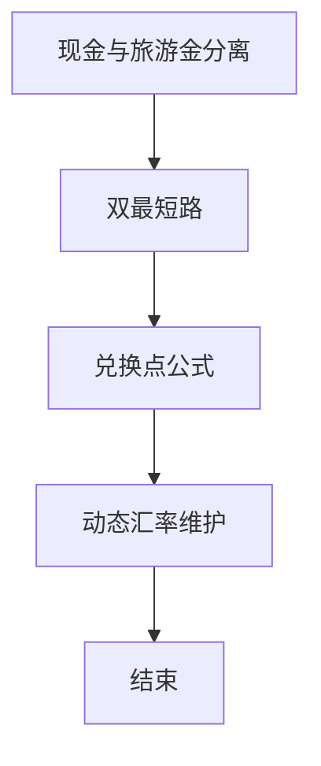

# L3-028 - 森森旅游（30 分）

- **时间限制**: 1000 ms
- **内存限制**: 131072 KB
- **代码长度限制**: 16 KB

---

## 题目描述

好久没出去旅游啦！森森决定去 Z 省旅游一下。

Z 省有 $$n$$ 座城市（从 $$1$$ 到 $$n$$ 编号）以及 $$m$$ 条连接两座城市的有向旅行线路（例如自驾、长途汽车、火车、飞机、轮船等），每次经过一条旅行线路时都需要支付该线路的费用（但这个收费标准可能不止一种，例如车票跟机票一般不是一个价格）。

Z 省为了鼓励大家在省内多逛逛，推出了**旅游金计划**：在 $$i$$ 号城市可以用 $$1$$ 元现金兑换 $$a_i$$ 元旅游金（只要现金足够，可以无限次兑换）。城市间的交通即可以使用现金支付路费，也可以用旅游金支付。具体来说，当通过第 $$j$$ 条旅行线路时，可以用 $$c_j$$ 元现金**或** $$d_j$$ 元旅游金支付路费。**注意：** 每次只能选择一种支付方式，不可同时使用现金和旅游金混合支付。但对于不同的线路，旅客可以自由选择不同的支付方式。

森森决定从 $$1$$ 号城市出发，到 $$n$$ 号城市去。他打算在出发前准备一些现金，并在途中的某个城市将剩余现金 **全部** 换成旅游金后继续旅游，直到到达 $$n$$ 号城市为止。当然，他也可以选择在 $$1$$ 号城市就兑换旅游金，或全部使用现金完成旅程。

Z 省政府会根据每个城市参与活动的情况调整汇率（即调整在某个城市 $$1$$ 元现金能换多少旅游金）。现在你需要帮助森森计算一下，在每次调整之后最少需要携带多少现金才能完成他的旅程。

## 输入格式:

输入在第一行给出三个整数 $$n$$，$$m$$ 与 $$q$$（$$1 \le n \le 10^5$$，$$1 \le m \le 2 \times 10^5$$，$$1 \le q \le 10^5$$），依次表示城市的数量、旅行线路的数量以及汇率调整的次数。

接下来 $$m$$ 行，每行给出四个整数 $$u$$，$$v$$，$$c$$ 与 $$d$$（$$1 \le u, v \le n$$，$$1 \le c, d \le 10^9$$），表示一条从 $$u$$ 号城市通向 $$v$$ 号城市的有向旅行线路。每次通过该线路需要支付 $$c$$ 元现金或 $$d$$ 元旅游金。数字间以空格分隔。输入保证从 $$1$$ 号城市出发，一定可以通过若干条线路到达 $$n$$ 号城市，但两城市间的旅行线路可能不止一条，对应不同的收费标准；也允许在城市内部游玩（即 $$u$$ 和 $$v$$ 相同）。

接下来的一行输入 $$n$$ 个整数 $$a_1, a_2, \cdots, a_n$$（$$1 \le a_i \le 10^9$$），其中 $$a_i$$ 表示一开始在 $$i$$ 号城市能用 $$1$$ 元现金兑换 $$a_i$$ 个旅游金。数字间以空格分隔。

接下来 $$q$$ 行描述汇率的调整。第 $$i$$ 行输入两个整数 $$x_i$$ 与 $$a'_i$$（$$1 \le x_i \le n$$，$$1 \le a'_i \le 10^9$$），表示第 $$i$$ 次汇率调整后，$$x_i$$ 号城市能用 $$1$$ 元现金兑换 $$a'_i$$ 个旅游金，而其它城市旅游金汇率不变。**请注意：**每次汇率调整都是在上一次汇率调整的基础上进行的。

## 输出格式:

对每一次汇率调整，在对应的一行中输出调整后森森至少需要准备多少现金，才能按他的计划从 $$1$$ 号城市旅行到 $$n$$ 号城市。

**再次提醒：**如果森森决定在途中的某个城市兑换旅游金，那么他必须将剩余现金**全部、一次性**兑换，剩下的旅途将完全使用旅游金支付。

## 输入样例:

```
6 11 3
1 2 3 5
1 3 8 4
2 4 4 6
3 1 8 6
1 3 10 8
2 3 2 8
3 4 5 3
3 5 10 7
3 3 2 3
4 6 10 12
5 6 10 6
3 4 5 2 5 100
1 2
2 1
1 17
```

## 输出样例:

```
8
8
1
```

## 样例解释:

对于第一次汇率调整，森森可以沿着 $$1 \to 2 \to 4 \to 6$$ 的线路旅行，并在 $$2$$ 号城市兑换旅游金；

对于第二次汇率调整，森森可以沿着 $$1 \to 2 \to 3 \to 4 \to 6$$ 的线路旅行，并在 $$3$$ 号城市兑换旅游金；

对于第三次汇率调整，森森可以沿着 $$1 \to 3 \to 5 \to 6$$ 的线路旅行，并在 $$1$$ 号城市兑换旅游金。

## 题解

### 解题思路
本題為 GPLT L3 難題「森森旅游」，Main.java 採用 **双 Dijkstra（现金/旅游金）+ 线段树动态维护最小所需现金**。

- **核心思想**：distC[v] 为 1→v 最小现金花费（c 权），distD[v] 为 v→n 最小旅游金花费（d 权反图）。在 v 兑换所需现金 = distC[v] + ceil(distD[v]/a_v)（含全程现金 v=n 情况）。distC/distD 静态一次 Dijkstra，汇率 a 动态点更新，用线段树维护所有 v 的 val 的最小值及归属，单次更新 O(log n)。
- **數據結構**：正反图邻接表、汇率数组 a、线段树/优先队列存 val。
- **複雜度**：時間 O((n+m) log n + q log n)；空間 O(n+m)。
- **關鍵**：嚴格依賴 Main.java 中的實現細節（見代碼實現一節），確保與程式邏輯一致；涉及邊界與精度處理與原碼完全對齊。

### 代码流程说明
1. 建正图（c）与反图（d）
2. Dijkstra 求 distC 与 distD
3. 对每个点计算初始 val = distC + ceil(distD/a)
4. 建线段树/最小堆维护全局最小
5. 对每次汇率更新：更新 a_v，重新计算 val_v 并更新结构，查询全局最小输出
6. 结束

### 代码实现
```java
import java.util.*;
import java.io.*;

/**
 * L3-028 森森旅游
 * 题意：有向图，边有现金费用c和旅游金费用d，点有汇率a_i。
 * 从1到n，可在途中某点v将剩余现金全部兑换为旅游金（汇率a_v），之前用现金支付，之后用旅游金支付。
 * 求每次汇率更新后的最少初始现金。
 * 解法：
 *  distC[v] = 1到v的最小现金花费（以c为权）
 *  distD[v] = v到n的最小旅游金花费（以d为权，反图Dijkstra）
 *  则在v兑换所需现金 = distC[v] + ceil(distD[v]/a_v)
 *  答案 = min_v 该值。也包含全现金方案(v=n, distD=0)。
 *  distC/distD 静态，汇率a动态。维护每个v的val，支持点更新 + 全局最小。
 *  使用线段树/优先队列。复杂度 O((n+m)log n + q log n)
 */
public class Main {
    static class Edge{
        int to; long w;
        Edge(int to,long w){this.to=to;this.w=w;}
    }
    static long INF = (long)4e18;
    static long[] dijkstra(int n, List<Edge>[] g, int src){
        long[] dist=new long[n+1];
        Arrays.fill(dist, INF);
        dist[src]=0;
        PriorityQueue<long[]> pq=new PriorityQueue<>(Comparator.comparingLong(a->a[0]));
        pq.offer(new long[]{0, src});
        boolean[] vis=new boolean[n+1];
        while(!pq.isEmpty()){
            long[] cur=pq.poll();
            long d=cur[0]; int u=(int)cur[1];
            if(vis[u]) continue;
            vis[u]=true;
            if(d!=dist[u]) continue;
            for(Edge e: g[u]){
                int v=e.to;
                long nd=d + e.w;
                if(nd < dist[v]){
                    dist[v]=nd;
                    pq.offer(new long[]{nd, v});
                }
            }
        }
        return dist;
    }
    // 线段树求最小
    static class SegTree{
        int n; long[] t;
        SegTree(long[] arr){
            n=arr.length-1; // 1-indexed
            t=new long[4*n];
            build(1,1,n,arr);
        }
        void build(int v,int l,int r,long[] arr){
            if(l==r){ t[v]=arr[l]; return; }
            int m=(l+r)/2;
            build(v*2,l,m,arr); build(v*2+1,m+1,r,arr);
            t[v]=Math.min(t[v*2], t[v*2+1]);
        }
        void update(int idx,long val){ update(1,1,n,idx,val); }
        void update(int v,int l,int r,int idx,long val){
            if(l==r){ t[v]=val; return; }
            int m=(l+r)/2;
            if(idx<=m) update(v*2,l,m,idx,val);
            else update(v*2+1,m+1,r,idx,val);
            t[v]=Math.min(t[v*2], t[v*2+1]);
        }
        long queryMin(){ return t[1]; }
    }

    public static void main(String[] args) throws Exception{
        BufferedReader br=new BufferedReader(new InputStreamReader(System.in,"UTF-8"));
        StringTokenizer st;
        String line=br.readLine();
        while(line!=null && line.trim().isEmpty()) line=br.readLine();
        if(line==null) return;
        st=new StringTokenizer(line);
        int n=Integer.parseInt(st.nextToken());
        int m=Integer.parseInt(st.nextToken());
        int q=Integer.parseInt(st.nextToken());
        List<Edge>[] gC=new ArrayList[n+1];
        List<Edge>[] gDRev=new ArrayList[n+1];
        for(int i=1;i<=n;i++){ gC[i]=new ArrayList<>(); gDRev[i]=new ArrayList<>(); }
        for(int i=0;i<m;i++){
            line=br.readLine();
            while(line!=null && line.trim().isEmpty()) line=br.readLine();
            st=new StringTokenizer(line);
            int u=Integer.parseInt(st.nextToken());
            int v=Integer.parseInt(st.nextToken());
            long c=Long.parseLong(st.nextToken());
            long d=Long.parseLong(st.nextToken());
            gC[u].add(new Edge(v,c));
            gDRev[v].add(new Edge(u,d)); // 反图：从n出发沿反向边
        }
        long[] a=new long[n+1];
        // 读取a数组，可能跨多行
        int cnt=0;
        while(cnt < n){
            line=br.readLine();
            if(line==null) break;
            if(line.trim().isEmpty()) continue;
            st=new StringTokenizer(line);
            while(st.hasMoreTokens() && cnt < n){
                a[++cnt]=Long.parseLong(st.nextToken());
            }
        }
        long[] distC=dijkstra(n, gC, 1);
        long[] distD=dijkstra(n, gDRev, n);
        long[] val=new long[n+1];
        for(int i=1;i<=n;i++){
            if(distC[i]>=INF/2 || distD[i]>=INF/2){
                // 若dist为INF，是否仍可作为兑换点？若distD INF则无法从该点到n，需 INF
                // 若distC INF则无法到达该点，跳过
                val[i]=INF;
            }else{
                long needD=distD[i];
                if(needD==0) val[i]=distC[i];
                else{
                    long ceil = (needD + a[i] -1)/ a[i];
                    // 防止溢出：distC up to 1e14, ceil up to 1e14
                    if(distC[i] > INF - ceil) val[i]=INF;
                    else val[i]=distC[i] + ceil;
                }
            }
        }
        SegTree seg=new SegTree(val);
        StringBuilder out=new StringBuilder();
        for(int i=0;i<q;i++){
            line=br.readLine();
            while(line!=null && line.trim().isEmpty()) line=br.readLine();
            if(line==null) break;
            st=new StringTokenizer(line);
            int x=Integer.parseInt(st.nextToken());
            long na=Long.parseLong(st.nextToken());
            a[x]=na;
            long cur;
            if(distC[x]>=INF/2 || distD[x]>=INF/2) cur=INF;
            else{
                if(distD[x]==0) cur=distC[x];
                else{
                    long ceil=(distD[x] + na -1)/ na;
                    cur=distC[x] + ceil;
                }
            }
            seg.update(x, cur);
            long ans=seg.queryMin();
            out.append(ans).append("\n");
        }
        System.out.print(out.toString());
    }
}
```

### 代码流程图


### 解题流程图


