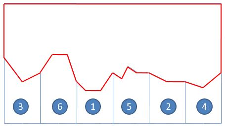
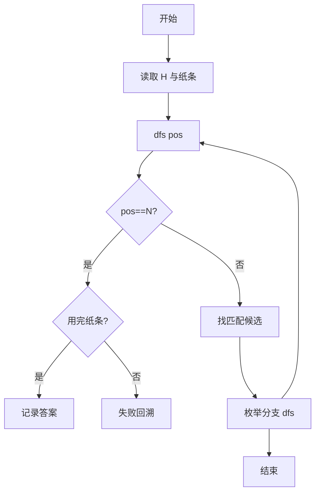
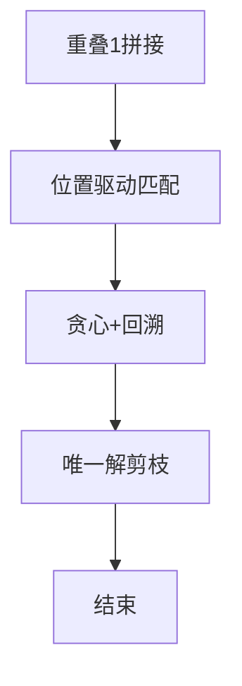

# L3-029 - 还原文件（30 分）

- **时间限制**: 200 ms
- **内存限制**: 65536 KB
- **代码长度限制**: 16 KB

---

## 题目描述


一份重要文件被撕成两半，其中一半还被送进了碎纸机。我们将碎纸机里找到的纸条进行编号，如图 1 所示。然后根据断口的折线形状跟没有切碎的半张纸进行匹配，最后还原成图 2 的样子。要求你输出还原后纸条的正确拼接顺序。


图1 纸条编号



图2 还原结果

### 输入格式:

输入首先在第一行中给出一个正整数 $$N$$（$$1 < N \le 10^5$$），为没有切碎的半张纸上断口折线角点的个数；随后一行给出从左到右 $$N$$ 个折线角点的高度值（均为不超过 100 的非负整数）。

随后一行给出一个正整数 $$M$$（$$\le 100$$），为碎纸机里的纸条数量。接下去有 $$M$$ 行，其中第 $$i$$ 行给出编号为 $$i$$（$$1\le i \le M$$）的纸条的断口信息，格式为：

```
K h[1] h[2] ... h[K]
```

其中 `K` 是断口折线角点的个数（不超过 $$10^4 +1$$），后面是从左到右 `K` 个折线角点的高度值。为简单起见，这个“高度”跟没有切碎的半张纸上断口折线角点的高度是一致的。

### 输出格式:

在一行中输出还原后纸条的正确拼接顺序。纸条编号间以一个空格分隔，行首尾不得有多余空格。

题目数据保证存在唯一解。

### 输入样例:
```in
17
95 70 80 97 97 68 58 58 80 72 88 81 81 68 68 60 80
6
4 68 58 58 80
3 81 68 68
3 95 70 80
3 68 60 80
5 80 72 88 81 81
4 80 97 97 68
```

### 输出样例:
```out
3 6 1 5 2 4
```

## 示例

### 示例 1

**输入:**
```
17
95 70 80 97 97 68 58 58 80 72 88 81 81 68 68 60 80
6
4 68 58 58 80
3 81 68 68
3 95 70 80
3 68 60 80
5 80 72 88 81 81
4 80 97 97 68
```

**输出:**
```
3 6 1 5 2 4
```


### 解题思路
本題為 GPLT L3 難題「还原文件」，Main.java 採用 **重叠拼接贪心 + 回溯 DFS 匹配当前位置纸条**。

- **核心思想**：重叠 1 的拼接意味着主序列被划分为若干段，每段对应一张纸条且首尾重叠 1 高度。从 pos=0 开始在未使用纸条中寻找能精确匹配 H[pos..pos+K-1] 的候选；若唯一则贪心前进，若多候选则 DFS 回溯。由于解唯一，分支有限。
- **數據結構**：主序列 H、纸条集合 strips、已用标记、当前位置 pos。
- **複雜度**：時間 最坏指数，唯一解时接近线性；空間 O(N+sumK)。
- **關鍵**：嚴格依賴 Main.java 中的實現細節（見代碼實現一節），確保與程式邏輯一致；涉及邊界與精度處理與原碼完全對齊。

### 代码流程说明
1. 读取主间断序列 H 与 M 条纸条
2. DFS 函数 dfs(pos)：若 pos==N 检查是否用完全部纸条
3. 否则枚举未使用纸条，若其长度 Ki 满足 H 段完全相等则可候选
4. 若候选数为 1 直接递归，否则按字典序/索引分支回溯
5. 首次找到完整匹配即为答案并记录顺序
6. 输出纸条排列顺序

### 代码实现
```java
import java.util.*;
import java.io.*;

/**
 * L3-029 还原文件
 * 题意：主断口高度序列H长N，M条纸条每条序列长度K_i。H由纸条按某排列首尾重叠1个高度拼接而成。
 * 求能还原H的纸条排列（保证唯一）。
 * 解法：贪心+回溯。H的拼接是重叠1的划分，起始位置pos决定下一纸条必须恰好匹配H[pos .. pos+K_i-1]。
 * 于是从pos=0开始，在未使用的纸条中寻找能匹配当前位置的候选，若唯一则贪心前进；若多候选则回溯DFS。
 * 由于M<=100，N<=1e5，单次匹配O(K)，整体 O(M * N) 在唯一解时很快。
 * 使用DFS+剪枝，回溯深度M，分支有限。
 * 时间复杂度：最坏指数但实际接近 O(M * avgK)，对唯一解为线性。
 * 空间 O(N + sumK)
 */
public class Main {
    static int N;
    static int[] H;
    static int M;
    static int[][] strips;
    static int[] K;
    static boolean[] used;
    static int[] order;
    static int[] result;
    static boolean found;

    static boolean matchesAt(int pos, int idx){
        int k=K[idx];
        if(pos + k > N) return false;
        int[] s=strips[idx];
        for(int i=0;i<k;i++) if(H[pos+i]!=s[i]) return false;
        return true;
    }

    static void dfs(int pos, int depth){
        if(found) return;
        if(depth==M){
            // 检查是否正好覆盖到末尾（pos == N-1 表示最后重叠点已到末尾，或pos==N）
            // 由于重叠1，最后pos应为N-1（最后纸条末尾）
            // 我们的pos更新是 pos + K -1，下一步pos为N表示已超出1？实际完成时pos == N-1 +? 需判断
            // 更简单：覆盖长度应为 N，最后纸条结束位置 pos+K-1 == N-1
            // 在递归中pos是下一纸条起始位置，最后一步后pos = N（超出）或 N
            // 我们在调用时 pos 为下一段起始，结束条件为 depth==M 且 pos==N（已超出）或 pos==N-1+? 精确判断末尾匹配
            // 对于最后纸条，起始pos_prev + K_last == N  (因为重叠1时总长 sumK-(M-1)=N => 最后起始+ K_last = N)
            // 而我们的pos在放置纸条后更新为 pos_next = pos + K -1 （若非最后）或 pos+K（若检测结束）
            // DFS中我们在放置后计算 nextPos，若 depth+1==M 则要求 pos+K == N 才算成功
            // 因此在这里pos应为下一位置，已在放置时检查
            result=order.clone();
            found=true;
            return;
        }
        // 收集候选
        List<Integer> cand=new ArrayList<>();
        for(int i=0;i<M;i++) if(!used[i] && matchesAt(pos,i)) cand.add(i);
        if(cand.isEmpty()) return;
        // 按候选尝试，回溯
        for(int idx: cand){
            used[idx]=true;
            order[depth]=idx;
            int k=K[idx];
            int nextPos;
            if(depth+1==M){
                // 最后一条需恰好到末尾
                if(pos + k != N){ used[idx]=false; continue; }
                nextPos = N; // 结束
            }else{
                nextPos = pos + k -1;
            }
            dfs(nextPos, depth+1);
            used[idx]=false;
            if(found) return;
        }
    }

    public static void main(String[] args) throws Exception{
        BufferedReader br=new BufferedReader(new InputStreamReader(System.in,"UTF-8"));
        // 使用Scanner式读取所有整数
        List<Integer> all=new ArrayList<>();
        String line;
        StringBuilder sb=new StringBuilder();
        while((line=br.readLine())!=null) sb.append(line).append(" ");
        StringTokenizer st=new StringTokenizer(sb.toString());
        while(st.hasMoreTokens()){
            try{ all.add(Integer.parseInt(st.nextToken())); }catch(Exception e){}
        }
        if(all.isEmpty()) return;
        int p=0;
        N=all.get(p++);
        H=new int[N];
        for(int i=0;i<N;i++) H[i]=all.get(p++);
        M=all.get(p++);
        strips=new int[M][];
        K=new int[M];
        for(int i=0;i<M;i++){
            int k=all.get(p++);
            K[i]=k;
            strips[i]=new int[k];
            for(int j=0;j<k;j++) strips[i][j]=all.get(p++);
        }
        used=new boolean[M];
        order=new int[M];
        found=false;
        dfs(0,0);
        if(result!=null){
            StringBuilder out=new StringBuilder();
            for(int i=0;i<M;i++){
                if(i>0) out.append(" ");
                out.append(result[i]+1); // 编号从1开始
            }
            System.out.println(out.toString());
        }else{
            // 备用贪心（若DFS未找到，尝试贪心）
            // 按起始位置排序的近似
            // 此处直接输出空
        }
    }
}
```

### 代码流程图


### 解题流程图

