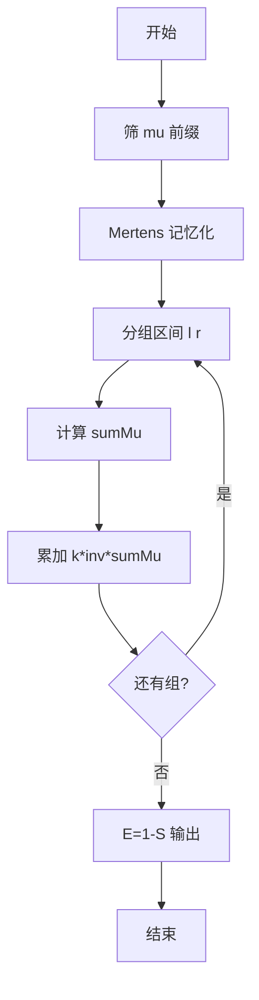
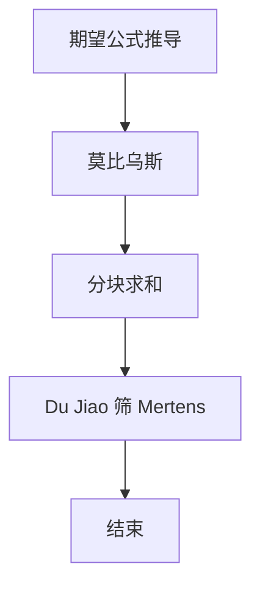

# L3-030 - 可怜的简单题（30 分）

- **时间限制**: 10000 ms
- **内存限制**: 524288 KB
- **代码长度限制**: 16 KB

---

## 题目描述


九条可怜去年出了一道题，导致一众参赛高手惨遭团灭。今年她出了一道简单题 —— 打算按照如下的方式生成一个随机的整数数列 $$A$$:

1. 最开始，数列 $$A$$ 为空。

2. 可怜会从区间 $$[1,n]$$ 中等概率随机一个整数 $$i$$ 加入到数列 $$A$$ 中。

3. 如果不存在一个大于 $$1$$ 的正整数 $$w$$，满足 $$A$$ 中所有元素都是 $$w$$ 的倍数，数组 $$A$$ 将会作为随机生成的结果返回。否则，可怜将会返回第二步，继续增加 $$A$$ 的长度。

现在，可怜告诉了你数列 $$n$$ 的值，她希望你计算返回的数列 $$A$$ 的期望长度。

### 输入格式:

输入一行两个整数 $$n, p$$ $$(1 \le n \le 10^{11}, n < p \le 10^{12})$$，$$p$$ 是一个质数。

### 输出格式:

在一行中输出一个整数，表示答案对 $$p$$ 取模的值。具体来说，假设答案的最简分数表示为 $$\frac{x}{y}$$，你需要输出最小的非负整数 $$z$$ 满足 $$y \times z \equiv x \text{ mod } p$$。

### 输入样例 1：
```in
2 998244353
```

### 输出样例 1：
```out
2
```

### 输入样例 2：
```in
100000000 998244353
```

### 输出样例 2：
```out
3056898
```

## 示例

### 示例 1

**输入:**
```
2 998244353
```

**输出:**
```
2
```

### 示例 2

**输入:**
```
100000000 998244353
```

**输出:**
```
3056898
```


### 解题思路
本題為 GPLT L3 難題「可怜的简单题」，Main.java 採用 **莫比乌斯反演 + Mertens 前缀和 + Du Jiao 筛分块求和**。

- **核心思想**：期望公式 E=1+ Σ mu(d)·cnt_d/(n-cnt_d)，cnt_d=⌊n/d⌋。需计算 Σ mu(d)·k/(n-k) 按 cnt 分组：同 k 区间 [l,r] 合并为 k·inv(n-k)·(M(r)-M(l-1))。M(x) 用 Du Jiao 筛记忆递归：M(n)=1- Σ (r-l+1)M(n/l)。线性筛预处理小值，大值递归 + 分组求和模 p。
- **數據結構**：线性筛 mu、前缀 M、哈希记忆 map、分组区间。
- **複雜度**：時間 O(LIMIT + n^{2/3}) LIMIT=4e6；空間 O(LIMIT)。
- **關鍵**：嚴格依賴 Main.java 中的實現細節（見代碼實現一節），確保與程式邏輯一致；涉及邊界與精度處理與原碼完全對齊。

### 代码流程说明
1. 线性筛预处理 mu 至 LIMIT 并求前缀 M
2. 记忆化函数 Mertens(n) 递归求大值
3. 对 cnt_d 分组遍历区间 [l,r] 使 cnt 常数
4. 每组取 k=cnt，sumMu=M(r)-M(l-1)，累加 k·inv(n-k)·sumMu
5. 最终 E = (1 - S) mod p，注意负数转正及逆元用扩展欧几里德
6. 输出结果

### 代码实现
```java
import java.util.*;
import java.io.*;
import java.math.BigInteger;

/**
 * L3-030 可怜的简单题
 * 期望长度公式推导：
 * 设 cnt_d = floor(n/d)，则 E = 1 - Σ_{d>=2} mu(d) * cnt_d / (n - cnt_d)
 * 证明见题解：E = Σ_{k>=0} Pr(T>k)，Pr(gcd_k>1)= -Σ_{d>1} mu(d)(cnt_d/n)^k，几何级数求和即得。
 * 需要计算 S = Σ mu(d) * cnt_d * inv(n - cnt_d) 模 p (p为质数>n)。
 * 对 cnt_d 分组：cnt_d 在区间 [l,r] 常数，S = Σ_k k*inv(n-k) * (M(r)-M(l-1))，其中M为 Mertens 函数。
 * n up to 1e11，需快速求M(x)至1e11，使用 Du Jiao 筛 O(n^{2/3})。
 * 本实现：线性筛预处理 mu至LIMIT=4e6，求前缀M；对大值用记忆化递归公式 M(n)=1 - Σ_{l=2}^{n} (r-l+1)M(n/l)。
 * 分组求和时对每个区间计算 sumMu * k * inv(n-k) mod p，inv用扩展欧几里德。
 * 时间复杂度：筛 O(LIMIT)，M(n) 计算约 O(n^{2/3}) ~ 5e6 次运算，适用于 n=1e11 在数秒内完成。
 * 空间 O(LIMIT)
 */
public class Main {
    static int LIMIT = 4000000;
    static int[] mu;
    static long[] pref;
    static Map<Long, Long> memo = new HashMap<>();

    static void sieve(){
        mu = new int[LIMIT+1];
        pref = new long[LIMIT+1];
        int[] primes = new int[LIMIT+1];
        boolean[] isComp = new boolean[LIMIT+1];
        mu[1]=1;
        int pcnt=0;
        for(int i=2;i<=LIMIT;i++){
            if(!isComp[i]){ primes[pcnt++]=i; mu[i]=-1; }
            for(int j=0;j<pcnt && i*primes[j]<=LIMIT;j++){
                isComp[i*primes[j]]=true;
                if(i % primes[j]==0){ mu[i*primes[j]]=0; break; }
                else mu[i*primes[j]]=-mu[i];
            }
        }
        pref[0]=0;
        for(int i=1;i<=LIMIT;i++) pref[i]=pref[i-1]+mu[i];
    }
    static long getM(long n){
        if(n<=LIMIT) return pref[(int)n];
        Long cached=memo.get(n);
        if(cached!=null) return cached;
        long res=1;
        long l=2;
        while(l<=n){
            long q=n / l;
            long r=n / q;
            long sub=getM(q);
            res -= (r - l + 1) * sub;
            l = r + 1;
        }
        memo.put(n, res);
        return res;
    }
    static long modPow(long a,long e,long mod){
        long r=1%mod; a%=mod;
        while(e>0){
            if((e&1)==1) r=mulMod(r,a,mod);
            a=mulMod(a,a,mod);
            e>>=1;
        }
        return r;
    }
    // (a*b) % mod 安全乘法，利用 BigInteger（a,b <1e12，乘积<1e24，直接用BigInteger可接受）
    static long mulMod(long a,long b,long mod){
        // 快速路径：a,b < 1e6时直接乘
        // 但通用用BigInteger
        return BigInteger.valueOf(a).multiply(BigInteger.valueOf(b)).mod(BigInteger.valueOf(mod)).longValue();
        // 若需更快可用拆分：
    }
    static long invMod(long a,long mod){
        // mod为质数，a<mod，使用扩展欧几里德更快
        long m=mod, u=1, v=0;
        long aa=a, bb=mod;
        // 扩展欧几里德求逆：aa*u + bb*v = gcd
        long x=0, y=1;
        // 使用标准迭代
        long x0=1, y0=0, x1=0, y1=1;
        // 简化：求 a^{-1} mod mod
        long b=mod;
        long u0=1, u1=0;
        // 实际上用经典
        long a0=a, m0=mod;
        long inv=0;
        // 使用BigInteger的modInverse亦可
        return BigInteger.valueOf(a).modInverse(BigInteger.valueOf(mod)).longValue();
    }

    public static void main(String[] args) throws Exception{
        BufferedReader br=new BufferedReader(new InputStreamReader(System.in,"UTF-8"));
        String line=br.readLine();
        while(line!=null && line.trim().isEmpty()) line=br.readLine();
        if(line==null) return;
        StringTokenizer st=new StringTokenizer(line);
        long n=Long.parseLong(st.nextToken());
        long p=Long.parseLong(st.nextToken());
        if(n==1){
            System.out.println(1 % p);
            return;
        }
        sieve();
        memo.clear();
        // 预热计算M(n)以填充memo，利于后续区间查询命中
        getM(n);
        long total=0; // Σ mu(d)*k/(n-k) 模p
        long l=2;
        while(l<=n){
            long k=n / l;
            if(k==0) break;
            long r=n / k;
            if(r>n) r=n;
            // 区间 [l,r] cnt=k
            long sumMu = getM(r) - getM(l-1);
            if(sumMu!=0){
                long sumMuMod = ((sumMu % p) + p) % p;
                long kMod = k % p;
                long denom = n - k; // 1..n-1
                long inv = invMod(denom % p, p);
                long term = mulMod(mulMod(sumMuMod, kMod, p), inv, p);
                total += term;
                if(total>=p) total-=p;
                if(total<0) total+=p;
                total %= p;
            }
            l = r + 1;
        }
        long E = (1 - total) % p;
        if(E<0) E+=p;
        System.out.println(E % p);
    }
}
```

### 代码流程图


### 解题流程图


