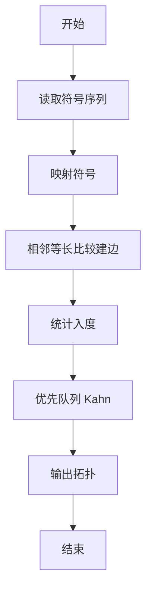
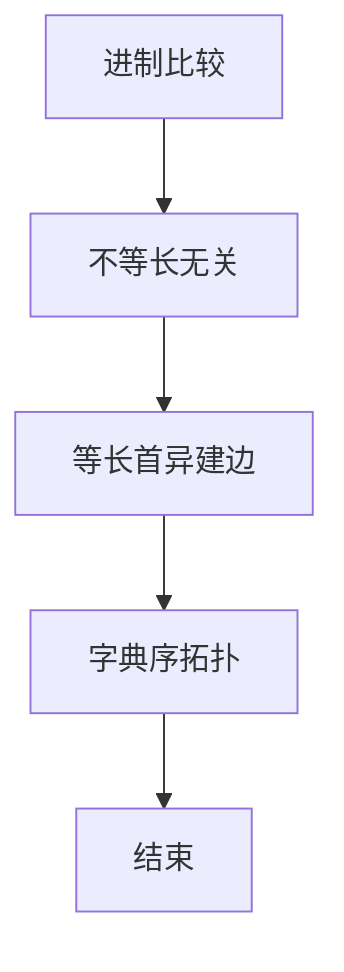

# L3-031 - 千手观音（30 分）

- **时间限制**: 200 ms
- **内存限制**: 65536 KB
- **代码长度限制**: 16 KB

---

## 题目描述


人类喜欢用 10 进制，大概是因为人类有一双手 10 根手指用于计数。于是在千手观音的世界里，数字都是 10 000 进制的，因为每位观音有 1 000 双手 ……


千手观音们的每一根手指都对应一个符号（但是观音世界里的符号太难画了，我们暂且用小写英文字母串来代表），就好像人类用自己的 10 根手指对应 0 到 9 这 10 个数字。同样的，就像人类把这 10 个数字排列起来表示更大的数字一样，ta们也把这些名字排列起来表示更大的数字，并且也遵循左边高位右边低位的规则，相邻名字间用一个点 `.` 分隔，例如 `pat.pta.cn` 表示千手观音世界里的一个 3 位数。


人类不知道这些符号代表的数字的大小。不过幸运的是，人类发现了千手观音们留下的一串数字，并且有理由相信，这串数字是从小到大有序的！于是你的任务来了：请你根据这串有序的数字，推导出千手观音每只手代表的符号的相对顺序。


注意：有可能无法根据这串数字得到全部的顺序，你只要尽量推出能得到的结果就好了。当若干根手指之间的相对顺序无法确定时，就暂且按它们的英文字典序升序排列。例如给定下面几个数字：

```
pat
cn
lao.cn
lao.oms
pta.lao
pta.pat
cn.pat
```

我们首先可以根据前两个数字推断 `pat` < `cn`；根据左边高位的顺序可以推断 `lao` < `pta` < `cn`；再根据高位相等时低位的顺序，可以推断出 `cn` < `oms`，`lao` < `pat`。综上我们得到两种可能的顺序：`lao` < `pat` < `pta` < `cn` < `oms`；或者 `lao` < `pta` < `pat` < `cn` < `oms`，即 `pat` 和 `pta` 之间的相对顺序无法确定，这时我们按字典序排列，得到 `lao` < `pat` < `pta` < `cn` < `oms`。

### 输入格式:

输入第一行给出一个正整数 $$N$$ ($$\le 10^5$$)，为千手观音留下的数字的个数。随后 $$N$$ 行，每行给出一个千手观音留下的数字，不超过 10 位数，每一位的符号用不超过 3 个小写英文字母表示，相邻两符号之间用 `.` 分隔。

我们假设给出的数字顺序在千手观音的世界里是严格递增的。题目保证数字是 $$10^4$$ 进制的，即符号的种类肯定不超过 $$10^4$$ 种。

### 输出格式:

在一行中按大小递增序输出符号。当若干根手指之间的相对顺序无法确定时，按它们的英文字典序升序排列。符号间仍然用 `.` 分隔。

### 输入样例:
```in
7
pat
cn
lao.cn
lao.oms
pta.lao
pta.pat
cn.pat
```

### 输出样例:
```out
lao.pat.pta.cn.oms
```

## 示例

### 示例 1

**输入:**
```
7
pat
cn
lao.cn
lao.oms
pta.lao
pta.pat
cn.pat
```

**输出:**
```
lao.pat.pta.cn.oms
```


### 解题思路
本題為 GPLT L3 難題「千手观音」，Main.java 採用 **相邻比较建偏序 + 字典序最小拓扑排序（Kahn+优先队列）**。

- **核心思想**：10000 进制，高位在左。长度不等则长者恒大不产生偏序；仅当两数长度相等时首个不同符号 a<b 产生有向边 a→b。相邻比较已捕获全部偏序。建图后题目保证无环，字典序最小拓扑即每次取入度 0 中字典序最小者（PriorityQueue）。
- **數據結構**：符号→id 映射、邻接表、入度数组、优先队列。
- **複雜度**：時間 O(N·L + M log M)；空間 O(M+E)。
- **關鍵**：嚴格依賴 Main.java 中的實現細節（見代碼實現一節），確保與程式邏輯一致；涉及邊界與精度處理與原碼完全對齊。

### 代码流程说明
1. 读取 N 个数的符号序列
2. 映射所有符号到 id 并记录字典序
3. 遍历相邻对：若长度相等则找首异符号建边
4. 去重边并统计入度
5. Kahn：优先队列取最小字典序零入度节点，弹出并减入度
6. 依次输出拓扑序列

### 代码实现
```java
import java.io.*;
import java.util.*;

/**
 * L3-031 千手观音
 * 
 * 题意：N 个 10000 进制数有序递增，每个数由 '.' 分隔 1~10 个符号（1~3 小写字母）组成。
 *      符号对应未知数字 0..9999，数的大小按高位在左、低位在右的数值比较。
 *      给定递增序列，推断符号的相对大小；无法确定时按英文字典序升序。
 * 
 * 观察：
 *  - 若两数长度不等，则较长者恒大于较短者（首位非零且进制足够大），与符号取值无关，不产生偏序。
 *  - 仅当相邻两数长度相等时，首个不同位置的符号可确定大小关系 a < b，建边 a -> b。
 *    相邻比较已足够捕获全部偏序（传递性）。
 *  - 对收集到的符号建有向图，题目保证无环。求字典序最小的拓扑排序：
 *    每次从入度为 0 的节点中取字典序最小者（PriorityQueue / Kahn）。
 *    这满足“无法确定时按字典序”要求。
 * 
 * 时间复杂度：设 N <= 1e5，L <=10 为单个数最多位数，M <= 1e4 为符号种类，E <= N 为边数
 *  - 读入与建图：O(N*L)
 *  - 拓扑排序（堆）：O((M+E) log M)
 * 空间复杂度：O(N*L + M + E)
 */
public class Main {
    public static void main(String[] args) throws Exception {
        BufferedReader br = new BufferedReader(new InputStreamReader(System.in, "UTF-8"));
        String line;
        // 跳过空行读取 N
        line = null;
        while ((line = br.readLine()) != null) {
            if (!line.trim().isEmpty()) break;
        }
        if (line == null) return;
        int N;
        try {
            N = Integer.parseInt(line.trim());
        } catch (NumberFormatException e) {
            // 若首行包含多余内容，只取第一个整数
            StringTokenizer st = new StringTokenizer(line);
            N = Integer.parseInt(st.nextToken());
        }

        List<String[]> nums = new ArrayList<>(N);
        Set<String> symbolSet = new HashSet<>(8192);

        int readCnt = 0;
        while (readCnt < N) {
            String s = br.readLine();
            if (s == null) break;
            s = s.trim();
            if (s.isEmpty()) continue; // 跳过空行（不计入 N）
            // 按 '.' 切分，手写切分避免正则开销并精确控制
            List<String> tokens = new ArrayList<>(10);
            int start = 0;
            for (int i = 0; i <= s.length(); i++) {
                if (i == s.length() || s.charAt(i) == '.') {
                    String tok = s.substring(start, i);
                    tokens.add(tok);
                    symbolSet.add(tok);
                    start = i + 1;
                }
            }
            nums.add(tokens.toArray(new String[0]));
            readCnt++;
        }

        // 若实际读到的不足 N（输入含空行或截断），按已有数量处理
        if (nums.size() != N) {
            N = nums.size();
        }
        if (N == 0) return;

        // 建立符号到 id 的映射
        List<String> idToWord = new ArrayList<>(symbolSet);
        Map<String, Integer> idMap = new HashMap<>(idToWord.size() * 2);
        for (int i = 0; i < idToWord.size(); i++) {
            idMap.put(idToWord.get(i), i);
        }
        int M = idToWord.size();

        List<Set<Integer>> adj = new ArrayList<>(M);
        for (int i = 0; i < M; i++) adj.add(new HashSet<>());
        int[] indeg = new int[M];

        // 仅长度相等时产生偏序
        for (int i = 0; i + 1 < N; i++) {
            String[] a = nums.get(i);
            String[] b = nums.get(i + 1);
            if (a.length != b.length) continue; // 较长必大，不推断
            for (int k = 0; k < a.length; k++) {
                if (!a[k].equals(b[k])) {
                    int u = idMap.get(a[k]);
                    int v = idMap.get(b[k]);
                    if (adj.get(u).add(v)) {
                        indeg[v]++;
                    }
                    break;
                }
            }
        }

        // 字典序最小的拓扑排序（Kahn + 最小堆）
        PriorityQueue<Integer> pq = new PriorityQueue<>((x, y) -> idToWord.get(x).compareTo(idToWord.get(y)));
        for (int i = 0; i < M; i++) if (indeg[i] == 0) pq.offer(i);

        List<Integer> result = new ArrayList<>(M);
        while (!pq.isEmpty()) {
            int u = pq.poll();
            result.add(u);
            for (int v : adj.get(u)) {
                if (--indeg[v] == 0) pq.offer(v);
            }
        }

        // 按题目保证无环，若有环（输入非法）则按已有结果 + 剩余字典序补充
        if (result.size() != M) {
            // 收集未入结果的节点，按字典序补齐（避免无输出）
            List<Integer> rest = new ArrayList<>();
            boolean[] inRes = new boolean[M];
            for (int x : result) inRes[x] = true;
            for (int i = 0; i < M; i++) if (!inRes[i]) rest.add(i);
            rest.sort((x, y) -> idToWord.get(x).compareTo(idToWord.get(y)));
            result.addAll(rest);
        }

        StringBuilder sb = new StringBuilder();
        for (int i = 0; i < result.size(); i++) {
            if (i > 0) sb.append('.');
            sb.append(idToWord.get(result.get(i)));
        }
        System.out.println(sb.toString());
    }
}
```

### 代码流程图


### 解题流程图


