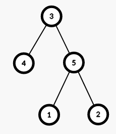
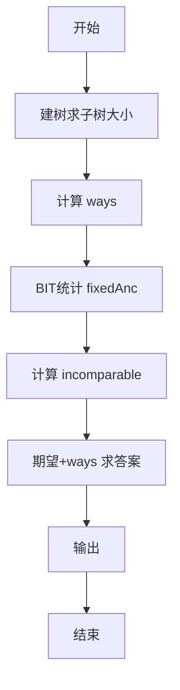
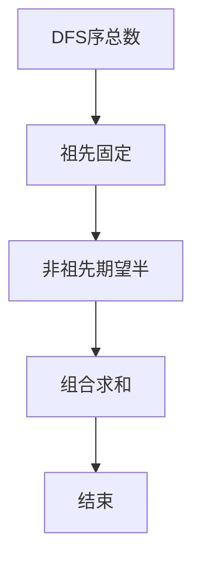

# L3-032 - 关于深度优先搜索和逆序对的题应该不会很难吧这件事（30 分）

- **时间限制**: 1000 ms
- **内存限制**: 262144 KB
- **代码长度限制**: 16 KB

---

## 背景知识

### 深度优先搜索与 DFS 序

深度优先搜索算法（DFS）是一种用于遍历或搜索树或图的算法。以下伪代码描述了在树 $T$ 上进行深度优先搜索的过程：

```
procedure DFS(T, u, L)      // T 是被深度优先搜索的树
                            // u 是当前搜索的节点
                            // L 是一个链表，保存了所有节点被第一次访问的顺序
  append u to L             // 将节点 u 添加到链表 L 的末尾
  for v in u.children do    // 枚举节点 u 的所有子节点 v
    DFS(T, v)               // 递归搜索节点 v
```

令 $r$ 为树 $T$ 的根，调用 `DFS(T, r, L)` 即可完成对 $T$ 的深度优先搜索，保存在链表 $L$ 中的排列被称为 DFS 序。相信聪明的你已经发现了，如果枚举子节点的顺序不同，最终得到的 DFS 序也会不同。

### 逆序对

给定一个长度为 $n$ 的整数序列 $a_1, a_2, \cdots, a_n$，该序列的逆序对数量是同时满足以下条件的有序数对 $(i, j)$ 的数量：
* $1 \le i < j \le n$；
* $a_i > a_j$。

## 问题求解

给定一棵 $n$ 个节点的树，其中节点 $r$ 为根。求该树所有可能的 DFS 序中逆序对数量之和。

## 输入格式

第一行输入两个整数 $n$，$r$（$2 \le n \le 3 \times 10^5$，$1 \le r \le n$）表示树的大小与根节点。

对于接下来的 $(n - 1)$ 行，第 $i$ 行输入两个整数 $u_i$ 与 $v_i$（$1 \le u_i, v_i \le n$），表示树上有一条边连接节点 $u_i$ 与 $v_i$。

## 输出格式

输出一行一个整数，表示该树所有可能的 DFS 序中逆序对数量之和。由于答案可能很大，请对 $10^9 + 7$ 取模后输出。

## 样例输入 1

```
5 3
1 5
2 5
3 5
4 3
```

## 样例输出 1

```
24
```

## 样例输入 2

```
10 5
10 2
2 5
10 7
7 1
7 9
4 2
3 10
10 8
3 6
```

## 样例输出 2

```
516
```

## 样例解释

下图展示了样例 1 中的树。



该树共有 $4$ 种可能的 DFS 序：
* $\{3, 4, 5, 1, 2\}$，有 6 个逆序对；
* $\{3, 4, 5, 2, 1\}$，有 7 个逆序对；
* $\{3, 5, 1, 2, 4\}$，有 5 个逆序对；
* $\{3, 5, 2, 1, 4\}$，有 6 个逆序对。

因此答案为 $6 + 7 + 5 + 6 = 24$。

## 题解

### 解题思路
本題為 GPLT L3 難題「关于深度优先搜索和逆序对的题应该不会很难吧这件事」，Main.java 採用 **组合计数 + 祖先固定对 + BIT 统计 fixedAnc + 期望半贡献**。

- **核心思想**：DFS 序总数 ways=Π fact[childCount]。祖先-后代对顺序固定，贡献 fixedAnc = 统计祖先编号 > 后代编号的对数（用祖先链 BIT）。非祖先对在不同子树，两种顺序各半，期望 0.5，贡献 incomparable/2。答案 = ways * (fixedAnc + incomparable·inv2) mod MOD。
- **數據結構**：树邻接表、DFS 子树大小、BIT 祖先查询、阶乘。
- **複雜度**：時間 O(n log n)；空間 O(n)。
- **關鍵**：嚴格依賴 Main.java 中的實現細節（見代碼實現一節），確保與程式邏輯一致；涉及邊界與精度處理與原碼完全對齊。

### 代码流程说明
1. 建无根树并以 r 为根 DFS 求 parent、子树大小、子节点数
2. 预计算阶乘及 inv2，计算 ways
3. DFS2 维护祖先链 BIT：进入节点前查询祖先中 >val 的数量累加 fixedAnc，BIT+1；递归子节点后 BIT-1
4. 计算 totalPairs、ancestorPairs、incomparable
5. 期望 = fixedAnc + incomparable·inv2 mod
6. 答案 = ways·期望 mod 1e9+7 输出

### 代码实现
```java
import java.io.*;
import java.util.*;

/**
 * L3-032 关于深度优先搜索和逆序对的题应该不会很难吧这件事
 * 
 * 题意：给定 n 节点无根树，指定根 r，所有 DFS 序（每个节点子节点排列任意）
 *       的逆序对数量之和对 1e9+7 取模。
 * 
 * 原理：
 *  - DFS 序总数 ways = Π factorial(cntChildren[u])
 *  - 祖先-后代对相对顺序固定，贡献为祖先编号 > 后代编号的对数 fixedAnc
 *  - 非祖先后代对（不同子树）属于某 LCA 的不同孩子块，两种顺序各占一半，
 *    期望贡献为 0.5，故其对总和的贡献为 incomparable * 0.5
 *  - 设 totalPairs = n*(n-1)/2，ancestorPairs = Σ(sz[u]-1)，incomparable = totalPairs - ancestorPairs
 *  - 期望逆序对 = fixedAnc + incomparable * inv2
 *  - 答案 = ways * 期望 mod MOD
 *  - fixedAnc 用 DFS 维护祖先链 + 树状数组（BIT）统计祖先中 > 当前点的数量
 * 
 * 时间复杂度：O(n log n)（建图 O(n)，求子树大小 O(n)，BIT 统计 O(n log n)）
 * 空间复杂度：O(n)
 */
public class Main {
    static final long MOD = 1000000007L;

    // Fenwick 树（1..n）
    static class BIT {
        int n;
        int[] bit;
        BIT(int n) { this.n = n; bit = new int[n + 2]; }
        void add(int idx, int delta) {
            for (int i = idx; i <= n; i += i & -i) bit[i] += delta;
        }
        int sum(int idx) {
            int s = 0;
            for (int i = idx; i > 0; i -= i & -i) s += bit[i];
            return s;
        }
    }

    // 快速输入
    static class FastScanner {
        private final InputStream in;
        private final byte[] buffer = new byte[1 << 16];
        private int ptr = 0, len = 0;
        FastScanner(InputStream in) { this.in = in; }
        private int readByte() throws IOException {
            if (ptr >= len) {
                len = in.read(buffer);
                ptr = 0;
                if (len <= 0) return -1;
            }
            return buffer[ptr++];
        }
        int nextInt() throws IOException {
            int c, sign = 1, val = 0;
            do { c = readByte(); if (c == -1) return Integer.MIN_VALUE; } while (c <= ' ');
            if (c == '-') { sign = -1; c = readByte(); }
            while (c > ' ') { val = val * 10 + (c - '0'); c = readByte(); }
            return val * sign;
        }
    }

    public static void main(String[] args) throws Exception {
        FastScanner fs = new FastScanner(System.in);
        int n = fs.nextInt();
        if (n == Integer.MIN_VALUE) return; // 无输入
        int r = fs.nextInt();

        @SuppressWarnings("unchecked")
        List<Integer>[] g = new ArrayList[n + 1];
        for (int i = 1; i <= n; i++) g[i] = new ArrayList<>();
        for (int i = 0; i < n - 1; i++) {
            int u = fs.nextInt();
            int v = fs.nextInt();
            if (u < 1 || u > n || v < 1 || v > n) continue;
            g[u].add(v);
            g[v].add(u);
        }

        // 建根树：parent 与 children
        int[] parent = new int[n + 1];
        int[] childCnt = new int[n + 1];
        @SuppressWarnings("unchecked")
        List<Integer>[] children = new ArrayList[n + 1];
        for (int i = 1; i <= n; i++) children[i] = new ArrayList<>();

        int[] stack = new int[n];
        int top = 0;
        int[] order = new int[n];
        int ord = 0;
        stack[top++] = r;
        parent[r] = 0;
        // 用于 visited 标记：parent 已赋值的即 visited
        // 为了避免重复入栈，用栈 + 迭代 DFS（类似 BFS 但保证遍历全）
        while (top > 0) {
            int u = stack[--top];
            order[ord++] = u;
            for (int v : g[u]) {
                if (v != parent[u]) {
                    parent[v] = u;
                    childCnt[u]++;
                    children[u].add(v);
                    stack[top++] = v;
                }
            }
        }

        // 子树大小
        int[] sz = new int[n + 1];
        for (int i = 1; i <= n; i++) sz[i] = 1;
        for (int i = ord - 1; i >= 0; i--) {
            int u = order[i];
            for (int v : children[u]) sz[u] += sz[v];
        }

        // ways = Π fact[childCnt]
        long[] fact = new long[n + 1];
        fact[0] = 1;
        for (int i = 1; i <= n; i++) fact[i] = fact[i - 1] * i % MOD;
        long ways = 1;
        for (int i = 1; i <= n; i++) {
            if (childCnt[i] > 1) ways = ways * fact[childCnt[i]] % MOD;
            else if (childCnt[i] == 1) ; // *1
        }

        // 祖先固定逆序对 fixedAnc：迭代 DFS 维护祖先链 BIT
        BIT bit = new BIT(n + 2);
        long fixedAnc = 0;
        int ancCnt = 0;
        Deque<int[]> dq = new ArrayDeque<>();
        dq.push(new int[]{r, 0}); // 0 enter, 1 exit
        // 需要 BIT 已清空
        while (!dq.isEmpty()) {
            int[] cur = dq.pop();
            int u = cur[0];
            int state = cur[1];
            if (state == 0) {
                // 查询祖先中 > u 的数量
                int cntLE = bit.sum(u); // 祖先中编号 <= u 的数量
                fixedAnc += (ancCnt - cntLE);
                // 加入当前节点
                bit.add(u, 1);
                ancCnt++;
                // 退出标记
                dq.push(new int[]{u, 1});
                // 孩子入栈（逆序以保持原序，但对计数无影响）
                List<Integer> ch = children[u];
                for (int i = ch.size() - 1; i >= 0; i--) {
                    dq.push(new int[]{ch.get(i), 0});
                }
            } else {
                bit.add(u, -1);
                ancCnt--;
            }
        }

        long totalPairs = (long) n * (n - 1) / 2;
        long ancestorPairs = 0;
        for (int i = 1; i <= n; i++) ancestorPairs += (sz[i] - 1);
        long incomparable = totalPairs - ancestorPairs;

        long inv2 = (MOD + 1) / 2; // 500000004
        long fixedMod = fixedAnc % MOD;
        long incMod = incomparable % MOD;
        long expect = (fixedMod + incMod * inv2 % MOD) % MOD;
        long answer = ways * expect % MOD;

        System.out.println(answer);
    }
}
```

### 代码流程图


### 解题流程图


