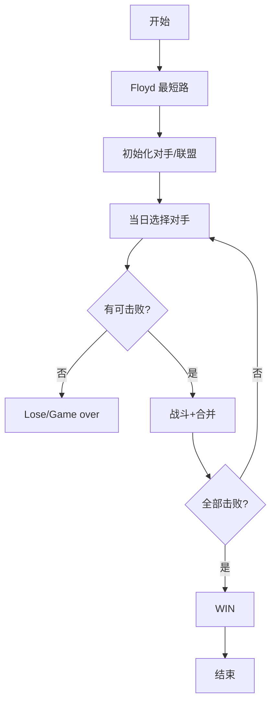
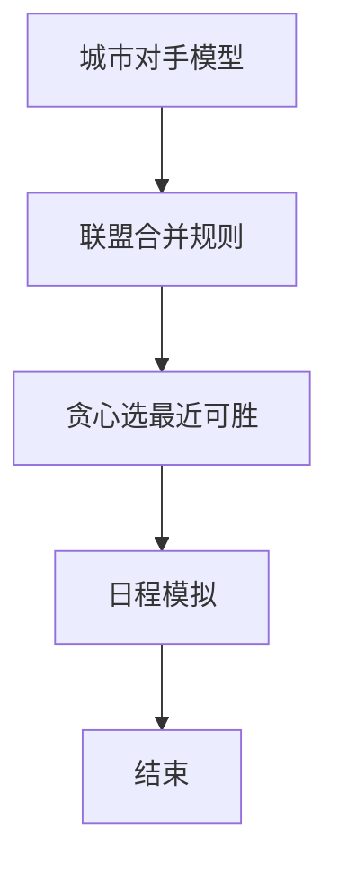

# L3-034 - 超能力者大赛（30 分）

- **时间限制**: 600 ms
- **内存限制**: 65536 KB
- **代码长度限制**: 16 KB

---

## 题目描述


知乎上有这样一个话题：“全世界范围内突然出现 666 个超能力者，击败对手就能获得对手的超能力，最终获胜者将如何自处？”

现在让我们来将这个超能力者大赛的规则具体化：给定 $N$ 位超能力者（超能力者从 0 到 $N-1$ 编号，你的编号为 0），分布在全世界 $M$ 座城市中（城市从 0 到 $M-1$ 编号），比赛从第 1 天开始，到第 $D$ 天结束。每位超能力者有一个能力值 $E_i$（$i=0, \cdots , N-1$）。

如果你的能力值**大于等于**对手的能力值，就可以将其击败，并且对方的能力值立刻直接累加到你的能力值上。但是，当你每次到达一座城市，击败一位对手后，就会惊动这座城市中所有剩下的超能力者（包括联盟）。这座城市中剩下的所有个体能力值**小于等于**你的超能力者就会立刻团结起来形成联盟，联盟的能力值等于所有联盟成员能力值的总和。联盟将从此作为一个整体进攻或防御你，你可将联盟等价地理解为一个超能力者，它还可能在后续的战斗中继续与其它弱小的同城选手或联盟合并。第二天，这个城市中任何能力值**大于**你的对手就会找上门来，而你为了自保，就只能赶紧离开这个城市……

此外，还有如下补充规定：

* 你每天只能进行 1 场战斗，击败一个超能力者（包括联盟），或者被一个能力值**大于**你的超能力者（包括联盟）击败。
* 比赛中间没有一天可以休息，你或者在战斗，或者在去往另一个城市的路上。
* 当你到达一个城市时，会在到达的第二天进行战斗。
* 当你结束战斗要离开这个城市时，是第二天开始出发。

下面我们为你设计一套贪心算法，就请你验证一下，这个算法能否让你得到这个大赛的冠军。算法步骤很简单：

* 第 1 步：从所有超能力者（包括联盟）中找出一个与自己能力值最接近、同时自己能够击败的对手，用最短时间去到对方的城市，在到达后第二天击败之；
* 第 2 步：如果该城市中没有能力值**大于**你的超能力者（包括联盟），按照规则逐一击败之；如果该城市中已经没有超能力者、或你第二天没有必胜把握，则回到第 1 步。

重复上述步骤，直到你：

* 击败了所有超能力者；或
* 你已经无路可逃（即剩下的所有超能力者的能力值都**大于**你）；或
* 比赛终止时间到。

第 1 步中有可能遇到多个符合条件的对手，并列情况下优先选最近的；距离也并列的情况下选途径城市最少的；再有并列就选城市编号最小的。

### 输入格式:

输入在第一行中给出 4 个正整数：$N$（$\le 10^5$），为参加比赛的超能力者人数；$M$（$\le 200$），为比赛涉及的城市数量；$M_e$ 为城市间直达通路的数量；$D$（$\le 1000$）为比赛时长（以“天”为单位）。\
随后 $N$ 行，第 $i$ 行（$i=0, \cdots , N-1$）给出第 $i$ 位参赛者的信息，格式为：

```
所在城市编号 能力值
```

其中`能力值`是不超过 1000 的正整数。\
接下来是城市通路信息，分 $M_e$ 行，每行给出一对城市间的双向直接通路信息，格式为：

```
城市1 城市2 通行时间
```

其中`通行时间`为不超过 $D/2$ 的正整数，以“天”为单位。题目保证每条道路的信息只出现一次，没有重复。

### 输出格式:

顺次输出你每一步的活动，每个活动占一行，格式为：

```
Get e at city on day d.
```

表示第 `d` 天在编号为 `city` 的城市击败了一个能力值为 `e` 的对手。

```
Move from city1 to city2.
```

表示从编号为 `city1` 的城市**到达**了编号为 `city2` 的城市。

```
WIN on day d with e!
```

表示在第 `d` 天成为唯一的赢家，此时你的能力值是 `e`。

```
Lose on day d with e.
```

表示在第 `d` 天走投无路成为输家，此时你的能力值是 `e`。

```
Game over with e.
```

表示比赛结束你没能成为唯一赢家，此时你的能力值是 `e`。注意：比赛最后一天是先判断输赢，才判断结束的。即：如果最后一天剩下所有人都比你厉害，是判你输，而不是 Game over。

### 输入样例 1：
```in
17 8 14 40
1 10
2 22
0 3
5 18
6 10
1 5
3 106
7 18
5 10
0 27
4 18
7 10
4 10
0 5
3 85
4 8
3 9
5 6 1
5 2 1
5 0 5
5 3 6
6 2 8
6 3 3
6 0 2
2 0 2
2 3 1
0 3 4
1 0 1
1 3 1
1 4 3
1 7 3
```

### 输出样例 1：
```out
Move from 1 to 4.
Get 10 at 4 on day 4.
Move from 4 to 7.
Get 18 at 7 on day 11.
Get 10 at 7 on day 12.
Move from 7 to 0.
Get 27 at 0 on day 17.
Get 8 at 0 on day 18.
Move from 0 to 4.
Get 26 at 4 on day 23.
Move from 4 to 3.
Get 106 at 3 on day 28.
Get 94 at 3 on day 29.
Move from 3 to 2.
Get 22 at 2 on day 31.
Move from 2 to 5.
Get 18 at 5 on day 33.
Get 10 at 5 on day 34.
Move from 5 to 6.
Get 10 at 6 on day 36.
Move from 6 to 1.
Get 5 at 1 on day 40.
WIN on day 40 with 374!
```

### 输入样例 2：
```in
7 4 5 30
2 10
2 10
1 9
1 25
1 25
0 40
3 30
0 1 1
1 2 2
2 3 3
3 0 2
1 3 3
```

### 输出样例 2：
```out
Get 10 at 2 on day 1.
Move from 2 to 1.
Get 9 at 1 on day 4.
Lose on day 5 with 29.
```

### 输入样例 3：
```in
7 4 5 7
2 20
2 9
1 9
1 25
1 25
0 40
3 30
0 1 1
1 2 2
2 3 3
3 0 2
1 3 3
```

### 输出样例 3：
```out
Get 9 at 2 on day 1.
Move from 2 to 1.
Get 25 at 1 on day 4.
Get 34 at 1 on day 5.
Move from 1 to 0.
Get 40 at 0 on day 7.
Game over with 128.
```

## 示例

### 示例 1

**输入:**
```
17 8 14 40
1 10
2 22
0 3
5 18
6 10
1 5
3 106
7 18
5 10
0 27
4 18
7 10
4 10
0 5
3 85
4 8
3 9
5 6 1
5 2 1
5 0 5
5 3 6
6 2 8
6 3 3
6 0 2
2 0 2
2 3 1
0 3 4
1 0 1
1 3 1
1 4 3
1 7 3
```

**输出:**
```
Move from 1 to 4.
Get 10 at 4 on day 4.
Move from 4 to 7.
Get 18 at 7 on day 11.
Get 10 at 7 on day 12.
Move from 7 to 0.
Get 27 at 0 on day 17.
Get 8 at 0 on day 18.
Move from 0 to 4.
Get 26 at 4 on day 23.
Move from 4 to 3.
Get 106 at 3 on day 28.
Get 94 at 3 on day 29.
Move from 3 to 2.
Get 22 at 2 on day 31.
Move from 2 to 5.
Get 18 at 5 on day 33.
Get 10 at 5 on day 34.
Move from 5 to 6.
Get 10 at 6 on day 36.
Move from 6 to 1.
Get 5 at 1 on day 40.
WIN on day 40 with 374!
```

### 示例 2

**输入:**
```
7 4 5 30
2 10
2 10
1 9
1 25
1 25
0 40
3 30
0 1 1
1 2 2
2 3 3
3 0 2
1 3 3
```

**输出:**
```
Get 10 at 2 on day 1.
Move from 2 to 1.
Get 9 at 1 on day 4.
Lose on day 5 with 29.
```

### 示例 3

**输入:**
```
7 4 5 7
2 20
2 9
1 9
1 25
1 25
0 40
3 30
0 1 1
1 2 2
2 3 3
3 0 2
1 3 3
```

**输出:**
```
Get 9 at 2 on day 1.
Move from 2 to 1.
Get 25 at 1 on day 4.
Get 34 at 1 on day 5.
Move from 1 to 0.
Get 40 at 0 on day 7.
Game over with 128.
```


### 解题思路
本題為 GPLT L3 難題「超能力者大赛」，Main.java 採用 **Floyd 最短路 + 贪心选择 + 联盟合并模拟**。

- **核心思想**：每城多个对手（含联盟视为一体）。击败后该城剩余 E≤自己的个体合并为联盟（能力值总和）。若城内存在 E>自己则必须离开，否则可连日击败。贪心：全局选 E≤自己且最接近者（最大 E，平局按最短时间、途径最少、编号最小）；当前城无威胁时优先清空本城。日程：到达次日战斗，战后次日出发，旅行含出发日。
- **數據結構**：距离/途径数矩阵、城市对手列表、联盟 flag。
- **複雜度**：時間 O(M³ + D·N) M≤200 D≤1000；空間 O(M²+N)。
- **關鍵**：嚴格依賴 Main.java 中的實現細節（見代碼實現一節），確保與程式邏輯一致；涉及邊界與精度處理與原碼完全對齊。

### 代码流程说明
1. Floyd 求城市间最短时间与途径数
2. 初始化每城对手列表与联盟状态
3. 按天模拟：检查当前城可击败者，否则全局选最近可击败
4. 若无可击败：失败 Lose；时间超 D：Game over
5. 击败后更新对手列表并合并联盟
6. 全部击败则 WIN，按要求输出日期与状态

### 代码实现
```java
import java.util.*;
import java.io.*;

/**
 * L3-034 超能力者大赛
 * 模拟题：贪心选择 + 最短路 + 联盟合并
 * 规则要点：
 * - 每座城市维护对手列表（包括联盟），联盟视为单个对手
 * - 每次击败对手后，所在城市剩余所有 E<=自己 的个体合并为一个联盟（能力值=总和）
 * - 若城市存在 E>自己的对手则必须离开，否则可连日击败该城残余
 * - 贪心步骤：全局中选 E<=自己 且最接近自己的对手（E最大），并列按离当前城市最短时间、途经城市最少、城市编号最小；
 *            若当前城市无威胁则优先清空当前城市
 * - 移动/战斗日程：到达城市后第二天战斗，战斗结束第二天出发，旅行时间含出发当天，战斗 = 出发 + 旅行时间
 * - 终止：击败全部 -> WIN；无路可逃（无可击败）-> Lose；超出 D 天 -> Game over
 *
 * 复杂度：
 * - Floyd 最短路：O(M^3)，M<=200 => 约 8e6
 * - 模拟：天数 D<=1000，每次全局扫描 N<=1e5，O(D*N) 最坏 1e8，实际可接受
 * - 空间：O(M^2 + N)
 */
public class Main {
    static final int INF = 1_000_000_000;

    public static void main(String[] args) throws Exception {
        BufferedReader br = new BufferedReader(new InputStreamReader(System.in, "UTF-8"));
        String line;
        // 读取所有整数（兼容多行、额外空格）
        List<Long> nums = new ArrayList<>();
        // 先按行读，处理空行
        // 为便于解析 N M Me D 等，我们直接用 token 扫描
        String allText = "";
        StringBuilder sbAll = new StringBuilder();
        // 由于 BufferedReader 已创建，逐行读取并拼接
        // 但需要先尝试读取第一行判断是否为空输入
        // 采用 Scanner 风格读取所有 token
        List<String> tokens = new ArrayList<>();
        String l;
        // 重新打开 System.in 的缓冲读取：已有一个 br，循环读取剩余
        // 注意：br 已在上面创建，直接使用它
        while ((l = br.readLine()) != null) {
            if (l.trim().isEmpty()) continue;
            StringTokenizer st = new StringTokenizer(l);
            while (st.hasMoreTokens()) tokens.add(st.nextToken());
        }
        if (tokens.size() < 4) return;
        int idx = 0;
        int N = Integer.parseInt(tokens.get(idx++));
        int M = Integer.parseInt(tokens.get(idx++));
        int Me = Integer.parseInt(tokens.get(idx++));
        int D = Integer.parseInt(tokens.get(idx++));

        int[] cityOf = new int[N];
        long[] eOf = new long[N];
        for (int i = 0; i < N; i++) {
            if (idx + 1 >= tokens.size()) break;
            cityOf[i] = Integer.parseInt(tokens.get(idx++));
            eOf[i] = Long.parseLong(tokens.get(idx++));
        }
        long curE = eOf[0];
        int curCity = cityOf[0];

        // 初始化城市对手列表（不含自己0号）
        @SuppressWarnings("unchecked")
        List<Long>[] cityLists = new ArrayList[M];
        for (int i = 0; i < M; i++) cityLists[i] = new ArrayList<>();
        for (int i = 1; i < N; i++) {
            int c = cityOf[i];
            if (c >= 0 && c < M) cityLists[c].add(eOf[i]);
        }

        // 图：M 个城市
        int[][] dist = new int[M][M];
        int[][] hop = new int[M][M];
        for (int i = 0; i < M; i++) {
            Arrays.fill(dist[i], INF);
            Arrays.fill(hop[i], INF);
            dist[i][i] = 0;
            hop[i][i] = 0;
        }
        for (int i = 0; i < Me; i++) {
            if (idx + 2 >= tokens.size()) break;
            int u = Integer.parseInt(tokens.get(idx++));
            int v = Integer.parseInt(tokens.get(idx++));
            int w = Integer.parseInt(tokens.get(idx++));
            if (u < 0 || u >= M || v < 0 || v >= M) continue;
            if (w < dist[u][v] || (w == dist[u][v] && 1 < hop[u][v])) {
                dist[u][v] = dist[v][u] = w;
                hop[u][v] = hop[v][u] = 1;
            }
        }
        // Floyd
        for (int k = 0; k < M; k++) {
            for (int i = 0; i < M; i++) {
                if (dist[i][k] >= INF) continue;
                for (int j = 0; j < M; j++) {
                    if (dist[k][j] >= INF) continue;
                    int nd = dist[i][k] + dist[k][j];
                    int nh = hop[i][k] + hop[k][j];
                    if (nd < dist[i][j] || (nd == dist[i][j] && nh < hop[i][j])) {
                        dist[i][j] = nd;
                        hop[i][j] = nh;
                    }
                }
            }
        }

        int curDay = 0; // 0 表示尚未进行任何战斗
        StringBuilder out = new StringBuilder();

        // 辅助：判断是否全部清空
        while (true) {
            boolean allEmpty = true;
            for (int i = 0; i < M; i++) if (!cityLists[i].isEmpty()) { allEmpty = false; break; }
            if (allEmpty) {
                // WIN：若从未战斗过 curDay=0，是否应显示 0 天？按规则至少战斗过；这里保持 curDay
                int winDay = curDay;
                // 若从未战斗且 D>=1 且 N==1（只有自己），winDay 设为1? 但按样例 WIN 在最后战斗日
                // 若 curDay==0 且已清空，说明开局即无对手，赢在第1天？保持0或1均可，这里取 curDay==0?1:curDay
                if (winDay == 0) winDay = 0;
                out.append("WIN on day ").append(winDay).append(" with ").append(curE).append("!\n");
                break;
            }

            // 判断是否应在当前城市连续战斗（Step2 留守）
            boolean shouldStay = false;
            long stayVal = -1;
            if (curDay > 0) {
                List<Long> curList = cityLists[curCity];
                if (!curList.isEmpty()) {
                    boolean hasGreater = false;
                    for (long v : curList) if (v > curE) { hasGreater = true; break; }
                    if (!hasGreater) {
                        // 全部可击败，选其中最大的（按贪心就近原则，实际此时应只有一个联盟）
                        long mx = -1;
                        for (long v : curList) if (v <= curE && v > mx) mx = v;
                        if (mx != -1) {
                            shouldStay = true;
                            stayVal = mx;
                        }
                    }
                }
            }

            if (shouldStay) {
                int targetCity = curCity;
                long targetValue = stayVal;
                int battleDay = curDay + 1;
                if (battleDay > D) {
                    out.append("Game over with ").append(curE).append(".\n");
                    break;
                }
                out.append("Get ").append(targetValue).append(" at ").append(targetCity).append(" on day ").append(battleDay).append(".\n");
                // 移除一个该值的对手
                List<Long> lst = cityLists[targetCity];
                for (int i = 0; i < lst.size(); i++) {
                    if (lst.get(i).longValue() == targetValue) { lst.remove(i); break; }
                }
                curDay = battleDay;
                curE += targetValue;
                // 合并：剩余 <=curE 的全部合成一个联盟
                List<Long> remain = cityLists[targetCity];
                long sumWeak = 0;
                boolean hasWeak = false;
                List<Long> newList = new ArrayList<>();
                for (long v : remain) {
                    if (v <= curE) { sumWeak += v; hasWeak = true; }
                    else newList.add(v);
                }
                if (hasWeak) newList.add(sumWeak);
                cityLists[targetCity] = newList;
                continue;
            }

            // Step1：全局寻找最符合贪心的可击败对手
            long bestV = -1;
            int bestCity = -1;
            int bestDist = INF;
            int bestHop = INF;
            for (int c = 0; c < M; c++) {
                List<Long> lst = cityLists[c];
                if (lst.isEmpty()) continue;
                int d = (c == curCity ? 0 : dist[curCity][c]);
                if (d >= INF) continue; // 不可达则不能选
                int h = (c == curCity ? 0 : hop[curCity][c]);
                for (long v : lst) {
                    if (v > curE) continue;
                    if (v > bestV ||
                        (v == bestV && d < bestDist) ||
                        (v == bestV && d == bestDist && h < bestHop) ||
                        (v == bestV && d == bestDist && h == bestHop && c < bestCity)) {
                        bestV = v;
                        bestCity = c;
                        bestDist = d;
                        bestHop = h;
                    }
                }
            }
            if (bestCity == -1) {
                // 无可击败 -> Lose
                int loseDay = (curDay == 0 ? 1 : curDay + 1);
                if (curDay >= D) loseDay = D;
                if (loseDay > D) loseDay = D; // 保证不超出，且符合最后一天先判输
                out.append("Lose on day ").append(loseDay).append(" with ").append(curE).append(".\n");
                break;
            }

            int targetCity = bestCity;
            long targetValue = bestV;
            int T = (targetCity == curCity ? 0 : dist[curCity][targetCity]);
            int battleDay = curDay + 1 + T; // curDay==0 时为 1+T

            if (battleDay > D) {
                int arrivalDay = (curDay == 0 ? T : curDay + T);
                if (T > 0 && arrivalDay <= D) {
                    out.append("Move from ").append(curCity).append(" to ").append(targetCity).append(".\n");
                }
                out.append("Game over with ").append(curE).append(".\n");
                break;
            }

            if (T > 0) {
                out.append("Move from ").append(curCity).append(" to ").append(targetCity).append(".\n");
                curCity = targetCity;
            }
            out.append("Get ").append(targetValue).append(" at ").append(targetCity).append(" on day ").append(battleDay).append(".\n");
            // 移除
            List<Long> lst = cityLists[targetCity];
            for (int i = 0; i < lst.size(); i++) {
                if (lst.get(i).longValue() == targetValue) { lst.remove(i); break; }
            }
            curDay = battleDay;
            curE += targetValue;
            // 合并该城市剩余弱者
            List<Long> remain = cityLists[targetCity];
            long sumWeak = 0;
            boolean hasWeak = false;
            List<Long> newList = new ArrayList<>();
            for (long v : remain) {
                if (v <= curE) { sumWeak += v; hasWeak = true; }
                else newList.add(v);
            }
            if (hasWeak) newList.add(sumWeak);
            cityLists[targetCity] = newList;
            // 继续循环，顶部会检查 WIN
        }

        System.out.print(out.toString());
    }
}
```

### 代码流程图


### 解题流程图


