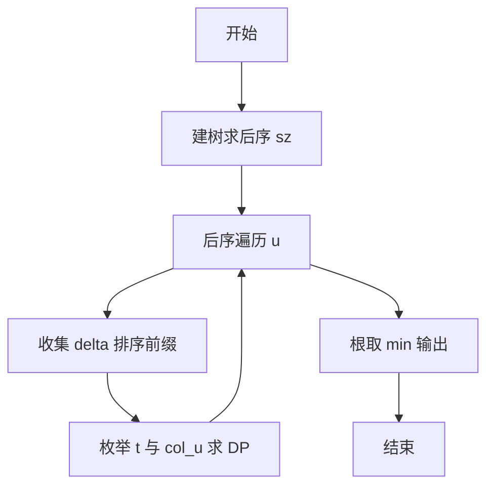
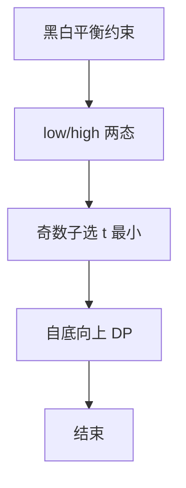

# L3-035 - 完美树（30 分）

- **时间限制**: 400 ms
- **内存限制**: 262144 KB
- **代码长度限制**: 16 KB

---

## 题目描述

给定一棵有 $N$ 个结点的树（树中结点从 $1$ 到 $N$ 编号，根结点编号为 $1$）。每个结点有一种颜色，或为黑，或为白。

称以结点 $u$ 为根的子树是 **好的**，若子树中黑色结点与白色结点的数量之差的绝对值不超过 $1$。称整棵树是 **完美树**，若对于所有 $1 \le i \le N$，以结点 $i$ 为根的子树都是好的。

你需要将整棵树变成完美树，为此你可以进行以下操作任意次（包括零次）：选择任意一个结点 $i$  ($1 \le i \le N$)，改变结点 $i$ 的颜色（若结点 $i$ 目前是黑色则将其改为白色，若结点 $i$ 目前是白色则将其改为黑色）。这次操作的代价为 $P_i$。

求将给定的树变为完美树的最小代价。

注：以结点 $i$ 为根的子树，由结点 $i$ 以及结点 $i$ 的所有后代结点组成。

## 输入格式:

输入第一行为一个数 $N$ ($1 \le N \le 10^5$)，表示树的结点个数。

接下来的 $N$ 行，第 $i$ 行的前三个数为 $C_i, P_i, K_i$ ($1 \le P_i \le 10^4, 0 \le K_i \le N$)，分别表示树上编号为 $i$ 的结点的初始颜色（$0$ 为白色，$1$ 为黑色）、变换颜色的代价及孩子结点的数量。紧跟着有 $K_i$ 个数，为孩子结点的编号。数字均用一个空格隔开，所有的编号保证在 $1$ 到 $N$ 里，且不会有环。

数据中只包含一棵树。

## 输出格式:

输出一行一个数，表示将树 $T$ 变为完美树的最小代价。

## 输入样例:

```
10
1 100 3 2 3 4
0 20 1 7
0 5 2 5 6
0 8 1 10
0 7 0
0 2 0
1 1 2 8 9
0 15 0
0 13 0
1 8 0

```

## 输出样例:

```
15
```

## 提示:

样例中最佳的方案是：将 9 号点和 6 号点从白色变为黑色，此时代价为 13 + 2 = 15。

## 题解

### 解题思路
本題為 GPLT L3 難題「完美树」，Main.java 採用 **树形 DP：子树黑白平衡 + 排序前缀和择优**。

- **核心思想**：子树大小 sz，偶数要求黑=sz/2，奇数可取 floor/ceil。DP[v][b] 黑数 b 达低/高值最小代价。子节点贡献：base=Σ lowCost，Smin=Σ low，奇数子 delta=high-low 排序取 t 个前缀和，S=Smin+t，B=S+col_u 匹配目标取最小。迭代栈避免递归溢出。
- **數據結構**：邻接表、后序栈、sz 数组、DP low/highCost 数组。
- **複雜度**：時間 O(N log N)；空間 O(N)。
- **關鍵**：嚴格依賴 Main.java 中的實現細節（見代碼實現一節），確保與程式邏輯一致；涉及邊界與精度處理與原碼完全對齊。

### 代码流程说明
1. 建树，迭代栈求后序与 sz
2. 后序遍历每个 u：收集子节点 low/high 与 delta 排序及前缀和
3. 枚举 col_u ∈{0,1} 与 t ∈[0,奇数子数] 使 B 达到 low/high 目标，取最小得 DP[u][low/high]
4. 根处理完毕后答案取 min(DP[root])
5. 输出最小代价

### 代码实现
```java
import java.util.*;
import java.io.*;

/**
 * L3-035 完美树
 * 题意：N个结点的有根树(根1)，每个结点有初始颜色 C_i(0白1黑) 和翻转代价 P_i。
 *      要求对每个结点 u，以 u 为根的子树内黑白数量差绝对值 <=1，求最小总代价。
 *      子树大小 sz[u]，若 sz 为偶数则黑数必须 = sz/2；若奇数则黑数 = floor/ceil。
 *
 * 算法：树形 DP，自底向上。
 *   设 sz[u] 已知，记 low[u]=sz[u]/2, high[u]=(sz[u]+1)/2（奇数时 low+1=high，偶数相等）。
 *   DP[u][b] = 子树 u 内黑数为 b 时的最小代价（b 仅取 low/high 之一或两者）。
 *   转移：设子结点 v 的 low/high 已知，记 base = sum lowCost(v)，Smin = sum low(v)，
 *         对奇数子结点 delta = highCost-lowCost，排序后前缀和 pref[t] 为选 t 个奇数子取 high 的最小额外代价。
 *         则子结点总和 S = Smin + t，子树 u 的黑数 B = S + col_u (col_u 0/1)。
 *         枚举 col_u 和 t 使 B 达到 low/high 目标，取最小。
 *   正确性：每个奇数子结点在 low/high 间差 1，选 t 个取 high 的最优即选 delta 最小的 t 个。
 *   复杂度：每个结点对子结点 deltas 排序， sum deg log deg = O(N log N)，空间 O(N)。
 *   N=1e5 时递归深度可能溢出，采用迭代栈求后序。
 */
public class Main {
    static final long INF = (long)4e18;
    public static void main(String[] args) throws Exception {
        BufferedInputStream in = new BufferedInputStream(System.in);
        FastScanner fs = new FastScanner(in);
        Integer nObj = fs.nextInt();
        if (nObj == null) return;
        int N = nObj;
        int[] C = new int[N+1];
        int[] P = new int[N+1];
        @SuppressWarnings("unchecked")
        List<Integer>[] ch = new ArrayList[N+1];
        for (int i=1;i<=N;i++) ch[i]=new ArrayList<>();
        for (int i=1;i<=N;i++) {
            int ci = fs.nextInt();
            int pi = fs.nextInt();
            int ki = fs.nextInt();
            C[i]=ci;
            P[i]=pi;
            for (int k=0;k<ki;k++) {
                int child = fs.nextInt();
                ch[i].add(child);
            }
        }

        // 迭代求后序
        int[] sz = new int[N+1];
        List<Integer> order = new ArrayList<>(N);
        Deque<Integer> stack = new ArrayDeque<>();
        stack.push(1);
        while (!stack.isEmpty()) {
            int u = stack.pop();
            order.add(u);
            for (int v: ch[u]) stack.push(v);
        }
        // postorder = reverse(order)
        long[] dpLow = new long[N+1];
        long[] dpHigh = new long[N+1];
        for (int idx = order.size()-1; idx>=0; idx--) {
            int u = order.get(idx);
            int s = 1;
            for (int v: ch[u]) s += sz[v];
            sz[u]=s;

            // 收集子结点信息
            long base = 0;
            long sMin = 0;
            List<Long> deltas = new ArrayList<>();
            for (int v: ch[u]) {
                int szv = sz[v];
                int low = szv/2;
                sMin += low;
                base += dpLow[v]; // dpLow==dpHigh for even, else low cost
                if ((szv & 1) == 1) {
                    long d = dpHigh[v] - dpLow[v];
                    deltas.add(d);
                }
            }
            Collections.sort(deltas);
            int odd = deltas.size();
            long[] pref = new long[odd+1];
            pref[0]=0;
            for (int i=0;i<odd;i++) pref[i+1]=pref[i]+deltas.get(i);

            long col0 = (C[u]==0?0:P[u]);
            long col1 = (C[u]==1?0:P[u]);
            int szu = sz[u];
            if ((szu & 1)==0) {
                int target = szu/2;
                long best = INF;
                long t0 = (long)target - sMin - 0;
                if (t0>=0 && t0<=odd) {
                    long cand = base + pref[(int)t0] + col0;
                    if (cand < best) best = cand;
                }
                long t1 = (long)target - sMin - 1;
                if (t1>=0 && t1<=odd) {
                    long cand = base + pref[(int)t1] + col1;
                    if (cand < best) best = cand;
                }
                dpLow[u]=best;
                dpHigh[u]=best;
            } else {
                int lowT = szu/2;
                int highT = lowT+1;
                long bestLow = INF, bestHigh = INF;
                long t0 = (long)lowT - sMin - 0;
                if (t0>=0 && t0<=odd) bestLow = Math.min(bestLow, base + pref[(int)t0] + col0);
                long t1 = (long)lowT - sMin - 1;
                if (t1>=0 && t1<=odd) bestLow = Math.min(bestLow, base + pref[(int)t1] + col1);
                long th0 = (long)highT - sMin - 0;
                if (th0>=0 && th0<=odd) bestHigh = Math.min(bestHigh, base + pref[(int)th0] + col0);
                long th1 = (long)highT - sMin - 1;
                if (th1>=0 && th1<=odd) bestHigh = Math.min(bestHigh, base + pref[(int)th1] + col1);
                dpLow[u]=bestLow;
                dpHigh[u]=bestHigh;
            }
        }
        long ans;
        if ((sz[1] & 1)==0) ans = dpLow[1];
        else ans = Math.min(dpLow[1], dpHigh[1]);
        System.out.println(ans);
    }

    // 快速输入
    static class FastScanner {
        private final InputStream in;
        private final byte[] buffer = new byte[1<<16];
        private int ptr=0,len=0;
        FastScanner(InputStream in){this.in=in;}
        private int readByte() throws IOException {
            if (ptr>=len) {
                len=in.read(buffer);
                ptr=0;
                if (len<=0) return -1;
            }
            return buffer[ptr++];
        }
        Integer nextInt() throws IOException {
            int c,sign=1,val=0;
            do {
                c=readByte();
                if (c==-1) return null;
            } while (c<=' ');
            if (c=='-'){sign=-1;c=readByte();}
            while (c>' ') {
                val=val*10+(c-'0');
                c=readByte();
            }
            return val*sign;
        }
    }
}
```

### 代码流程图


### 解题流程图


