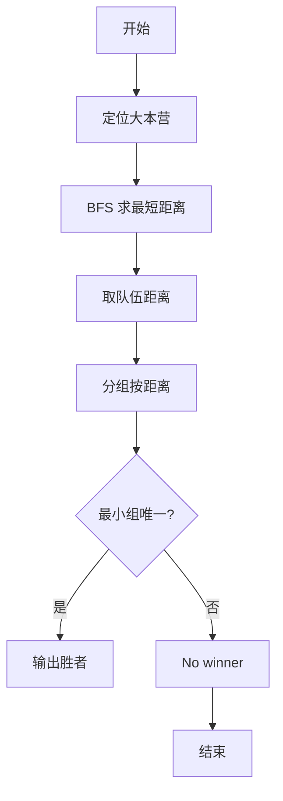
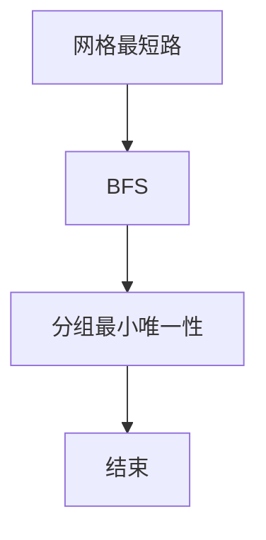

# L3-037 - 夺宝大赛（30 分）

- **时间限制**: 400 ms
- **内存限制**: 65536 KB
- **代码长度限制**: 16 KB

---

## 题目描述


夺宝大赛的地图是一个由 $n\times m$ 个方格子组成的长方形，主办方在地图上标明了所有障碍、以及大本营宝藏的位置。参赛的队伍一开始被随机投放在地图的各个方格里，同时开始向大本营进发。所有参赛队从一个方格移动到另一个无障碍的相邻方格（“相邻”是指两个方格有一条公共边）所花的时间都是 1 个单位时间。但当有多支队伍同时进入大本营时，必将发生火拼，造成参与火拼的所有队伍无法继续比赛。大赛规定：最先到达大本营并能活着夺宝的队伍获得胜利。
假设所有队伍都将以最快速度冲向大本营，请你判断哪个队伍将获得最后的胜利。

### 输入格式:

输入首先在第一行给出两个正整数 $m$ 和 $n$（$2< m,n\le 100$），随后 $m$ 行，每行给出 $n$ 个数字，表示地图上对应方格的状态：$1$ 表示方格可通过；$0$ 表示该方格有障碍物，不可通行；$2$ 表示该方格是大本营。题目保证只有 1 个大本营。
接下来是参赛队伍信息。首先在一行中给出正整数 $k$（$0<k<m\times n/2$），随后 $k$ 行，第 $i$（$1\le i \le k$）行给出编号为 $i$ 的参赛队的初始落脚点的坐标，格式为 `x y`。这里规定地图左上角坐标为 `1 1`，右下角坐标为 `n m`，其中 `n` 为列数，`m` 为行数。注意参赛队只能在地图范围内移动，不得走出地图。题目保证没有参赛队一开始就落在有障碍的方格里。

### 输出格式:

在一行中输出获胜的队伍编号和其到达大本营所用的单位时间数量，数字间以 1 个空格分隔，行首尾不得有多余空格。若没有队伍能获胜，则在一行中输出 `No winner.`

### 输入样例 1：
```in
5 7
1 1 1 1 1 0 1
1 1 1 1 1 0 0
1 1 0 2 1 1 1
1 1 0 0 1 1 1
1 1 1 1 1 1 1
7
1 5
7 1
1 1
5 5
3 1
3 5
1 4
```

### 输出样例 1：
```out
7 6
```

### 输入样例 2：
```in
5 7
1 1 1 1 1 0 1
1 1 1 1 1 0 0
1 1 0 2 1 1 1
1 1 0 0 1 1 1
1 1 1 1 1 1 1
7
7 5
1 3
7 1
1 1
5 5
3 1
3 5
```

### 输出样例 2：
```out
No winner.
```

## 示例

### 示例 1

**输入:**
```
5 7
1 1 1 1 1 0 1
1 1 1 1 1 0 0
1 1 0 2 1 1 1
1 1 0 0 1 1 1
1 1 1 1 1 1 1
7
1 5
7 1
1 1
5 5
3 1
3 5
1 4
```

**输出:**
```
7 6
```

### 示例 2

**输入:**
```
5 7
1 1 1 1 1 0 1
1 1 1 1 1 0 0
1 1 0 2 1 1 1
1 1 0 0 1 1 1
1 1 1 1 1 1 1
7
7 5
1 3
7 1
1 1
5 5
3 1
3 5
```

**输出:**
```
No winner.
```


### 解题思路
本題為 GPLT L3 難題「夺宝大赛」，Main.java 採用 **BFS 多源最短路 + 分组判定唯一最小距离**。

- **核心思想**：大本营值为 2，可通行 1/2。BFS 从大本营出发求到所有可达格最短步数。每个队伍起点距离若不可达视为 INF 不参与。按距离分组，若最小距离组大小唯一则该队伍获胜，否则 No winner。
- **數據結構**：网格矩阵、队列、距离矩阵、队伍列表分组。
- **複雜度**：時間 O(mn + k log k)；空間 O(mn)。
- **關鍵**：嚴格依賴 Main.java 中的實現細節（見代碼實現一節），確保與程式邏輯一致；涉及邊界與精度處理與原碼完全對齊。

### 代码流程说明
1. 读取 m,n 矩阵与队伍起点列表
2. 定位大本营 (值 2)，BFS 4 向扩展求 dist
3. 对每个队伍取 dist[队伍起点]（不可达 INF）
4. 按距离分组并排序，取最小距离组
5. 若该组唯一则输出对应队伍，否则输出 No winner
6. 结束

### 代码实现
```java
import java.io.*;
import java.util.*;

/**
 * L3-037 夺宝大赛
 * 思路：从大本营(值为2)出发对可通行格(1和2)做 BFS 求最短距离，
 *       每个队伍的距离即为其起点到大本营的最短路（不可达视为 INF 不参与）。
 *       将可达队伍按距离分组，距离最小且组大小为1的队伍获胜；
 *       若不存在这样的组则输出 No winner.
 * 时间复杂度: O(m*n + k log k)，m*n ≤ 1e4
 * 空间复杂度: O(m*n)
 */
public class Main {
    public static void main(String[] args) throws Exception {
        BufferedReader br = new BufferedReader(new InputStreamReader(System.in, "UTF-8"));
        // 快速读取所有整数 token
        List<Integer> tokens = new ArrayList<>();
        String line;
        while ((line = br.readLine()) != null) {
            if (line.trim().isEmpty()) continue;
            StringTokenizer st = new StringTokenizer(line);
            while (st.hasMoreTokens()) {
                tokens.add(Integer.parseInt(st.nextToken()));
            }
        }
        if (tokens.isEmpty()) return;
        int idx = 0;
        int m = tokens.get(idx++); // 行数
        int n = tokens.get(idx++); // 列数
        int[][] grid = new int[m][n];
        int tr = -1, tc = -1;
        for (int i = 0; i < m; i++) {
            for (int j = 0; j < n; j++) {
                if (idx >= tokens.size()) break;
                grid[i][j] = tokens.get(idx++);
                if (grid[i][j] == 2) {
                    tr = i; tc = j;
                }
            }
        }
        if (tr == -1) { // 题目保证有1个，不会发生
            System.out.println("No winner.");
            return;
        }
        // BFS
        int[][] dist = new int[m][n];
        for (int[] row : dist) Arrays.fill(row, -1);
        ArrayDeque<int[]> q = new ArrayDeque<>();
        q.add(new int[]{tr, tc});
        dist[tr][tc] = 0;
        int[] dr = {-1, 1, 0, 0};
        int[] dc = {0, 0, -1, 1};
        while (!q.isEmpty()) {
            int[] cur = q.poll();
            int r = cur[0], c = cur[1];
            for (int d = 0; d < 4; d++) {
                int nr = r + dr[d], nc = c + dc[d];
                if (nr < 0 || nr >= m || nc < 0 || nc >= n) continue;
                if (grid[nr][nc] == 0) continue; // 障碍
                if (dist[nr][nc] != -1) continue;
                dist[nr][nc] = dist[r][c] + 1;
                q.add(new int[]{nr, nc});
            }
        }

        if (idx >= tokens.size()) {
            System.out.println("No winner.");
            return;
        }
        int k = tokens.get(idx++);
        // 队伍从1编号
        int[] teamDist = new int[k + 1];
        Arrays.fill(teamDist, -1); // -1 表示不可达
        List<int[]> reachable = new ArrayList<>(); // {dist, id}
        for (int i = 1; i <= k; i++) {
            if (idx + 1 >= tokens.size()) break;
            int x = tokens.get(idx++); // 列 1..n
            int y = tokens.get(idx++); // 行 1..m
            int c = x - 1, r = y - 1;
            if (r < 0 || r >= m || c < 0 || c >= n) {
                teamDist[i] = -1;
                continue;
            }
            int d = dist[r][c];
            teamDist[i] = d;
            if (d != -1) {
                reachable.add(new int[]{d, i});
            }
        }

        if (reachable.isEmpty()) {
            System.out.println("No winner.");
            return;
        }
        reachable.sort((a, b) -> {
            if (a[0] != b[0]) return Integer.compare(a[0], b[0]);
            return Integer.compare(a[1], b[1]);
        });
        int winnerId = -1, winnerDist = -1;
        int p = 0;
        while (p < reachable.size()) {
            int qptr = p;
            while (qptr < reachable.size() && reachable.get(qptr)[0] == reachable.get(p)[0]) qptr++;
            int cnt = qptr - p;
            if (cnt == 1) {
                winnerId = reachable.get(p)[1];
                winnerDist = reachable.get(p)[0];
                break;
            }
            p = qptr;
        }
        if (winnerId == -1) {
            System.out.println("No winner.");
        } else {
            System.out.println(winnerId + " " + winnerDist);
        }
    }
}
```

### 代码流程图


### 解题流程图


