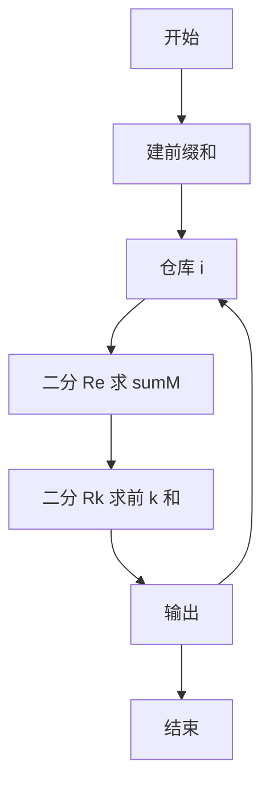
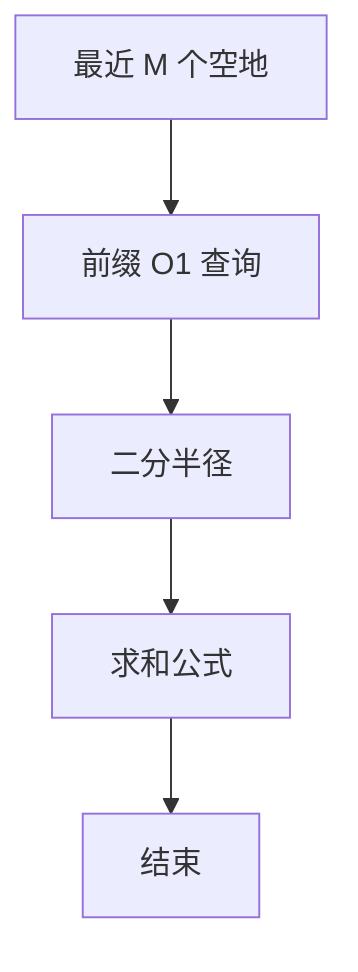

# L3-038 - 工业园区建设（30 分）

- **时间限制**: 800 ms
- **内存限制**: 65536 KB
- **代码长度限制**: 16 KB

---

## 题目描述


某工业园区要进行建设，共有 $N$ 块工业用地排成一条直线，其中上面已经有若干块用地建设起了工厂，其他地方为空地。

现在工业园区计划在空地上建设至多 $M$ 个新工厂以及一个仓库，希望在完成计划后，仓库离最近的 $k$ 个工厂的距离之和尽可能小。

两块用地的距离等于他们的编号的差；即 1 号用地与 2 号用地的距离为 1。一个空地上只能建设一个工厂，仓库可以跟工厂建在一起。

### 输入格式:

数据的第一行是一个正整数 $T$，表示数据的组数。

每组数据的输入第一行为三个整数 $N, M, k$ ($1 \le N \le 2\times10^5, 0 \le M \le N, 1 \le k \le N$)，表示有 $N$ 块用地，最多可以新建 $M$ 个新工厂，仓库离最近的 $k$ 个工厂距离之和需要尽可能小。

接下来的一行是一个只由 $0,1$ 组成的长度为 $N$ 的字符串 $S$，第 $i$ 个字符 $S_i$ 为 $0$ 表示第 $i$ 块地块为空地，$1$ 表示第 $i$ 块地块上已建工厂。地块编号从 1 开始。 

数据约定：

设 $F_S$ 为 $S$ 对应的已建工厂的地块数量，则有 $k \le M + F_S \le N$。给定的数据有 $\sum{N}\le5\times10^5$。

### 输出格式:

输出 $N$ 个整数，表示仓库建在第 $i$ 块用地时，离最近的 $k$ 个工厂的最小的距离之和是多少。

### 输入样例:
```in
3
5 1 3
10110
10 3 5
1001001010
2 1 2
10
```

### 输出样例:
```out
3 2 2 2 3
10 7 6 7 6 6 6 6 7 10
1 1
```

## 示例

### 示例 1

**输入:**
```
3
5 1 3
10110
10 3 5
1001001010
2 1 2
10
```

**输出:**
```
3 2 2 2 3
10 7 6 7 6 6 6 6 7 10
1 1
```


### 解题思路
本題為 GPLT L3 難題「工业园区建设」，Main.java 採用 **前缀和 + 二分半径求最近 M 个空地与前 k 小距离和**。

- **核心思想**：对仓库 i，新建工厂必选离 i 最近的 M 个空地，故候选集为已有工厂 + 最近 M 空地。用前缀和可在 O(1) 求区间 [l,r] 内数量与距离和。二分找最小半径 Re 使空地数≥M 得 sumM；再二分 Rk 使 count≥k 得答案 sum(Rk-1)+(k-cnt(Rk-1))*Rk。
- **數據結構**：位置 1..N 的工厂/空地布尔、前缀数量与距离和前缀。
- **複雜度**：時間 O(N log N) 每组，ΣN≤5e5；空間 O(N)。
- **關鍵**：嚴格依賴 Main.java 中的實現細節（見代碼實現一節），確保與程式邏輯一致；涉及邊界與精度處理與原碼完全對齊。

### 代码流程说明
1. 读取 N,M,k 与已有工厂/空地标记
2. 建数量与距离和前缀数组
3. 对每个查询仓库 i：二分 Re 求 sumM，上式计算
4. 二分 Rk 求第 k 小所需半径并计算总和
5. 输出结果
6. 结束

### 代码实现
```java
import java.io.*;
import java.util.*;

/**
 * L3-038 工业园区建设
 * 思路：对每个仓库位置 i，可新建的工厂必取离 i 最近的 M 个空地（距离最小的 M 个），
 *       因此 i 的答案是 “已有工厂 + 最近 M 个空地” 这一多重集里 k 个最小距离之和。
 *       利用位置 1..N 的前缀计数/前缀和，可 O(1) 求任意区间 [i-R,i+R] 内已有工厂/空地的
 *       数量与距离和。通过二分查找：
 *         1) Re = 使空地数量 >= M 的最小半径，求出最近 M 个空地的距离和 sumM[i]；
 *         2) Rk = 使 已有工厂数 + min(空地数,M) >= k 的最小半径，答案为
 *            sum(Rk-1) + (k - cnt(Rk-1)) * Rk。
 *       全部使用前缀和 O(1) 查询，整体 O(N log N)。
 * 时间复杂度: 每组 O(N log N)，ΣN ≤ 5e5
 * 空间复杂度: O(N)
 */
public class Main {

    // 区间 [l,r] 内数量
    static int cntIn(int[] pref, int l, int r) {
        if (l > r) return 0;
        return pref[r] - pref[l - 1];
    }

    // 区间 [l,r] 内已工厂/空地到 i 的距离和，prefC 为计数前缀，prefS 为位置和前缀
    static long sumDistIn(int i, int R, int N, int[] prefC, long[] prefS) {
        int l = Math.max(1, i - R);
        int r = Math.min(N, i + R);
        // 左侧 [l, i]
        int cntL = prefC[i] - prefC[l - 1];
        long sumL = prefS[i] - prefS[l - 1];
        long dL = (long) cntL * i - sumL;
        // 右侧 [i+1, r]
        int cntR = prefC[r] - prefC[i];
        long sumR = prefS[r] - prefS[i];
        long dR = sumR - (long) cntR * i;
        return dL + dR;
    }

    static int cntEInside(int i, int R, int N, int[] prefCntE) {
        int l = Math.max(1, i - R);
        int r = Math.min(N, i + R);
        return prefCntE[r] - prefCntE[l - 1];
    }

    static int cntAInside(int i, int R, int N, int[] prefCntA) {
        int l = Math.max(1, i - R);
        int r = Math.min(N, i + R);
        return prefCntA[r] - prefCntA[l - 1];
    }

    public static void main(String[] args) throws Exception {
        BufferedReader br = new BufferedReader(new InputStreamReader(System.in, "UTF-8"));
        BufferedWriter bw = new BufferedWriter(new OutputStreamWriter(System.out, "UTF-8"));
        String line;
        // 读取 T，跳过空行
        line = br.readLine();
        while (line != null && line.trim().isEmpty()) line = br.readLine();
        if (line == null) return;
        int T = Integer.parseInt(line.trim());
        // 为防止字符串中包含空格，按 token 读取更稳健，但 S 是 0/1 串，我们用行读取
        for (int tc = 0; tc < T; tc++) {
            // 读取 N M k
            do {
                line = br.readLine();
            } while (line != null && line.trim().isEmpty());
            if (line == null) break;
            StringTokenizer st = new StringTokenizer(line);
            while (st.countTokens() < 3) {
                // 若一行未读完，继续读下一行（防御）
                String extra = br.readLine();
                if (extra == null) break;
                line += " " + extra;
                st = new StringTokenizer(line);
            }
            int N = Integer.parseInt(st.nextToken());
            int M = Integer.parseInt(st.nextToken());
            int k = Integer.parseInt(st.nextToken());

            // 读取 S，可能包含空格
            String S = "";
            while (S.length() < N) {
                String sLine = br.readLine();
                if (sLine == null) break;
                sLine = sLine.trim().replaceAll("\\s+", "");
                if (sLine.isEmpty()) continue;
                S += sLine;
            }
            if (S.length() > N) S = S.substring(0, N);

            int[] prefCntA = new int[N + 1];
            long[] prefSumA = new long[N + 1];
            int[] prefCntE = new int[N + 1];
            long[] prefSumE = new long[N + 1];
            int totalE = 0;
            for (int i = 1; i <= N; i++) {
                char ch = S.charAt(i - 1);
                boolean isA = (ch == '1');
                prefCntA[i] = prefCntA[i - 1] + (isA ? 1 : 0);
                prefSumA[i] = prefSumA[i - 1] + (isA ? i : 0);
                prefCntE[i] = prefCntE[i - 1] + (isA ? 0 : 1);
                prefSumE[i] = prefSumE[i - 1] + (isA ? 0 : i);
                if (!isA) totalE++;
            }
            // 如果 M 大于空地总数，实际可建数量为 totalE
            int effM = Math.min(M, totalE);

            long[] sumM = null;
            if (effM > 0) {
                sumM = new long[N + 1];
                // 计算每个 i 的最近 effM 个空地距离和
                for (int i = 1; i <= N; i++) {
                    // 二分 Re
                    int lo = 0, hi = N; // hi 足够大
                    while (lo < hi) {
                        int mid = (lo + hi) >>> 1;
                        int cnt = cntEInside(i, mid, N, prefCntE);
                        if (cnt >= effM) hi = mid;
                        else lo = mid + 1;
                    }
                    int Re = lo;
                    if (Re == 0) {
                        sumM[i] = 0;
                    } else {
                        long sumBefore = sumDistIn(i, Re - 1, N, prefCntE, prefSumE);
                        int cntBefore = cntEInside(i, Re - 1, N, prefCntE);
                        long need = effM - cntBefore;
                        sumM[i] = sumBefore + need * Re;
                    }
                }
            }

            StringBuilder sb = new StringBuilder();
            for (int i = 1; i <= N; i++) {
                // 二分 Rk
                int lo = 0, hi = N;
                while (lo < hi) {
                    int mid = (lo + hi) >>> 1;
                    int cntA = cntAInside(i, mid, N, prefCntA);
                    int cntE = cntEInside(i, mid, N, prefCntE);
                    int total = cntA + Math.min(cntE, effM);
                    if (total >= k) hi = mid;
                    else lo = mid + 1;
                }
                int Rk = lo;
                long ans;
                if (Rk == 0) {
                    ans = 0;
                } else {
                    int cntA_before = cntAInside(i, Rk - 1, N, prefCntA);
                    long sumA_before = sumDistIn(i, Rk - 1, N, prefCntA, prefSumA);
                    int cntE_before = cntEInside(i, Rk - 1, N, prefCntE);
                    long totalSumBefore;
                    int totalCntBefore;
                    if (effM == 0) {
                        totalSumBefore = sumA_before;
                        totalCntBefore = cntA_before;
                    } else if (cntE_before >= effM) {
                        totalSumBefore = sumA_before + sumM[i];
                        totalCntBefore = cntA_before + effM;
                    } else {
                        long sumE_before = sumDistIn(i, Rk - 1, N, prefCntE, prefSumE);
                        totalSumBefore = sumA_before + sumE_before;
                        totalCntBefore = cntA_before + cntE_before;
                    }
                    int need = k - totalCntBefore;
                    ans = totalSumBefore + (long) need * Rk;
                }
                sb.append(ans);
                if (i < N) sb.append(' ');
            }
            bw.write(sb.toString());
            if (tc < T - 1) bw.newLine();
        }
        bw.flush();
    }
}
```

### 代码流程图


### 解题流程图


