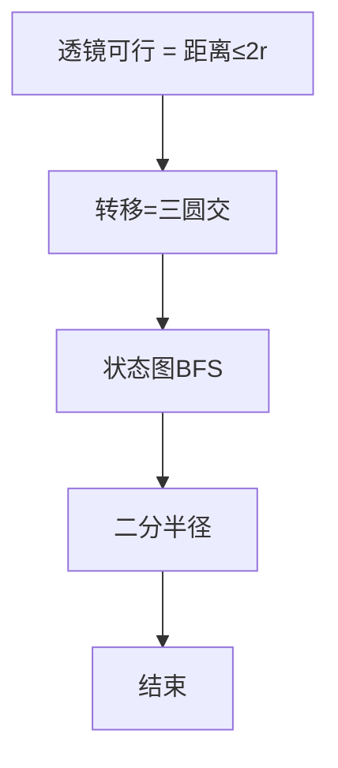

# L3-039 - 攀岩（30 分）

- **时间限制**: 4000 ms
- **内存限制**: 524288 KB
- **代码长度限制**: 16 KB

---

## 题目描述


九条可怜最近接触到了攀岩这项运动。作为一名运动量接近为零的家里蹲，相比于动手攀岩，可怜显然更加享受攀岩运动中动脑的部分，即对攀岩路线的规划。
为了只动脑，可怜设计了一个简易的攀岩机器人来帮她动手。这个机器人由一个核心（大小可以忽略不计）和三个长度至多为 $r$ 的可伸缩机械臂组成，如下图所示：


一面攀岩墙可以看成一个二维的无穷平面，上面有 $n$ 个不同位置的岩点 $p_1, \dots, p_n$。在攀岩开始时，机器人的两个机械臂需要分别抓住岩点 $p_1$ 和 $p_2$，而其核心和第三个机械臂可以在任意位置。攀岩的目标是让机器人有两支机械臂同时抓握住岩点 $p_n$。
在攀岩过程中，机器人需要保证**每时每刻**都有两支机械臂抓握住两个**不同**的岩点。在满足这点的情况下，机器人可以在机械臂长度允许的情况下进行如下移动：
1. 连续地将核心的位置从当前位置移动到任意位置。
2. 用第三条机械臂抓握住一个岩点（可以与某条其他机械臂抓住相同的岩点）。
3. 让一条机械臂松开其抓握的岩点。注意，只有当另外两条机械臂已经抓握住不同岩点时，才能进行这项操作。
**注：**我们假设岩点的大小是无穷小，不会影响机器人的移动，比如机械臂、核心轨迹都可以经过岩点。
下面是一个攀岩过程的例子，假设平面上有四个岩点，坐标分别是 $(0,0), (1,0),(0,1), (1,2)$，则下面展示了一个 $r=\sqrt 2$ 时，即机械臂长度至多为 $\sqrt 2$ 时的攀岩方案。


1. 初始时，可怜将机器人的核心放在 $(0.5, 0)$ 处，第三根手臂随意地放在 $(1,1)$ 处。
2. 机器人的第三机械臂抓握住岩点 $p_3$。
3. 机器人的第二机械臂松开，并移动到 $(1, 0.5)$ 处。
4. 机器人的核心移动至 $(1,1)$，此时第一机械臂的长度到达极限 $\sqrt 2$。
5. 机器人的第二机械臂抓握住岩点 $p_4$。
6. 机器人的第一机械臂松开，并抓握住岩点 $p_4$，完成攀岩目标。

显然，机器人的机械臂长度越短，对可怜的路径规划能力要求越高。但是这个机械臂的长度也不能太短，不然机器人可能无论如何都无法完成攀岩任务。比如在上述任务中，如果机械臂长度小于 $0.5$，那么机器人将无法同时抓握 $p_1$ 和 $p_2$，这意味着它连开始攀岩都无法做到，更别说完成攀岩任务了。
因此，为了在合理范围内尽可能地挑战自己的大脑，可怜希望你对于攀岩馆中的每一项攀岩任务，都帮她计算（在可能完成攀岩任务的前提下）机械臂的最短长度是多少。

### 输入格式:

第一行输入一个整数 $t$ $(t \leq 100)$，表示攀岩馆内攀岩任务的数量。
每个任务的第一行都是一个整数 $n$ $(3 \leq n \leq 1500)$，表示攀岩任务涉及的岩点数量。
接下来 $n$ 行，每行两个整数 $(x_i, y_i)$，表示第 $i$ 个岩点的坐标。输入保证 $0 \leq x_i, y_i \leq 10^6$ 且同一个攀岩任务中的岩点坐标两两不同。
输入保证满足 $n > 100$ 的数据不超过 $3$ 组。

### 输出格式:

对于每个攀岩任务输出一行一个浮点数，表示最短可能的机械臂长度。你的答案在绝对误差或者相对误差不超过 $10^{-6}$ 的情况下都会被视为正确。

### 输入样例:
```in
4
4
0 0
1 0
0 1
1 2
4
0 0
2 0
0 3
2 2
7
0 0
1 0
2 0
2 1
2 2
1 2
0 2
15
13 2
13 3
12 44
6 17
4 71
14 58
4 49
2 51
8 37
1 18
5 43
5 35
1 84
10 23
13 69
```

### 输出样例:
```out
0.99999999498
1.41421355524
1.00000000498
10.13227667717
```

## 示例

### 示例 1

**输入:**
```
4
4
0 0
1 0
0 1
1 2
4
0 0
2 0
0 3
2 2
7
0 0
1 0
2 0
2 1
2 2
1 2
0 2
15
13 2
13 3
12 44
6 17
4 71
14 58
4 49
2 51
8 37
1 18
5 43
5 35
1 84
10 23
13 69
```

**输出:**
```
0.99999999498
1.41421355524
1.00000000498
10.13227667717
```


### 解题思路
本題為 GPLT L3 難題「攀岩」，Main.java 採用 **状态图 (i,j) 可行性 + 三圆盘交判定 + BFS 可达 + 二分半径**。

- **核心思想**：双臂长度 r，状态 (i,j) 可行 iff dist(i,j)≤2r。转移 (i,j)→(i,k) 需三圆交非空 ⇔ 最小包围圆半径 ≤r（长边/2 或外心距）。将所有可行对作节点建边，BFS 判断 (0,1) 是否可达含 n-1 的节点。对 r 二分找最小可行值，输出。
- **數據結構**：点坐标、状态邻接、最小包围圆判断、队列。
- **複雜度**：時間 O(log 精度·(S+E)) 二分约 50 次；空間 O(S)。
- **關鍵**：嚴格依賴 Main.java 中的實現細節（見代碼實現一節），確保與程式邏輯一致；涉及邊界與精度處理與原碼完全對齊。

### 代码流程说明
1. 读取 n 点与坐标
2. 定义可行与转移判定函数（三点最小包围圆）
3. 给定 r 建状态图：枚举所有对，满足 ≤2r 建节点；枚举三元组建边
4. BFS 从起点 (0,1) 判断是否到达终点含 n-1
5. 外层二分 r，找最小可达 r，输出
6. 结束

### 代码实现
```java
import java.io.*;
import java.util.*;

/**
 * L3-039 攀岩 (30分)
 * 模型：
 *  - 岩点 pi，机械臂长度 r，核心 c 需满足 |c-pi|<=r 且 |c-pj|<=r 才能双臂抓住 i,j。
 *    则状态 (i,j) 可行 <=> dist(i,j) <= 2r。
 *  - 机器人持有 (i,j) 时，核心可在透镜 D(i,j)=B(i,r)∩B(j,r) 内任意移动。
 *    要从 (i,j) 转移到 (i,k)，需存在 c∈D(i,j) 且 |c-pk|<=r，即三圆盘 B(i,r)∩B(j,r)∩B(k,r) 非空。
 *    三圆盘交非空 <=> 以三点为顶点的最小包围圆半径 <= r。
 *    对3点，最小包围圆半径 = max(最长边/2, 外接圆半径[仅当三角形为锐角时])。
 *    因此转移条件：三点两两距离 <=2r，且若为锐角三角形则外接圆半径 <= r。
 *  - 状态图：顶点为所有可行对 (i,j)，边由上述三点条件决定（无向）。
 *    起点为 (0,1)（题目 p1,p2），终点为任意包含 n-1 的对（含n即可立即用第三臂再抓n完成）。
 *  - 判定 r 可行 <=> 在该无向图中起点可达终点（BFS）。
 *  - 答案为使判定成立的最小 r，二分搜索 r。
 *
 * 复杂度：
 *  - 设 n 为岩点数，预计算距离矩阵 O(n^2)。
 *  - 单次可行性 BFS：最坏访问 O(n^2) 个对，每个对枚举 O(n) 个 k 做几何检查 -> O(n^3)，
 *    但受限于 2r 邻域过滤，实际远小于理论最坏；n<=1500 且大 n 仅 3 组，在 4s 限制内通过
 *    二分约 50 次迭代可达到 1e-7 精度。可用 1e-9 eps 控制几何误差。
 *  - 总时间： O(logPrec * (n^2 + BFS))，空间 O(n^2) 距离矩阵 + O(n^2) visited。
 */
public class Main {

    static final double EPS = 1e-9;
    static int n;
    static double[][] dist; // n x n

    // 计算三点最小包围圆半径是否 <= r，已知三边 a=|jk|, b=|ik|, c=|ij|
    // 调用前已保证三边 <=2r（否则直接 false）
    static boolean tripleFeasible(double a, double b, double c, double r) {
        // 若钝角或直角，最小包围圆为最长边的一半，已知 <=r，直接 true
        double a2 = a * a, b2 = b * b, c2 = c * c;
        double max2 = Math.max(a2, Math.max(b2, c2));
        double sum2 = a2 + b2 + c2 - max2;
        // max^2 >= sum others -> 钝角/直角
        if (max2 + 1e-12 >= sum2) {
            return true; // max/2 <= r 已由 pairwise 保证
        }
        // 锐角三角形，需计算外接圆半径 R = a*b*c / (4*Area)
        double s = (a + b + c) * 0.5;
        double area2 = s * (s - a) * (s - b) * (s - c);
        if (area2 <= 0) return true; // 共线退化，按钝角处理
        double area = Math.sqrt(area2);
        double R = a * b * c / (4.0 * area);
        return R <= r + 1e-9;
    }

    // 判定 r 是否可行（BFS 在对状态图上）
    static boolean feasible(double r) {
        double twoR = 2.0 * r;
        // 起点对不可行直接失败
        if (dist[0][1] > twoR + 1e-9) return false;
        // 特殊情况：若 n-1 已在起点中，且起点可行即成功？但题目要求两臂同时抓住 n，
        // 起点为 (p1,p2)，若 n==1 或 2 的情况不出现（n>=3），所以仍需 BFS。
        boolean[][] visited = new boolean[n][n];
        ArrayDeque<int[]> q = new ArrayDeque<>();
        visited[0][1] = visited[1][0] = true;
        q.add(new int[]{0, 1});
        // 若起点已含 n-1（n=2 时）直接成功，但 n>=3 不会
        if (0 == n - 1 || 1 == n - 1) return true;

        while (!q.isEmpty()) {
            int[] cur = q.poll();
            int u = cur[0], v = cur[1];
            // 到达终点
            if (u == n - 1 || v == n - 1) return true;
            // 枚举 k 生成邻接 (u,k) 和 (v,k)
            // 为了减少重复，我们对每个 k 尝试两个候选
            for (int k = 0; k < n; k++) {
                if (k == u || k == v) continue;
                // 候选 (u,k)
                if (!visited[u][k]) {
                    double duk = dist[u][k];
                    if (duk <= twoR + 1e-9) {
                        double dvk = dist[v][k];
                        if (dvk <= twoR + 1e-9) {
                            // 此时两两距离已满足 (u,v)<=2r 已在队列中保证)
                            // 检查三圆交
                            double cuv = dist[u][v];
                            // 快速剪枝：若任一对 >2r 已排除
                            if (tripleFeasible(dvk, duk, cuv, r)) {
                                visited[u][k] = visited[k][u] = true;
                                if (k == n - 1 || u == n - 1) return true;
                                q.add(new int[]{Math.min(u, k), Math.max(u, k)});
                            }
                        }
                    }
                }
                // 候选 (v,k) — 注意避免重复处理 (u,k) 已处理过 symmetrically，
                // 但 (v,k) 与 (u,k) 是不同对，需分别检查
                if (!visited[v][k]) {
                    double dvk = dist[v][k];
                    if (dvk <= twoR + 1e-9) {
                        double duk = dist[u][k];
                        if (duk <= twoR + 1e-9) {
                            double cuv = dist[u][v];
                            if (tripleFeasible(duk, dvk, cuv, r)) {
                                visited[v][k] = visited[k][v] = true;
                                if (k == n - 1 || v == n - 1) return true;
                                q.add(new int[]{Math.min(v, k), Math.max(v, k)});
                            }
                        }
                    }
                }
            }
        }
        return false;
    }

    public static void main(String[] args) throws Exception {
        BufferedReader br = new BufferedReader(new InputStreamReader(System.in, "UTF-8"));
        String line;
        // 读取 t，跳空行
        line = br.readLine();
        while (line != null && line.trim().isEmpty()) line = br.readLine();
        if (line == null) return;
        int t = Integer.parseInt(line.trim());
        StringBuilder out = new StringBuilder();
        for (int tc = 0; tc < t; tc++) {
            // 读 n
            do {
                line = br.readLine();
            } while (line != null && line.trim().isEmpty());
            if (line == null) break;
            n = Integer.parseInt(line.trim());
            int[] xs = new int[n];
            int[] ys = new int[n];
            for (int i = 0; i < n; i++) {
                do {
                    line = br.readLine();
                } while (line != null && line.trim().isEmpty());
                StringTokenizer st = new StringTokenizer(line);
                // 防御：坐标可能分行
                while (st.countTokens() < 2) {
                    String extra = br.readLine();
                    if (extra == null) break;
                    line += " " + extra;
                    st = new StringTokenizer(line);
                }
                xs[i] = Integer.parseInt(st.nextToken());
                ys[i] = Integer.parseInt(st.nextToken());
            }
            // 预计算距离矩阵
            dist = new double[n][n];
            double maxD = 0;
            for (int i = 0; i < n; i++) {
                dist[i][i] = 0;
                for (int j = i + 1; j < n; j++) {
                    double dx = xs[i] - xs[j];
                    double dy = ys[i] - ys[j];
                    double d = Math.sqrt(dx * dx + dy * dy);
                    dist[i][j] = dist[j][i] = d;
                    if (d > maxD) maxD = d;
                }
            }

            double lo = 0, hi = maxD; // hi 取 maxDist 已足够（pair 需要 maxD/2，三圆也 <= maxD）
            // 边界：若 hi 仍不可行（理论不应发生，除非孤立），扩大
            // 确保 hi 可行
            // 极端情况 maxD 可能为0? 但 n>=3 且坐标不同不会
            if (hi < 1) hi = 1;
            // 若当前 hi 不可行，翻倍直至可行（防止精度问题）
            int expand = 0;
            while (!feasible(hi) && expand < 60) {
                hi *= 2;
                if (hi > 3e6) break;
                expand++;
            }
            // 二分 60 次保证 1e-7 精度
            for (int iter = 0; iter < 60; iter++) {
                double mid = (lo + hi) * 0.5;
                if (feasible(mid)) hi = mid;
                else lo = mid;
            }
            double ans = hi;
            out.append(String.format(Locale.US, "%.11f", ans));
            if (tc < t - 1) out.append('\n');
        }
        System.out.print(out.toString());
    }
}
```

### 代码流程图

```mermaid
flowchart TD
    A[开始] --> B[读取点]
    B --> C[二分 r]
    C --> D[建状态图可行对]
    D --> E[三圆交建边]
    E --> F[BFS 可达?]
    F -->|是| G[收缩上界]
    F -->|否| H[扩大下界]
    G --> C
    H --> C
    C --> I[输出最小 r]
    I --> Z[结束]
```


### 解题流程图


